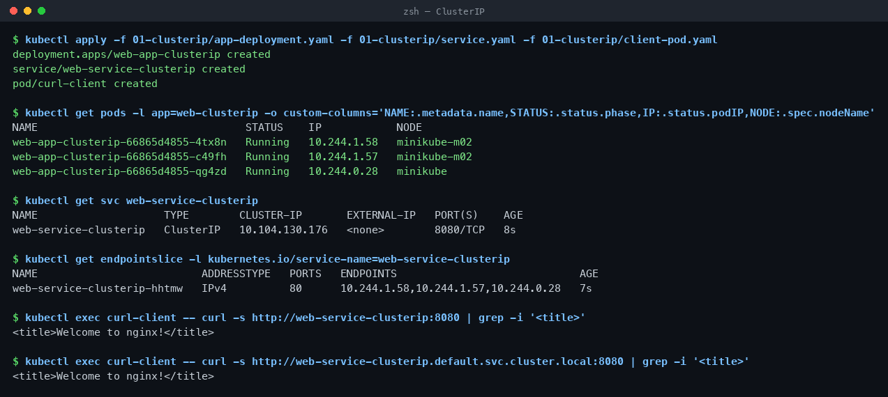
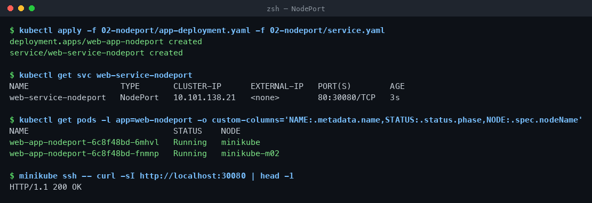
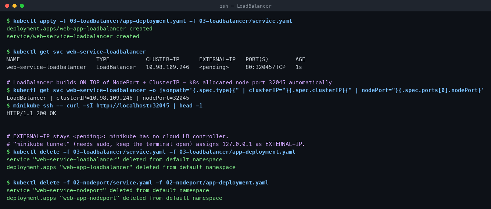
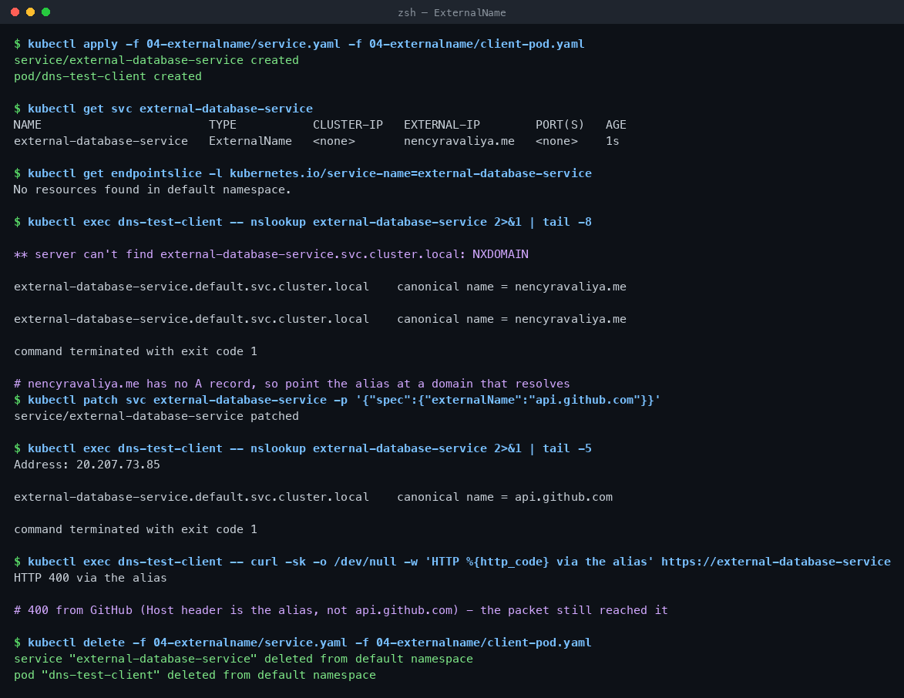
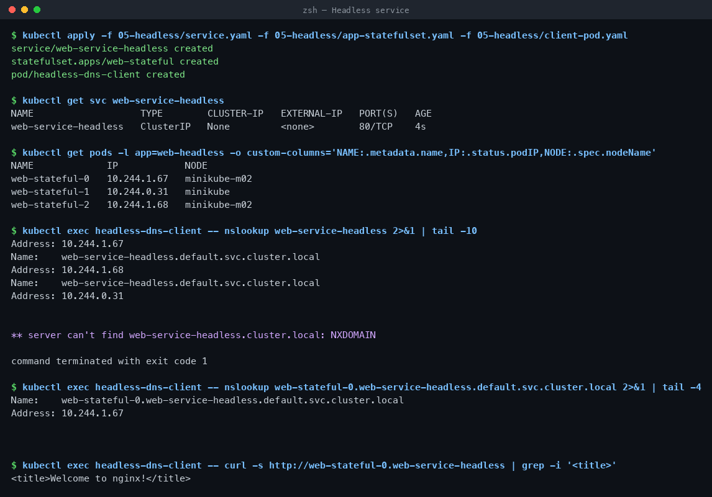
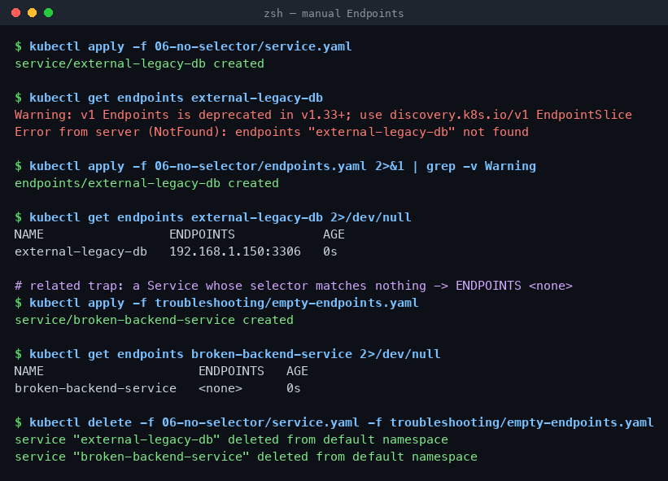
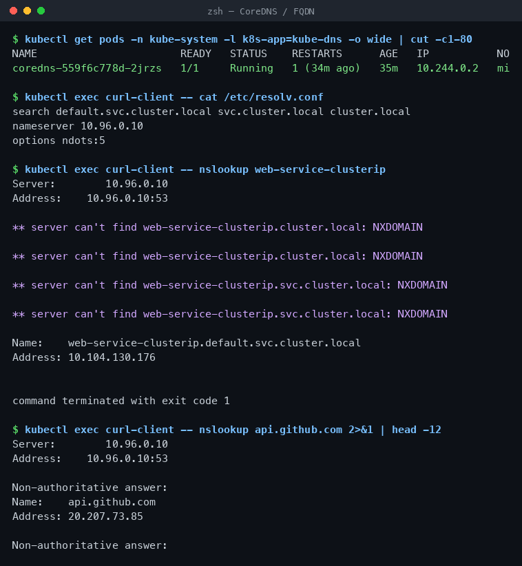
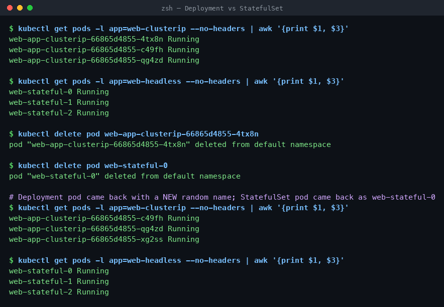
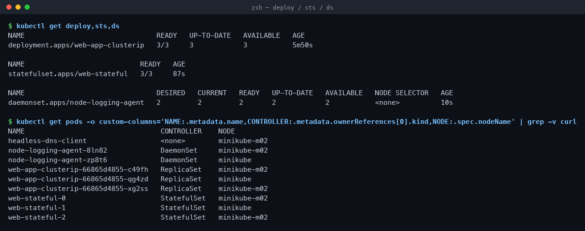
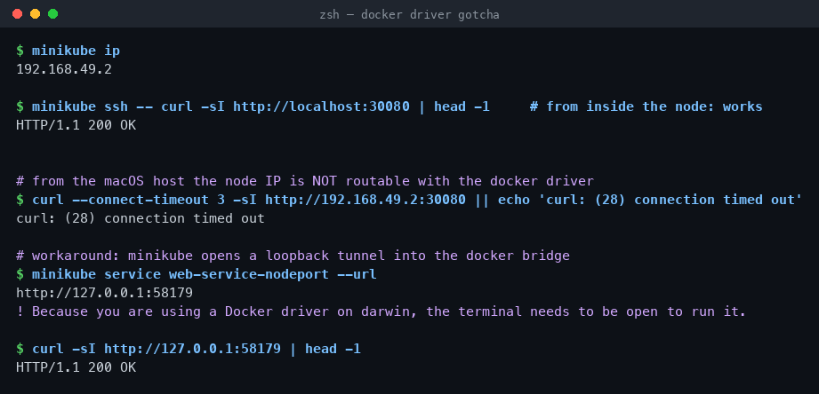

# Session 11 — Kubernetes Services & Cluster DNS

**Repo:** devops-heros / `session-11-kubernetes-services`
**Cluster:** minikube v1.39.0, Kubernetes v1.37.0, 2 nodes, Docker driver on macOS (Apple Silicon).

---

## Task 1 — The 4 ports

```
Client ──► nodePort 30080        (open on every node's IP, 30000–32767)
              └──► port 8080     (the Service's ClusterIP)
                      └──► targetPort 80    (the Pod)
                              └──► containerPort 80   (the process inside the container)
```

| Port | Declared in | Real effect |
| :--- | :--- | :--- |
| `containerPort` | Pod spec | None. Documentation only — the process listens whether you declare it or not. |
| `targetPort` | Service | The Pod port traffic is forwarded to. Can be a name, not just a number. |
| `port` | Service | The port the ClusterIP listens on, for in-cluster clients. |
| `nodePort` | Service (NodePort/LB) | Opens that port on **every** node. |

```bash
kubectl explain service.spec.ports
```

---

## Task 2 — ClusterIP (`01-clusterip/`)

Default type. Internal-only virtual IP, load balanced across the matching pods.

```bash
kubectl apply -f 01-clusterip/app-deployment.yaml -f 01-clusterip/service.yaml -f 01-clusterip/client-pod.yaml
```

```
NAME                                 STATUS    IP            NODE
web-app-clusterip-66865d4855-4tx8n   Running   10.244.1.58   minikube-m02
web-app-clusterip-66865d4855-c49fh   Running   10.244.1.57   minikube-m02
web-app-clusterip-66865d4855-qg4zd   Running   10.244.0.28   minikube

NAME                    TYPE        CLUSTER-IP       EXTERNAL-IP   PORT(S)    AGE
web-service-clusterip   ClusterIP   10.104.130.176   <none>        8080/TCP   8s

NAME                          ADDRESSTYPE   PORTS   ENDPOINTS
web-service-clusterip-hhtmw   IPv4          80      10.244.1.58,10.244.1.57,10.244.0.28
```

The EndpointSlice is built by the endpoint controller from the label selector — that list is what kube-proxy actually programs.

```bash
kubectl exec curl-client -- curl -s http://web-service-clusterip:8080 | grep -i '<title>'
kubectl exec curl-client -- curl -s http://web-service-clusterip.default.svc.cluster.local:8080 | grep -i '<title>'
```

```
<title>Welcome to nginx!</title>
<title>Welcome to nginx!</title>
```

Short name and full FQDN both work — see Task 8 for why.



---

## Task 3 — NodePort (`02-nodeport/`)

```bash
kubectl apply -f 02-nodeport/app-deployment.yaml -f 02-nodeport/service.yaml
kubectl get svc web-service-nodeport
```

```
NAME                   TYPE       CLUSTER-IP      EXTERNAL-IP   PORT(S)        AGE
web-service-nodeport   NodePort   10.101.138.21   <none>        80:30080/TCP   3s

NAME                              STATUS    NODE
web-app-nodeport-6c8f48bd-6mhvl   Running   minikube
web-app-nodeport-6c8f48bd-fnmnp   Running   minikube-m02

$ minikube ssh -- curl -sI http://localhost:30080 | head -1
HTTP/1.1 200 OK
```

`80:30080/TCP` = ClusterIP port 80, node port 30080. Port 30080 is open on **both** nodes even though each only runs one pod — kube-proxy forwards across nodes. Hitting it from macOS is a separate problem, see Task 12.



---

## Task 4 — LoadBalancer (`03-loadbalancer/`)

```bash
kubectl apply -f 03-loadbalancer/app-deployment.yaml -f 03-loadbalancer/service.yaml
kubectl get svc web-service-loadbalancer
```

```
NAME                       TYPE           CLUSTER-IP      EXTERNAL-IP   PORT(S)        AGE
web-service-loadbalancer   LoadBalancer   10.98.109.246   <pending>     80:32045/TCP   1s

$ kubectl get svc web-service-loadbalancer \
    -o jsonpath='{.spec.type}{" | clusterIP="}{.spec.clusterIP}{" | nodePort="}{.spec.ports[0].nodePort}'
LoadBalancer | clusterIP=10.98.109.246 | nodePort=32045

$ minikube ssh -- curl -sI http://localhost:32045 | head -1
HTTP/1.1 200 OK
```

Two things to notice:

1. **LoadBalancer is a superset** — Kubernetes silently allocated a ClusterIP *and* a NodePort (32045) underneath it. The cloud LB just points at that node port.
2. **`EXTERNAL-IP` stays `<pending>`** because minikube has no cloud controller to call. On EKS/GKE/AKS this field fills in with a real LB address in a minute or two.

To fake it locally, run in a second terminal (needs sudo, and the terminal must stay open):

```bash
minikube tunnel      # EXTERNAL-IP becomes 127.0.0.1, then: curl http://localhost
```



---

## Task 5 — ExternalName (`04-externalname/`)

No selector, no endpoints, no proxying — CoreDNS just returns a CNAME.

```bash
kubectl apply -f 04-externalname/service.yaml -f 04-externalname/client-pod.yaml
kubectl get svc external-database-service
```

```
NAME                        TYPE           CLUSTER-IP   EXTERNAL-IP        PORT(S)   AGE
external-database-service   ExternalName   <none>       nencyravaliya.me   <none>    1s

$ kubectl get endpointslice -l kubernetes.io/service-name=external-database-service
No resources found in default namespace.

$ kubectl exec dns-test-client -- nslookup external-database-service
external-database-service.default.svc.cluster.local   canonical name = nencyravaliya.me
```

`nencyravaliya.me` has no A record, so re-pointed the alias at a domain that resolves to prove traffic actually flows:

```bash
kubectl patch svc external-database-service -p '{"spec":{"externalName":"api.github.com"}}'
```

```
Address: 20.207.73.85
external-database-service.default.svc.cluster.local   canonical name = api.github.com

$ kubectl exec dns-test-client -- curl -sk -o /dev/null -w 'HTTP %{http_code}' https://external-database-service
HTTP 400 via the alias
```

400 is GitHub rejecting the Host header (it is the alias name, not `api.github.com`) — the packet still got there. Real use: point `db-service` at an RDS endpoint so app code never hardcodes the cloud hostname, and so you can swap dev/prod targets by editing one Service.



---

## Task 6 — Headless service (`05-headless/`)

`clusterIP: None` → no virtual IP, no load balancing. DNS returns every pod IP directly.

```bash
kubectl apply -f 05-headless/service.yaml -f 05-headless/app-statefulset.yaml -f 05-headless/client-pod.yaml
```

```
NAME                   TYPE        CLUSTER-IP   EXTERNAL-IP   PORT(S)   AGE
web-service-headless   ClusterIP   None         <none>        80/TCP    4s

NAME             IP            NODE
web-stateful-0   10.244.1.67   minikube-m02
web-stateful-1   10.244.0.31   minikube
web-stateful-2   10.244.1.68   minikube-m02

$ kubectl exec headless-dns-client -- nslookup web-service-headless
Address: 10.244.1.67
Address: 10.244.1.68
Address: 10.244.0.31          <- three A records, one per pod
```

Each pod also gets its own stable DNS name:

```bash
kubectl exec headless-dns-client -- nslookup web-stateful-0.web-service-headless.default.svc.cluster.local
kubectl exec headless-dns-client -- curl -s http://web-stateful-0.web-service-headless | grep -i '<title>'
```

```
Name:    web-stateful-0.web-service-headless.default.svc.cluster.local
Address: 10.244.1.67

<title>Welcome to nginx!</title>
```

This is why Kafka, Cassandra and MongoDB replica sets need a headless Service: a client must reach *a specific* broker/primary, not "any pod".



---

## Task 7 — Service without a selector (`06-no-selector/`)

Drop the selector and Kubernetes stops managing endpoints — you write them yourself.

```bash
kubectl apply -f 06-no-selector/service.yaml
kubectl get endpoints external-legacy-db
```

```
Error from server (NotFound): endpoints "external-legacy-db" not found
```

```bash
kubectl apply -f 06-no-selector/endpoints.yaml     # name MUST equal the Service name
kubectl get endpoints external-legacy-db
```

```
NAME                 ENDPOINTS            AGE
external-legacy-db   192.168.1.150:3306   0s
```

Pods now reach an off-cluster MySQL box via a normal cluster DNS name.

Related trap — a selector with a typo compiles fine but matches nothing:

```bash
kubectl apply -f troubleshooting/empty-endpoints.yaml
kubectl get endpoints broken-backend-service
```

```
NAME                     ENDPOINTS   AGE
broken-backend-service   <none>      0s
```

`ENDPOINTS: <none>` is the first thing to check when a Service returns connection refused.



---

## Task 8 — CoreDNS, FQDN and `ndots:5`

```bash
kubectl get pods -n kube-system -l k8s-app=kube-dns
kubectl exec curl-client -- cat /etc/resolv.conf
```

```
NAME                       READY   STATUS    IP
coredns-559f6c778d-2jrzs   1/1     Running   10.244.0.2

search default.svc.cluster.local svc.cluster.local cluster.local
nameserver 10.96.0.10
options ndots:5
```

FQDN anatomy: `web-service-clusterip` **.** `default` **.** `svc` **.** `cluster.local`
→ service **.** namespace **.** resource type **.** cluster domain

`ndots:5` means: any name with fewer than 5 dots gets every `search` suffix appended first. Watch it happen:

```
$ kubectl exec curl-client -- nslookup web-service-clusterip
** server can't find web-service-clusterip.cluster.local: NXDOMAIN
** server can't find web-service-clusterip.svc.cluster.local: NXDOMAIN
Name:    web-service-clusterip.default.svc.cluster.local
Address: 10.104.130.176
```

Two search suffixes are tried and fail (each repeated for A and AAAA) before the right one resolves. For an external call like `api.stripe.com` (2 dots < 5) every request pays 3 NXDOMAINs before the real lookup — a well-known source of latency and CoreDNS load in production. Fixes: use a trailing dot (`api.stripe.com.`) or set `dnsConfig.options ndots: 1` on the pod.



---

## Task 9 — Pod identity: Deployment vs StatefulSet

Both running, then delete one pod from each:

```bash
kubectl delete pod web-app-clusterip-66865d4855-4tx8n
kubectl delete pod web-stateful-0
```

**Before**

```
web-app-clusterip-66865d4855-4tx8n Running      web-stateful-0 Running
web-app-clusterip-66865d4855-c49fh Running      web-stateful-1 Running
web-app-clusterip-66865d4855-qg4zd Running      web-stateful-2 Running
```

**After**

```
web-app-clusterip-66865d4855-c49fh Running      web-stateful-0 Running
web-app-clusterip-66865d4855-qg4zd Running      web-stateful-1 Running
web-app-clusterip-66865d4855-xg2ss Running      web-stateful-2 Running
        ^ new random suffix                            ^ same ordinal back
```

Deployment pods are cattle — the replacement has a new name, new IP, new DNS record. StatefulSet pods are pets — `web-stateful-0` comes back as `web-stateful-0`, with the same DNS name and the same PVC.



---

## Task 10 — Deployment vs StatefulSet vs DaemonSet

```
$ kubectl get deploy,sts,ds
deployment.apps/web-app-clusterip    3/3
statefulset.apps/web-stateful        3/3
daemonset.apps/node-logging-agent    2 desired / 2 ready
```

| | Deployment | StatefulSet | DaemonSet |
| :--- | :--- | :--- | :--- |
| **Workload** | Stateless APIs, web front ends | Databases, queues, anything clustered | Node-level agents |
| **Pod names** | `<name>-<rs-hash>-<random>` | `<name>-0, -1, -2` | `<name>-<random>`, one per node |
| **Identity** | Disposable | Stable name, DNS and storage | Tied to its node |
| **Start / stop order** | Parallel, any order | Sequential 0→1→2, reverse on delete | Parallel on all nodes |
| **Storage** | Shared or emptyDir | One PVC per ordinal (`volumeClaimTemplates`) | hostPath / node-local |
| **Service** | ClusterIP / NodePort / LB | Headless (`clusterIP: None`) required | Usually none |
| **Scaling** | `replicas: N`, anywhere | Ordinal, from the tail | Automatic with node count |
| **Examples** | Nginx, Flask, Node API | Kafka, MongoDB, PostgreSQL, ZooKeeper | Fluentd, node-exporter, Cilium, Falco |



---

## Task 11 — Cost & service selection

### The LoadBalancer-per-service anti-pattern

```
BAD — one cloud LB per microservice
  svc A ──► NLB 1  ($25/mo)
  svc B ──► NLB 2  ($25/mo)
  svc C ──► NLB 3  ($25/mo)
  50 services = ~$1,250/month, 50 IPs to manage, 50 TLS certs

GOOD — one LB, one Ingress controller
  Internet ──► 1 LB ($25/mo) ──► NGINX Ingress Controller ──► ClusterIP A / B / C ...
  50 services = ~$25/month, one IP, one cert, host+path routing
```

Same saving applies to certificates and DNS records, not just the LB bill.

### Decision tree

```
Need access from outside the cluster?
├── NO ──► need to address individual pods (Kafka, DB replicas)?
│          ├── YES ──► Headless Service (clusterIP: None)
│          └── NO  ──► ClusterIP
└── YES ─► pointing at an external domain (RDS, Stripe)?
           ├── YES ──► ExternalName
           └── NO  ─► on a managed cloud?
                      ├── YES + HTTP/HTTPS ──► one Ingress behind one LoadBalancer,
                      │                        apps stay ClusterIP
                      ├── YES + raw TCP/UDP ──► LoadBalancer
                      └── NO (local / on-prem) ──► NodePort
```

---

## Task 12 — Minikube Docker driver: why `<node-ip>:<nodePort>` fails

```bash
minikube ip                                          # 192.168.49.2
minikube ssh -- curl -sI http://localhost:30080      # HTTP/1.1 200 OK     (inside the node)
curl --connect-timeout 3 -sI http://192.168.49.2:30080
```

```
curl: (28) connection timed out
```

**Cause:** with `--driver=docker` the "node" is a container on an internal Docker bridge network. On Linux that bridge lives in the host kernel, so `192.168.49.2` is routable. On macOS and Windows, Docker Desktop runs the daemon inside its own Linux VM — the host has no route to `192.168.49.x` at all. The node port is open; the address is simply unreachable from the Mac.

**Workaround 1 — loopback tunnel per service:**

```bash
minikube service web-service-nodeport --url
```

```
http://127.0.0.1:58179
! Because you are using a Docker driver on darwin, the terminal needs to be open to run it.

$ curl -sI http://127.0.0.1:58179 | head -1
HTTP/1.1 200 OK
```

**Workaround 2 — `minikube tunnel`:** runs as root, adds host routes and binds privileged ports, so `type: LoadBalancer` services get `EXTERNAL-IP: 127.0.0.1` and plain `http://localhost` works. Also must stay open in its own terminal.

`kubectl port-forward svc/<name> 8080:80` works too and needs no sudo.



---

## Cleanup

```bash
kubectl delete -f 01-clusterip/ -f 02-nodeport/ -f 03-loadbalancer/ -f 04-externalname/ -f 05-headless/ -f 06-no-selector/ --ignore-not-found
```
