# Session 12 — Ingress, ConfigMaps & Secrets

**Repo:** devops-heros / `session-12-ingress-configmaps-secrets`
**Cluster:** minikube v1.39.0, Kubernetes v1.37.0, 2 nodes, Docker driver on macOS (Apple Silicon), `ingress` addon enabled.

```bash
cd session-12-ingress-configmaps-secrets
```

---

## Task 1 — ConfigMap: decouple config from the image

```bash
kubectl apply -f 01-configmap/app-config.yaml
kubectl describe configmap yatri-app-config
kubectl get configmap yatri-app-config -o jsonpath='{.data.ENVIRONMENT}'
```

```
NAME               DATA   AGE
yatri-app-config   5      1s

Data
====
DEFAULT_CURRENCY:   INR
ENVIRONMENT:        production
LOG_LEVEL:          INFO
MAX_BOOKING_DAYS:   30
PORT:               5000

$ kubectl get configmap yatri-app-config -o jsonpath='{.data.ENVIRONMENT}'
production
```

Same image, different ConfigMap per environment — that is the whole point.

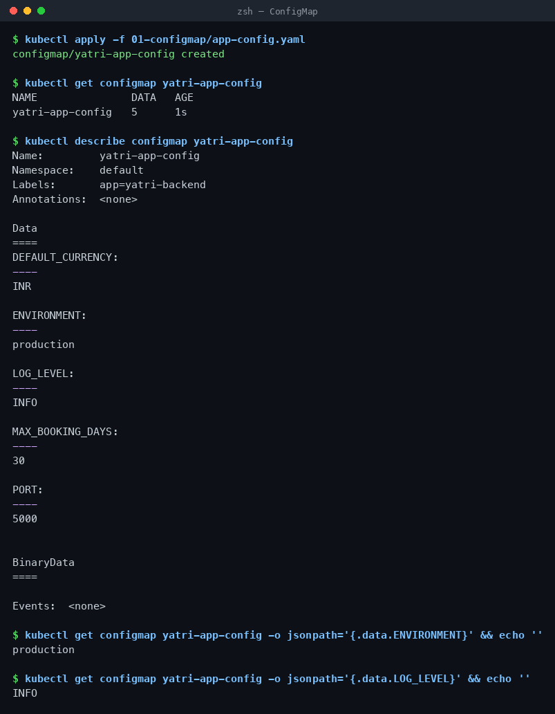

---

## Task 2 — ConfigMap updates do NOT reach running pods

```bash
kubectl patch configmap yatri-app-config --type merge -p '{"data":{"ENVIRONMENT":"staging"}}'
kubectl exec deploy/yatri-backend -- env | grep ENVIRONMENT
```

```
configmap/yatri-app-config patched
staging   <- ConfigMap is updated

ENVIRONMENT=production   <- but the running pod still says production
```

Environment variables are copied into the container **once, at start**. The fix is a rolling restart, not a pod delete:

```bash
kubectl rollout restart deployment/yatri-backend
kubectl rollout status deployment/yatri-backend
kubectl exec deploy/yatri-backend -- env | grep ENVIRONMENT
```

```
deployment.apps/yatri-backend restarted
deployment "yatri-backend" successfully rolled out
ENVIRONMENT=staging
```

Mounted as a **volume** instead of `env`, a ConfigMap does update live (~60s kubelet sync) — but the app has to re-read the file.

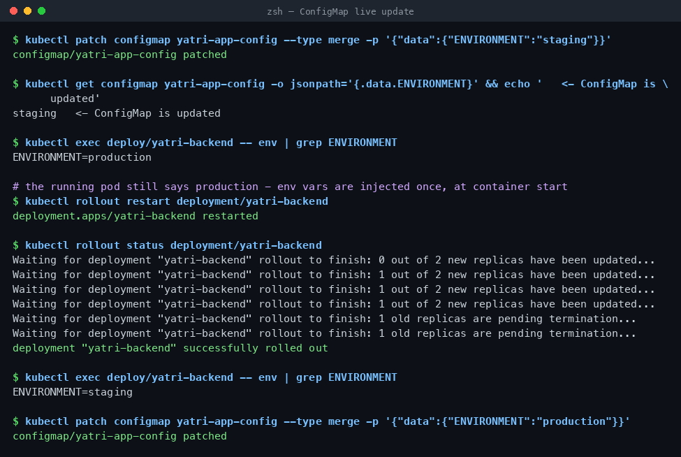

---

## Task 3 — Secret: Base64 is encoding, not encryption

```bash
kubectl apply -f 02-secret/db-secret.yaml
kubectl describe secret yatri-db-secret
kubectl get secret yatri-db-secret -o jsonpath='{.data.POSTGRES_PASSWORD}' | base64 --decode
```

```
NAME              TYPE     DATA   AGE
yatri-db-secret   Opaque   3      0s

Data
====
POSTGRES_DB:        19 bytes
POSTGRES_PASSWORD:  14 bytes
POSTGRES_USER:      11 bytes

$ ... | base64 --decode
secretpassword
yatri_admin
```

`describe` masks the values as byte counts, but anyone with `get secret` RBAC decodes them in one command. Real protection comes from RBAC + etcd encryption-at-rest, not from Base64.

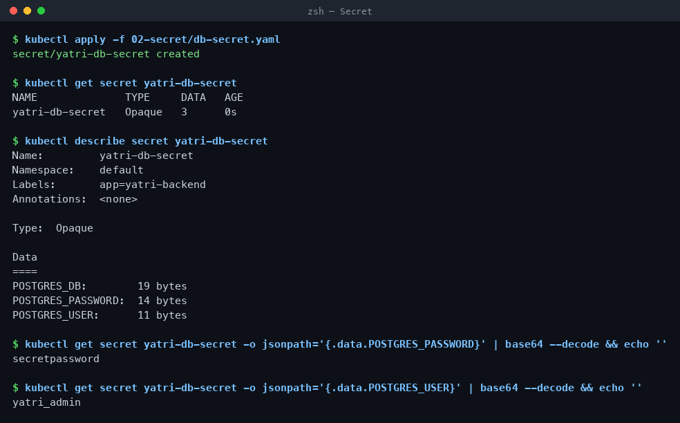

---

## Task 4 — The trailing newline gotcha

```bash
echo    'secretpassword' | xxd | tail -1
echo    'secretpassword' | base64
echo -n 'secretpassword' | xxd | tail -1
echo -n 'secretpassword' | base64
```

```
00000000: 7365 6372 6574 7061 7373 776f 7264 0a    secretpassword.
c2VjcmV0cGFzc3dvcmQK        <- WRONG, ends in K

00000000: 7365 6372 6574 7061 7373 776f 7264       secretpassword
c2VjcmV0cGFzc3dvcmQ=        <- RIGHT, ends in =
```

That extra `0a` is a real byte in the Secret. Postgres receives `secretpassword\n`, the password does not match, and you get an auth failure that looks like a wrong password. Always `echo -n`, or use `kubectl create secret generic --from-literal=` which handles it for you.

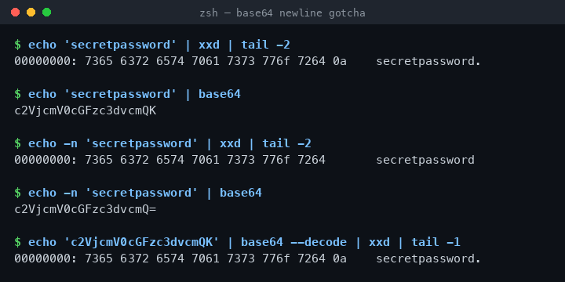

---

## Task 5 — Enterprise secret management

```bash
kubectl get crds | grep -i secret
```

```
No resources found
Standard native secrets in use - no external secret operator installed
```

**Why committing Secret YAML to Git is wrong**

- Git history is forever — `git rm` does not remove the value from earlier commits.
- Anyone with repo read access gets production credentials; repo access ≠ cluster RBAC.
- No rotation, no expiry, no audit trail of who read what.

**How it is actually done**

```
AWS Secrets Manager / Azure Key Vault / HashiCorp Vault
        │  (IRSA / workload identity — no static credentials)
        ▼
External Secrets Operator  or  Vault Agent Injector
        │  syncs on an interval, handles rotation
        ▼
Kubernetes Secret (created in-cluster, never in Git)
        ▼
Pod  ──  env var  or  mounted volume
```

Git holds only an `ExternalSecret` CR naming *which* secret to fetch — never the value.

**CI/CD:** GitHub Actions secrets / Azure DevOps Variable Groups inject values at deploy time (`envsubst`, Helm `--set`, `kubectl create secret --from-literal`), so the manifest repo stays clean.

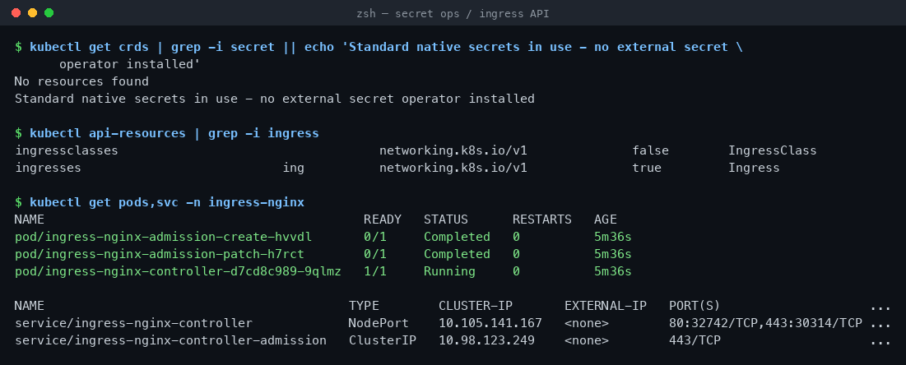

---

## Task 6 — ConfigMap + Secret injected together

`04-full-demo/backend.yaml` uses both styles: `envFrom.configMapRef` for bulk plain config, `env.valueFrom.secretKeyRef` for each credential.

```bash
kubectl apply -f 04-full-demo/configmap.yaml -f 04-full-demo/secret.yaml \
              -f 04-full-demo/backend.yaml -f 04-full-demo/frontend.yaml
kubectl exec deploy/yatri-backend -- env | grep -E 'ENVIRONMENT|LOG_LEVEL|POSTGRES|DEFAULT_CURRENCY'
```

```
NAME                             READY   STATUS    RESTARTS   AGE
yatri-backend-6c58cb99c7-9gdr4   1/1     Running   0          1s
yatri-frontend-ddcfc4b5f-78n7j   1/1     Running   0          1s

DEFAULT_CURRENCY=INR
ENVIRONMENT=production
LOG_LEVEL=INFO
POSTGRES_DB=yatri_production_db
POSTGRES_PASSWORD=secretpassword
POSTGRES_USER=yatri_admin
```

`envFrom` pulls every ConfigMap key at once; `secretKeyRef` names one key at a time, which is what you want for credentials — explicit, and easy to audit.

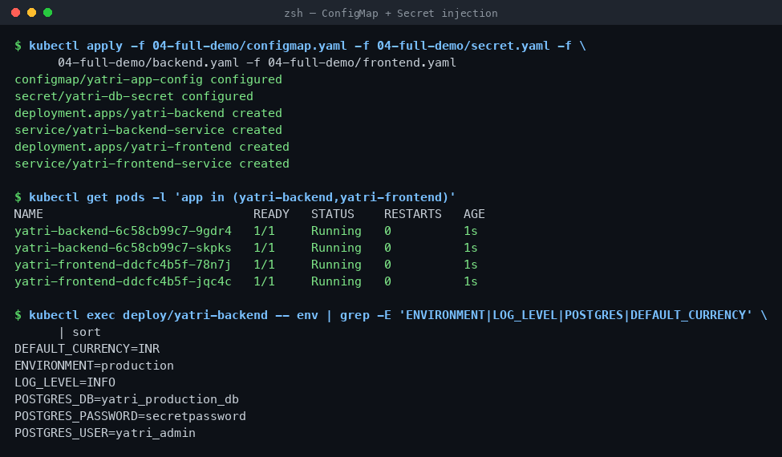

---

## Task 7 — Ingress resource vs Ingress Controller

```bash
kubectl api-resources | grep -i ingress
```

```
ingressclasses     networking.k8s.io/v1   false   IngressClass
ingresses    ing   networking.k8s.io/v1   true    Ingress
```

| | Ingress **resource** | Ingress **controller** |
| :--- | :--- | :--- |
| What it is | A YAML object in etcd — hosts, paths, TLS refs | A running pod (NGINX / Traefik / HAProxy / Envoy) |
| What it does | Nothing on its own | Watches the API, regenerates `nginx.conf`, reloads, serves traffic |
| Installed by | You, with `kubectl apply` | Cluster admin, once (`minikube addons enable ingress`) |
| If missing | Rules are silently ignored | Nothing routes at all |

Apply an Ingress with no controller installed and nothing breaks and nothing works — the object just sits there with an empty `ADDRESS`. Same if you forget `ingressClassName: nginx`.

---

## Task 8 — Enable and verify the NGINX Ingress Controller

```bash
minikube addons enable ingress
kubectl get pods -n ingress-nginx
kubectl wait --namespace ingress-nginx --for=condition=ready pod \
  --selector=app.kubernetes.io/component=controller --timeout=120s
kubectl get svc -n ingress-nginx
```

```
- Using image registry.k8s.io/ingress-nginx/controller:v1.15.1
* The 'ingress' addon is enabled

NAME                                       READY   STATUS      RESTARTS   AGE
ingress-nginx-admission-create-hvvdl       0/1     Completed   0          38s
ingress-nginx-admission-patch-h7rct        0/1     Completed   0          38s
ingress-nginx-controller-d7cd8c989-9qlmz   1/1     Running     0          38s

pod/ingress-nginx-controller-d7cd8c989-9qlmz condition met

NAME                       TYPE       CLUSTER-IP       PORT(S)
ingress-nginx-controller   NodePort   10.105.141.167   80:32742/TCP,443:30314/TCP
```

The two `Completed` pods are one-shot Jobs that generate and patch the admission webhook's TLS cert — they are supposed to stay Completed.

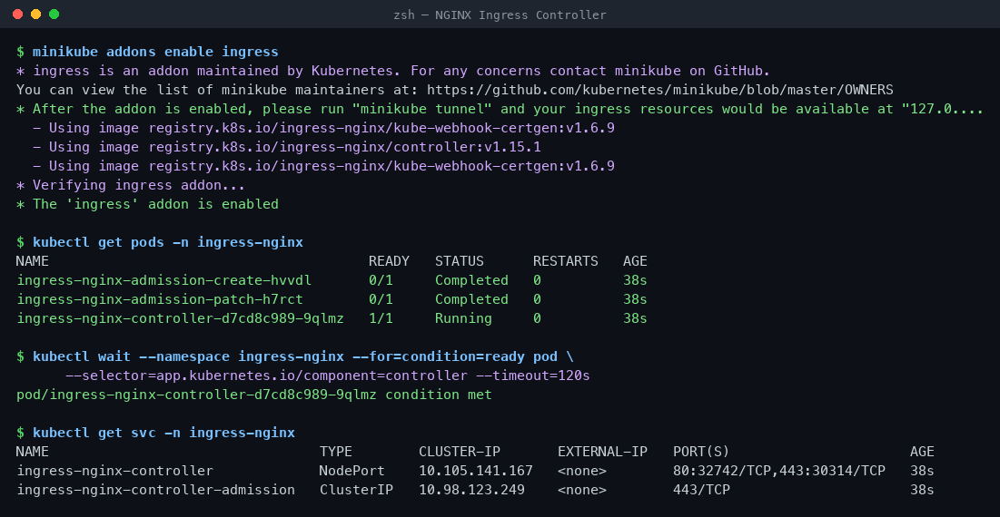

---

## Task 9 — Local DNS mapping (`/etc/hosts`)

```bash
minikube ip
echo "$(minikube ip)  yatri.local" | sudo tee -a /etc/hosts
```

```
192.168.49.2
not mapped yet
sudo: a password is required
```

Two separate problems here:

1. `/etc/hosts` needs sudo. Run it yourself in a terminal to persist the entry.
2. Even with the entry, `curl http://yatri.local` still fails from macOS — on the Docker driver `192.168.49.2` is not routable from the host (same reason as Session 11, Task 12). You also need `minikube tunnel`.

No-sudo alternative that works today — port-forward the controller and set the Host header yourself:

```bash
kubectl port-forward -n ingress-nginx svc/ingress-nginx-controller 8080:80 &
curl -s -H 'Host: yatri.local' http://localhost:8080/ | grep -i '<title>'
curl -s -H 'Host: yatri.local' http://localhost:8080/api/
```

```
<title>Welcome to nginx!</title>

Yatri Backend API
=================
ENVIRONMENT     : production
LOG_LEVEL       : INFO
DEFAULT_CURRENCY: INR
POSTGRES_USER   : yatri_admin
POSTGRES_DB     : yatri_production_db
```

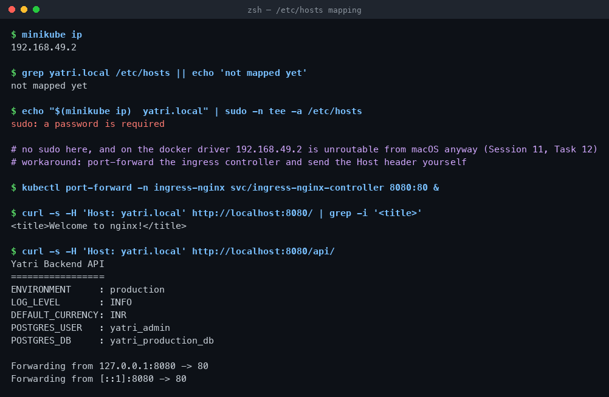

---

## Task 10 — Path-based routing (Layer 7)

```bash
kubectl apply -f 04-full-demo/ingress.yaml
kubectl describe ingress yatri-ingress
```

```
Rules:
  Host         Path             Backends
  ----         ----             --------
  yatri.local
               /api(/|$)(.*)    yatri-backend-service:80  (10.244.1.5:5000,10.244.0.9:5000)
               /                yatri-frontend-service:80 (10.244.1.2:80,10.244.0.6:80)

Annotations:   nginx.ingress.kubernetes.io/rewrite-target: /$2
               nginx.ingress.kubernetes.io/ssl-redirect: false
               nginx.ingress.kubernetes.io/use-regex: true
```

Tested from inside the node:

```bash
minikube ssh -- 'curl -s -H "Host: yatri.local" http://localhost/ | grep -i "<title>"'
minikube ssh -- 'curl -s -H "Host: yatri.local" http://localhost/api/'
```

```
<title>Welcome to nginx!</title>

Yatri Backend API
=================
ENVIRONMENT     : production
LOG_LEVEL       : INFO
DEFAULT_CURRENCY: INR
POSTGRES_USER   : yatri_admin
POSTGRES_DB     : yatri_production_db
```

One IP, one port, two microservices. `rewrite-target: /$2` strips `/api` before forwarding, so the backend sees `/` and does not need to know its own public prefix. The `(.*)` capture group is `$2`, which is why `use-regex: true` is required.

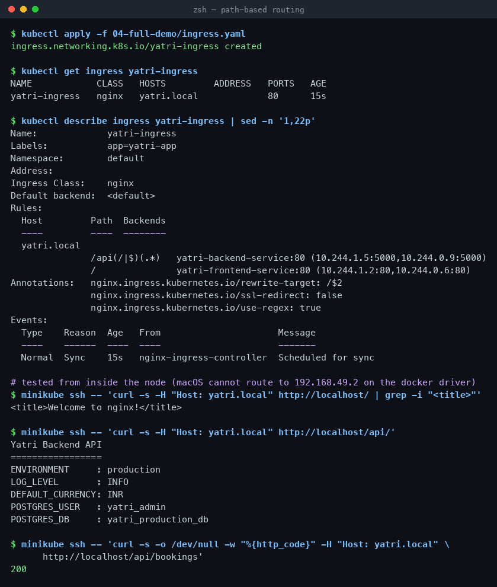

---

## Tasks 11 & 12 — Host-based and hybrid routing

`03-ingress/ingress-tls.yaml` does both in one object: two virtual hosts, and the API host also filters on a path.

```bash
kubectl apply -f 03-ingress/ingress-tls.yaml
kubectl describe ingress campus-ingress-tls
```

```
TLS:
  campus-tls-cert terminates portal.campus.local,api.campus.local
Rules:
  Host                  Path              Backends
  ----                  ----              --------
  portal.campus.local
                        /()(.*)           yatri-frontend-service:80
  api.campus.local
                        /api(/|$)(.*)     yatri-backend-service:80
```

```bash
minikube ssh -- 'curl -sk --resolve portal.campus.local:443:127.0.0.1 https://portal.campus.local/ | grep -i "<title>"'
minikube ssh -- 'curl -sk --resolve api.campus.local:443:127.0.0.1 https://api.campus.local/api/'
minikube ssh -- 'curl -s -o /dev/null -w "HTTP %{http_code} -> %{redirect_url}" -H "Host: portal.campus.local" http://localhost/'
```

```
<title>Welcome to nginx!</title>

Yatri Backend API
=================
ENVIRONMENT     : production
...

HTTP 308 -> https://portal.campus.local/
```

Same node IP, same port 443 — only the `Host` header (SNI) decides which service answers. The `308` is `ssl-redirect: "true"` pushing plain HTTP up to HTTPS.

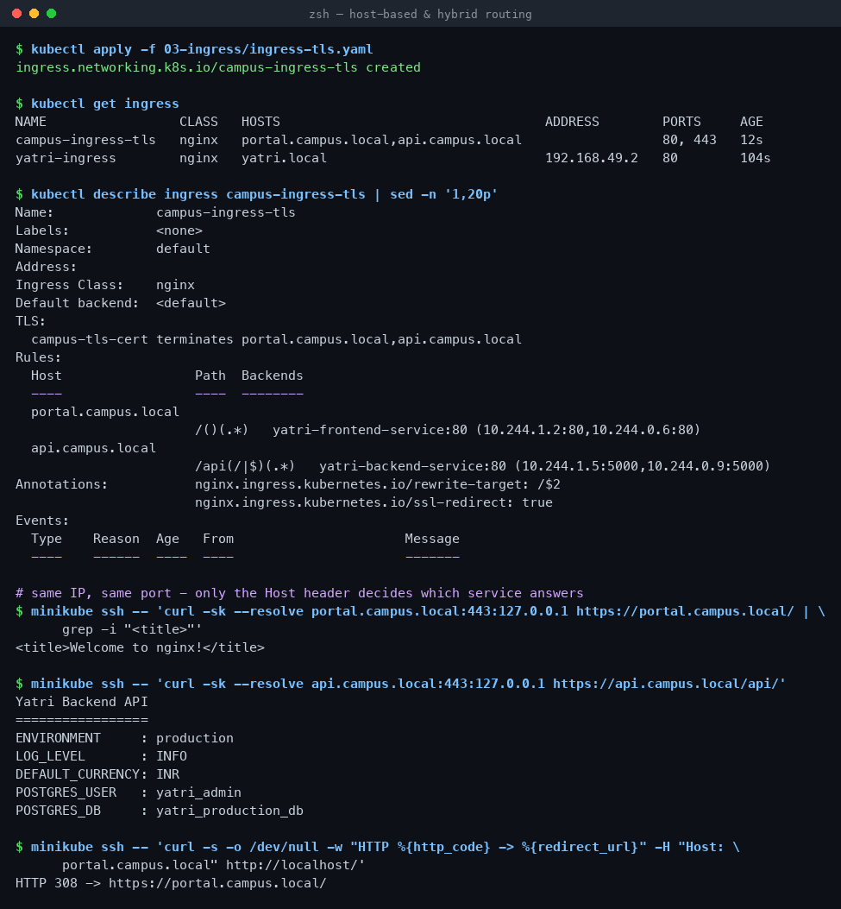

---

## Task 13 — TLS termination

```bash
openssl req -x509 -nodes -days 365 -newkey rsa:2048 -keyout tls.key -out tls.crt \
  -subj '/CN=campus.local/O=CampusDevOps'
kubectl create secret tls campus-tls-cert --cert=tls.crt --key=tls.key
```

```
secret/campus-tls-cert created

NAME              TYPE                DATA   AGE
campus-tls-cert   kubernetes.io/tls   2      0s
```

First attempt served the **wrong certificate**:

```
* SSL connection using TLSv1.3 / TLS_AES_256_GCM_SHA384
*  subject: O=Acme Co; CN=Kubernetes Ingress Controller Fake Certificate
< HTTP/2 200
```

The controller log says why:

```
SSL certificate "default/campus-tls-cert" does not contain a Common Name or
Subject Alternative Name for server "portal.campus.local" ... Using default certificate
```

Modern x509 validation ignores CN entirely — the cert needs a **SAN**. Regenerated with `-addext`:

```bash
openssl req -x509 -nodes -days 365 -newkey rsa:2048 -keyout tls.key -out tls.crt \
  -subj '/CN=campus.local/O=CampusDevOps' \
  -addext 'subjectAltName=DNS:campus.local,DNS:portal.campus.local,DNS:api.campus.local'
kubectl create secret tls campus-tls-cert --cert=tls.crt --key=tls.key --dry-run=client -o yaml | kubectl apply -f -
```

```
X509v3 Subject Alternative Name:
    DNS:campus.local, DNS:portal.campus.local, DNS:api.campus.local

secret/campus-tls-cert configured

* SSL connection using TLSv1.3 / TLS_AES_256_GCM_SHA384
*  subject: CN=campus.local; O=CampusDevOps       <- our cert now
< HTTP/2 200
```

TLS terminates **at the Ingress controller** — traffic from there to the pods is plain HTTP inside the cluster. `tls.key` and `tls.crt` were generated outside the repo and are not committed.

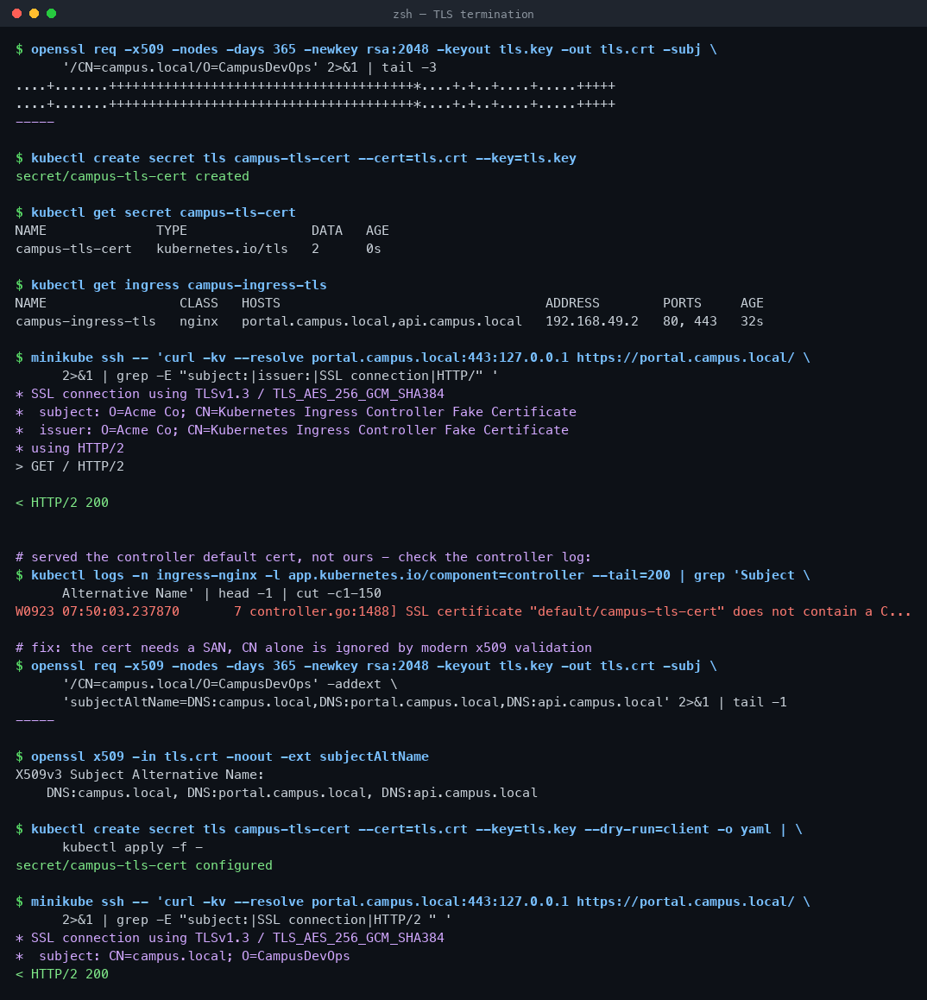

---

## Task 14 — End-to-end automation

`backend.yaml` and `frontend.yaml` each hold a Deployment **and** a Service in one file, separated by `---` — a multi-document YAML, so one `kubectl apply` creates both and one `kubectl delete -f` removes both.

```bash
bash 04-full-demo/run-demo.sh
```

```
[INFO] Step 1: Enabling NGINX Ingress Controller on Minikube...
[INFO] Step 2: Applying ConfigMap (plain-text configuration)...
configmap/yatri-app-config created
[INFO] Step 3: Applying Secret (sensitive database credentials)...
secret/yatri-db-secret created
[INFO] Step 4: Deploying Frontend (Nginx) + ClusterIP Service...
deployment.apps/yatri-frontend created
service/yatri-frontend-service created
[INFO] Step 5: Deploying Backend (Python HTTP server) + ClusterIP Service...
deployment.apps/yatri-backend created
service/yatri-backend-service created
[INFO] Step 6: Waiting for all pods to reach Running state...
deployment "yatri-frontend" successfully rolled out
deployment "yatri-backend" successfully rolled out
[INFO] Step 7: Applying Ingress routing rules...
ingress.networking.k8s.io/yatri-ingress created
[INFO] Step 9: Adding yatri.local to /etc/hosts (requires sudo)...
sudo: a password is required
```

Steps 1–8 complete; step 9 is the `/etc/hosts` write from Task 9 and needs a sudo password.

```bash
kubectl get deploy,svc -l 'app in (yatri-backend,yatri-frontend)'
bash 04-full-demo/cleanup.sh
```

```
deployment.apps/yatri-backend    2/2   2   2   12s
deployment.apps/yatri-frontend   2/2   2   2   12s
service/yatri-backend-service    ClusterIP   10.101.248.235   80/TCP
service/yatri-frontend-service   ClusterIP   10.96.23.42      80/TCP

[INFO] All demo resources removed.

$ kubectl get ingress yatri-ingress
Error from server (NotFound): ingresses.networking.k8s.io "yatri-ingress" not found
```

Both scripts use `set -euo pipefail` and `--ignore-not-found=true`, so cleanup is safe to run twice.

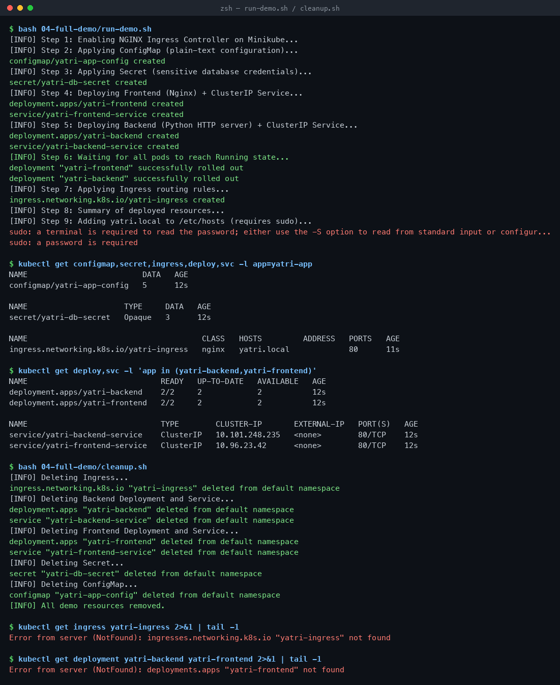

---

## Cleanup

```bash
bash 04-full-demo/cleanup.sh
kubectl delete -f 03-ingress/ingress-tls.yaml --ignore-not-found
kubectl delete secret campus-tls-cert --ignore-not-found
minikube addons disable ingress
```
