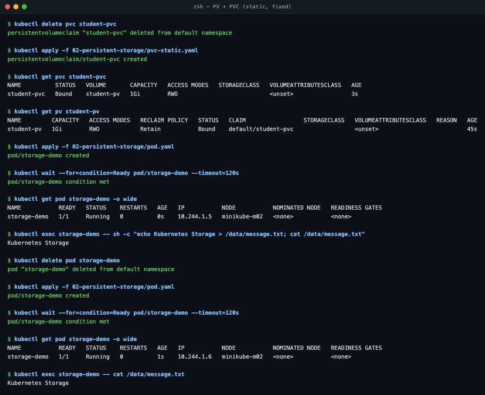
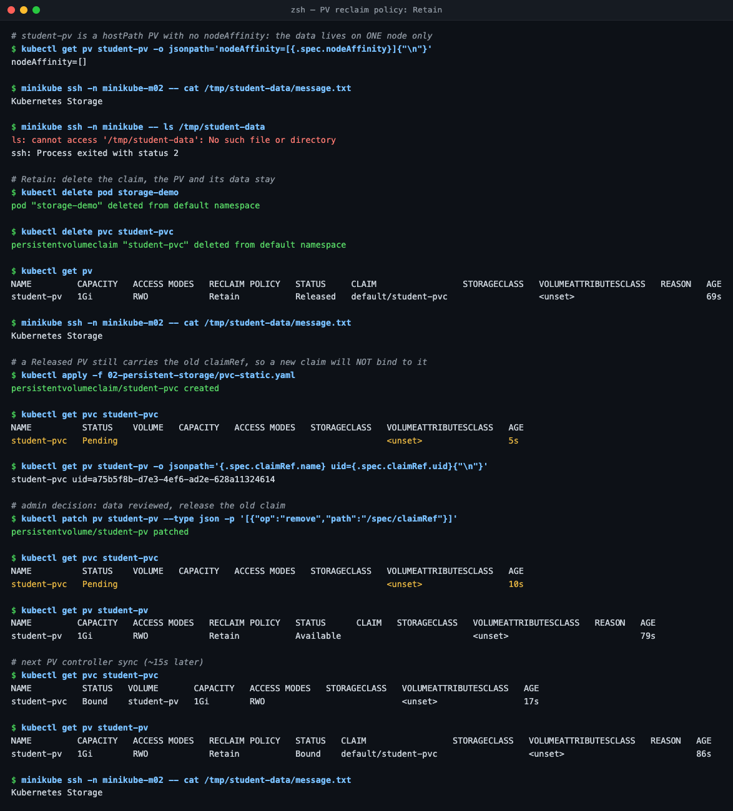

# Task 1 — Kubernetes Volumes

**Cluster:** minikube v1.39.0, Kubernetes v1.37.0, 2 nodes (`minikube`, `minikube-m02`), Docker driver on macOS (Apple Silicon).
The YAML used here is the instructor's, from `../01-volumes`, `../02-persistent-storage` and `../03-storageclass`. Every output below is real and was captured from this cluster.

```
                    lifetime tied to...        where the bytes live
emptyDir            the Pod                    node disk, under /var/lib/kubelet/pods/<pod-uid>/
hostPath            the node                   a fixed directory on whichever node runs the Pod
PV + PVC            the PV (independent)       whatever backs the PV (here: hostPath / local disk)
StorageClass        —                          a template a provisioner uses to create PVs on demand
```

```bash
cd session-13-storage-hpa-probes
```

---

## 1. emptyDir

A scratch directory created **when the Pod is scheduled** and deleted **when the Pod is deleted**. Every container in the Pod can mount it, so it is the standard way for a sidecar to share files with the main container.

```yaml
# 01-volumes/emptydir-pod.yaml
  volumes:
    - name: app-storage
      emptyDir: {}          # medium: Memory  -> tmpfs (RAM, counts against the memory limit)
```

**Practical — container restart vs Pod deletion**

```bash
kubectl apply -f 01-volumes/emptydir-pod.yaml
kubectl exec emptydir-demo -- sh -c "echo Hello Kubernetes > /data/message.txt; cat /data/message.txt"
kubectl exec emptydir-demo -- sh -c "kill 1"            # crash the container, not the Pod
kubectl get pod emptydir-demo
kubectl exec emptydir-demo -- cat /data/message.txt
```

```
Hello Kubernetes

NAME            READY   STATUS    RESTARTS     AGE
emptydir-demo   1/1     Running   1 (8s ago)   9s

Hello Kubernetes          <- survived the container restart
```

The data lives on the node in a directory keyed by the Pod UID:

```
$ minikube ssh -n minikube-m02 -- sudo cat /var/lib/kubelet/pods/75dd9b0f-.../volumes/kubernetes.io~empty-dir/app-storage/message.txt
Hello Kubernetes
```

Now delete the **Pod** and recreate it:

```
$ kubectl delete pod emptydir-demo && kubectl apply -f 01-volumes/emptydir-pod.yaml
$ kubectl exec emptydir-demo -- cat /data/message.txt
cat: /data/message.txt: No such file or directory

$ minikube ssh -n minikube-m02 -- sudo ls /var/lib/kubelet/pods/75dd9b0f-...
ls: cannot access '/var/lib/kubelet/pods/75dd9b0f-...': No such file or directory
```

A new Pod gets a new UID and a new, empty directory. Kubelet garbage-collects the old one a few seconds after deletion. Right after `kubectl delete` the directory was still there.

**Use for:** caches, temp files, sidecar file sharing (log shipper reading app logs). **Never** for data you need to keep.


---

## 2. hostPath

Mounts a directory **from the node's own filesystem** into the Pod. The data outlives the Pod, but only on the node where it was written.

```yaml
# 01-volumes/hostpath-pod.yaml
  volumes:
    - name: host-storage
      hostPath:
        path: /tmp/hostpath-data
        type: DirectoryOrCreate   # create it if missing (others: Directory, File, Socket, ...)
```

**Practical — it's node-local**

```
$ kubectl get pod hostpath-demo -o wide          -> NODE minikube-m02
$ kubectl exec hostpath-demo -- sh -c "echo written-by-hostpath-demo > /data/host.txt"

$ minikube ssh -n minikube-m02 -- cat /tmp/hostpath-data/host.txt
written-by-hostpath-demo
$ minikube ssh -n minikube -- ls -la /tmp/hostpath-data
ls: cannot access '/tmp/hostpath-data': No such file or directory

$ kubectl delete pod hostpath-demo
$ minikube ssh -n minikube-m02 -- cat /tmp/hostpath-data/host.txt
written-by-hostpath-demo        <- outlived the Pod
```

Now the scheduler places the replacement Pod on the **other** node (simulated with `nodeName`):

```
$ kubectl patch -f 01-volumes/hostpath-pod.yaml --local --type merge -p '{"spec":{"nodeName":"minikube"}}' -o yaml | kubectl apply -f -
$ kubectl exec hostpath-demo -- cat /data/host.txt
cat: /data/host.txt: No such file or directory
```

`DirectoryOrCreate` quietly created a **new, empty** directory on `minikube`. The app starts normally and simply has no data, which is the worst kind of failure because nothing errors.

**Use for:** node agents that need node files (log collectors reading `/var/log`, CNI/CSI plugins, `/var/run/containerd/containerd.sock`). Avoid for app data. It's also a security risk, since a Pod with `hostPath: /` can read the whole node. Pod Security "restricted"/"baseline" policies block it.


---

## 3. PersistentVolume (PV)

A cluster-scoped piece of storage with its own lifecycle, independent of any Pod. An admin creates it (static provisioning), or a provisioner creates it (dynamic, §5).

```yaml
# 02-persistent-storage/pv.yaml
kind: PersistentVolume
spec:
  capacity:
    storage: 1Gi
  accessModes: [ReadWriteOnce]
  persistentVolumeReclaimPolicy: Retain
  hostPath:
    path: /tmp/student-data
```

| Field | Meaning |
| :--- | :--- |
| `capacity` | Size offered |
| `accessModes` | `RWO` one node read-write · `ROX` many nodes read-only · `RWX` many nodes read-write · `RWOP` one **Pod** |
| `persistentVolumeReclaimPolicy` | `Retain` keep PV + data after the claim is deleted · `Delete` remove both |
| `storageClassName` | Unset here, so its class is `""`. This matters in §4 |
| `nodeAffinity` | Which nodes can use it. Unset here, which matters too (see the mini project) |

Phases: `Available` → `Bound` → `Released` (claim deleted, `Retain`) → manual cleanup.

---

## 4. PersistentVolumeClaim (PVC)

A namespaced **request** for storage. A Pod never references a PV directly, only a claim (`persistentVolumeClaim.claimName`). The controller binds a claim to a PV that matches on **class, access mode and size**.

### Gotcha: the instructor's PVC never binds to the instructor's PV on minikube

```bash
kubectl apply -f 02-persistent-storage/pv.yaml
kubectl apply -f 02-persistent-storage/pvc.yaml
kubectl get pvc student-pvc
kubectl get pv student-pv
```

```
NAME          STATUS   VOLUME                                     CAPACITY   STORAGECLASS
student-pvc   Bound    pvc-ae25b50c-b5bd-4aa0-9b7c-f2c00db60c24   500Mi      standard

NAME         CAPACITY   RECLAIM POLICY   STATUS      CLAIM   STORAGECLASS
student-pv   1Gi        Retain           Available                           <- never used
```

The guide expects `student-pvc  Bound  student-pv`. What actually happened:

```
$ grep storageClassName 02-persistent-storage/pvc.yaml
(no storageClassName in pvc.yaml)
$ kubectl get pvc student-pvc -o jsonpath='{.spec.storageClassName}'
standard                                  <- set by the DefaultStorageClass admission plugin
$ kubectl get pv student-pv -o jsonpath='class=[{.spec.storageClassName}]'
class=[]
```

**Root cause:** leaving `storageClassName` out does **not** mean "no class". The API server stamps the cluster's **default** class (`standard`) on the claim, and a claim only binds to PVs of the same class. The provisioner then created a brand-new volume, and `student-pv` sat unused.


**Fix:** opt out of dynamic provisioning explicitly with `storageClassName: ""` ([`../02-persistent-storage/pvc-static.yaml`](../02-persistent-storage/pvc-static.yaml)):

```
$ kubectl delete pvc student-pvc
$ kubectl apply -f 02-persistent-storage/pvc-static.yaml
$ kubectl get pvc student-pvc
NAME          STATUS   VOLUME       CAPACITY   ACCESS MODES
student-pvc   Bound    student-pv   1Gi        RWO            <- asked for 500Mi, got the whole 1Gi PV
```

A claim binds to a **whole** PV. Asking for 500Mi against a 1Gi PV wastes the other 500Mi.

**Practical — data survives the Pod**

```
$ kubectl apply -f 02-persistent-storage/pod.yaml
$ kubectl exec storage-demo -- sh -c "echo Kubernetes Storage > /data/message.txt"
$ kubectl delete pod storage-demo && kubectl apply -f 02-persistent-storage/pod.yaml
$ kubectl exec storage-demo -- cat /data/message.txt
Kubernetes Storage
```



### Retain in practice: Released is not Available

```
$ kubectl delete pod storage-demo && kubectl delete pvc student-pvc
$ kubectl get pv
NAME         RECLAIM POLICY   STATUS     CLAIM
student-pv   Retain           Released   default/student-pvc

$ minikube ssh -n minikube-m02 -- cat /tmp/student-data/message.txt
Kubernetes Storage                        <- data kept

$ kubectl apply -f 02-persistent-storage/pvc-static.yaml
$ kubectl get pvc student-pvc
student-pvc   Pending                     <- will NOT rebind on its own
$ kubectl get pv student-pv -o jsonpath='{.spec.claimRef.name} uid={.spec.claimRef.uid}'
student-pvc uid=a75b5f8b-...              <- still points at the deleted claim's UID
```

`Retain` is a safety catch: someone has to look at the data and decide. Releasing it is an explicit admin action:

```
$ kubectl patch pv student-pv --type json -p '[{"op":"remove","path":"/spec/claimRef"}]'
$ kubectl get pvc student-pvc          # after the next PV-controller sync (~15s)
student-pvc   Bound    student-pv   1Gi   RWO
```

Same caveat as hostPath: `student-pv` has `nodeAffinity=[]`, and its data exists only on `minikube-m02` (`ls /tmp/student-data` on `minikube` → no such file).



---

## 5. StorageClass & dynamic provisioning

A StorageClass is a template: **which provisioner** creates the volume, with **which parameters**, **reclaim policy** and **binding mode**. A PVC naming the class triggers the provisioner to create a matching PV automatically. No admin ticket needed.

```
$ kubectl describe storageclass standard
IsDefaultClass:        Yes                       <- annotation storageclass.kubernetes.io/is-default-class=true
Provisioner:           k8s.io/minikube-hostpath
ReclaimPolicy:         Delete
VolumeBindingMode:     Immediate
```

```bash
kubectl get pv                                  # No resources found
kubectl apply -f 03-storageclass/pvc.yaml       # storageClassName: standard
kubectl get pvc dynamic-pvc
kubectl get pv
kubectl describe pvc dynamic-pvc
```

```
dynamic-pvc   Bound    pvc-cff5ff40-cbf4-456f-a478-5e44e90bbf81   500Mi   RWO   standard

NAME                                       CAPACITY   RECLAIM POLICY   STATUS   CLAIM
pvc-cff5ff40-cbf4-456f-a478-5e44e90bbf81   500Mi      Delete           Bound    default/dynamic-pvc

Normal  ExternalProvisioning   Waiting for a volume to be created either by the external provisioner 'k8s.io/minikube-hostpath' ...
Normal  Provisioning           External provisioner is provisioning volume for claim "default/dynamic-pvc"
Normal  ProvisioningSucceeded  Successfully provisioned volume pvc-cff5ff40-...
```

Flow: **PVC → StorageClass → provisioner → PV → bound**. Note the PV is exactly 500Mi (made to measure), unlike the static 1Gi PV.

```
$ kubectl get pv pvc-cff5ff40-... -o jsonpath='{.spec.hostPath.path}'
/tmp/hostpath-provisioner/default/dynamic-pvc        <- created on node "minikube", where the provisioner Pod runs

$ kubectl delete pvc dynamic-pvc
$ kubectl get pv
No resources found                                    <- reclaimPolicy: Delete removed the PV too
```


### `Immediate` vs `WaitForFirstConsumer`

| | `Immediate` (minikube `standard`) | `WaitForFirstConsumer` (`local-path`, most cloud CSI classes) |
| :--- | :--- | :--- |
| PV created | As soon as the PVC exists | When the first Pod using it is **scheduled** |
| Node / zone choice | Provisioner decides, unaware of the Pod | Follows the Pod's node / zone |
| Risk | Volume in zone A, Pod scheduled in zone B | None, the topology is chosen together |

This is not theory. In the mini project, minikube's `standard` class created a hostPath PV **without node affinity**, and the two replicas ended up on different nodes with **two different copies** of `/data`. Switching to `local-path` (`WaitForFirstConsumer` + PV `nodeAffinity`) fixed it. See [Task 3 in the main README](../README.md#task-3--mini-project).

---

## Summary

| | emptyDir | hostPath | PV / PVC (static) | StorageClass (dynamic) |
| :--- | :--- | :--- | :--- | :--- |
| Survives container restart | Yes | Yes | Yes | Yes |
| Survives Pod deletion | **No** | Yes, same node only | Yes | Yes |
| Follows Pod to another node | No | **No** (silent empty dir) | Only if the backend is network storage, or `nodeAffinity` pins the Pod | Same |
| Who creates it | Kubelet | Already on node | Admin | Provisioner |
| Typical use | Cache, sidecar sharing | Node agents | Pre-provisioned disks | Everything else |

## Commands

```bash
kubectl get pv,pvc
kubectl get storageclass
kubectl describe pvc <name>                     # Events: why it is Pending / which provisioner
kubectl get pvc <name> -o jsonpath='{.spec.storageClassName}'
kubectl get pv <name> -o jsonpath='{.spec.claimRef}'
kubectl patch pv <name> --type json -p '[{"op":"remove","path":"/spec/claimRef"}]'   # reuse a Released PV
minikube ssh -n <node> -- ls -la <hostPath>     # see the bytes on the node
```

**References:** [Volumes](https://kubernetes.io/docs/concepts/storage/volumes/) · [Persistent Volumes](https://kubernetes.io/docs/concepts/storage/persistent-volumes/) · [Storage Classes](https://kubernetes.io/docs/concepts/storage/storage-classes/) · [Dynamic Provisioning](https://kubernetes.io/docs/concepts/storage/dynamic-provisioning/)
