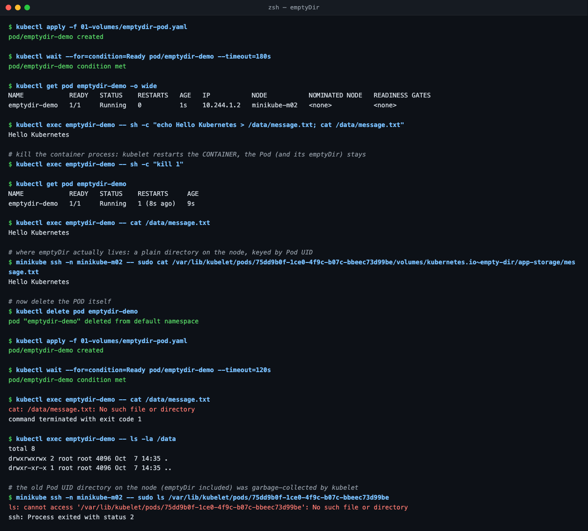
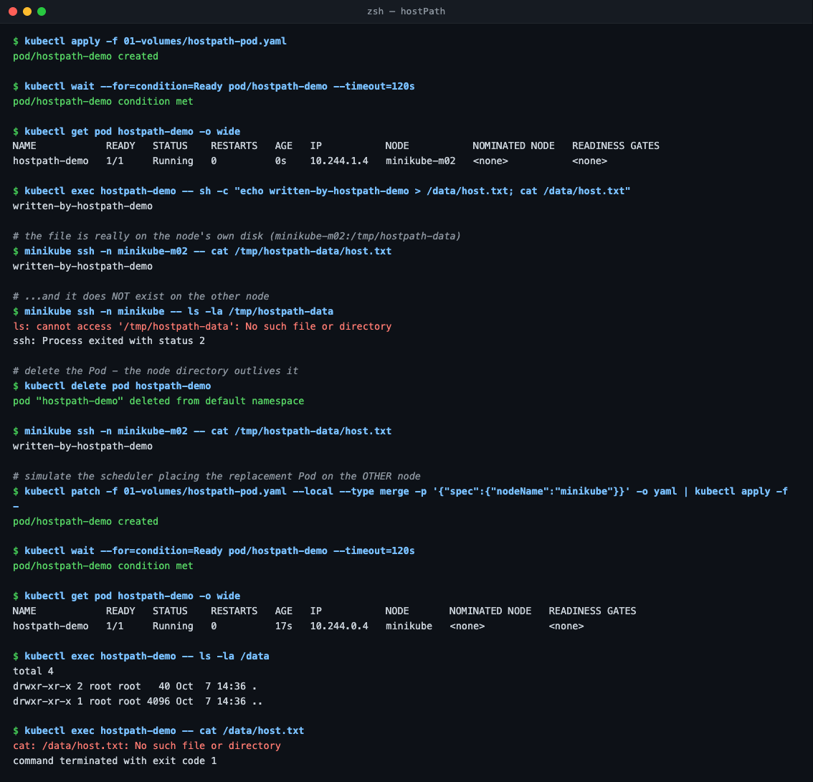
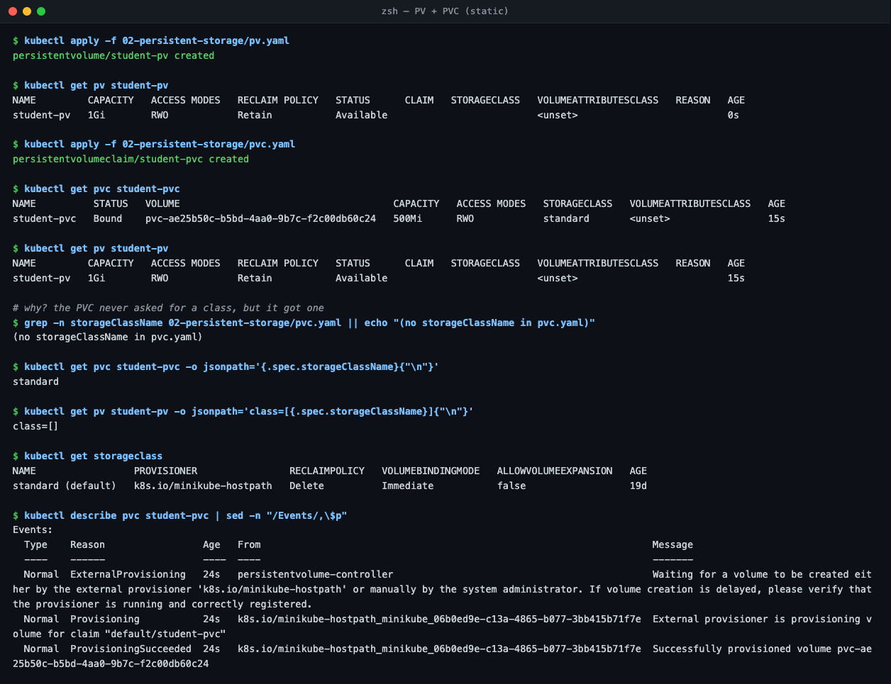
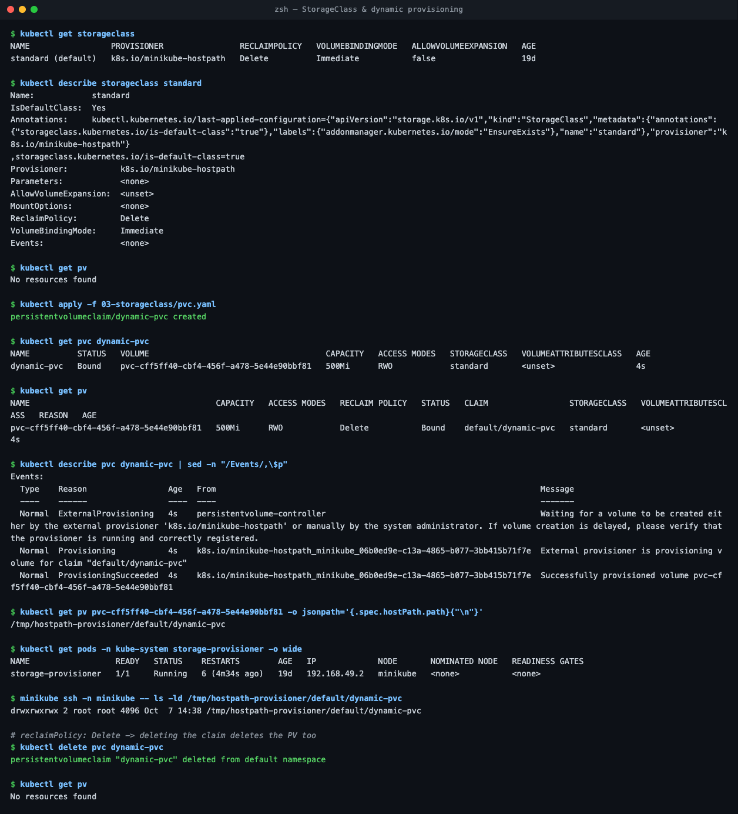

# Task 1 — Kubernetes Volumes

YAML used: `../01-volumes`, `../02-persistent-storage`, `../03-storageclass` (instructor's). All output is real (2-node minikube).

## emptyDir
- Empty dir created with the Pod, deleted with the Pod. Shared by all containers in the Pod.
- Practical: wrote a file → killed the container → file **still there** → deleted the Pod → file **gone**.
- Lives on the node at `/var/lib/kubelet/pods/<pod-uid>/volumes/kubernetes.io~empty-dir/`.
- Use for: cache, temp files, sidecar sharing.

## hostPath
- Mounts a directory from the **node** into the Pod; outlives the Pod.
- Practical: file written on `minikube-m02`; the same Pod scheduled on `minikube` saw an **empty** dir (`DirectoryOrCreate` silently made a new one).
- Use for: node agents (logs, CNI). Avoid for app data; security risk.

## PersistentVolume (PV)
- Cluster-wide storage with its own lifecycle; created by an admin (static) or a provisioner (dynamic).
- Key fields: `capacity`, `accessModes` (RWO / ROX / RWX / RWOP), `reclaimPolicy` (Retain / Delete).
- `Retain`: deleting the PVC leaves the PV `Released` with data intact; it won't rebind until `claimRef` is removed.

## PersistentVolumeClaim (PVC)
- A namespaced request for storage; Pods only reference PVCs. Binds on class + access mode + size.
- **Gotcha:** the instructor's `pvc.yaml` has no `storageClassName`, so the default `standard` class was stamped on it and it got a new dynamic PV; `student-pv` stayed `Available`.
- Fix: `storageClassName: ""` ([`pvc-static.yaml`](../02-persistent-storage/pvc-static.yaml)) → bound to `student-pv`; data survived Pod delete.
- A PVC gets the **whole** PV (asked 500Mi, got 1Gi).

## StorageClass & dynamic provisioning
- StorageClass = template: provisioner + reclaim policy + binding mode. One can be marked default.
- Practical: `dynamic-pvc` (class `standard`) → provisioner created `pvc-cff5…` (500Mi) automatically → deleting the PVC deleted the PV (`Delete`).
- `Immediate` binds before a Pod exists; `WaitForFirstConsumer` waits for scheduling, so the volume lands where the Pod runs (fixed the mini-project bug).

| | emptyDir | hostPath | PV/PVC | StorageClass |
| :--- | :--- | :--- | :--- | :--- |
| Survives Pod delete | No | Same node only | Yes | Yes |
| Created by | kubelet | already on node | admin | provisioner |
