# Session 13 — Kubernetes Storage, HPA & Probes

**Repo:** devops-heros / `session-13-storage-hpa-probes`
**Cluster:** minikube v1.39.0, Kubernetes v1.37.0, 2 nodes (`minikube`, `minikube-m02`), containerd, Docker driver on macOS (Apple Silicon, Docker Desktop VM with 8 CPU / 4 GB).
**Addons enabled during the lab:** `metrics-server` (Task 2), `storage-provisioner-rancher` (Task 3 fix).

Every output and screenshot below comes from real commands run on this cluster. Where the result differed from the session guides, the difference is shown and explained rather than smoothed over.

```bash
cd session-13-storage-hpa-probes
```

## Deliverables

| Homework item | Where |
| :--- | :--- |
| Volume documentation (Task 1) | [`01-kubernetes-volumes/README.md`](01-kubernetes-volumes/README.md) |
| HPA YAML | [`04-hpa/hpa.yaml`](04-hpa/hpa.yaml), [`hpa/hpa-backend.yaml`](hpa/hpa-backend.yaml) (instructor's) |
| Load generator | [`04-hpa/load-generator.yaml`](04-hpa/load-generator.yaml), [`hpa/load-generator.yaml`](hpa/load-generator.yaml) (new), [`hpa/load_generator.sh`](hpa/load_generator.sh) (instructor's, see Task 2b) |
| HPA output + screenshots | [Task 2](#task-2--hpa-hands-on) below, [`screenshots/`](screenshots/) |
| Mini-project implementation | [Task 3](#task-3--mini-project) below, [`mini-project/`](mini-project/) + fix [`mini-project/pvc-local-path.yaml`](mini-project/pvc-local-path.yaml) |
| Probes hands-on | [Probes](#probes--liveness-readiness-startup) below |

## What did not go as the guides said

| # | Where | Expected (guide) | Actually happened | Root cause → fix |
| :-- | :--- | :--- | :--- | :--- |
| 1 | `02-persistent-storage` | `student-pvc` binds `student-pv` | Bound a new dynamic PV; `student-pv` stayed `Available` | Default StorageClass is stamped on class-less PVCs → `storageClassName: ""` ([details](01-kubernetes-volumes/README.md#4-persistentvolumeclaim-pvc)) |
| 2 | `04-hpa` | HPA shows CPU % | `cpu: <unknown>/50%` | metrics-server not installed → `minikube addons enable metrics-server` |
| 3 | `04-hpa` | More load generators → more CPU | 4 generators gave the same CPU as 1, plus `wget: bad address` | Node conntrack table full (dropped packets), per-request DNS lookups → generator hits the Service IP from an env var |
| 4 | `05-probes` | Edit probe path, `kubectl apply` | `spec: Forbidden: pod updates may not change fields...` | Pod spec is immutable → `kubectl replace --force` |
| 5 | `hpa/load_generator.sh` | Load on `yatri-backend` | 0 requests reached the cluster | macOS AirPlay Receiver owns port 5000 |
| 6 | `hpa/load_generator.sh` (port 5050) | Sustained load | Tunnel died after ~540 connections | `kubectl port-forward` is a debug tunnel to one Pod → generate load in-cluster |
| 7 | `mini-project` | All replicas share `/data` | Replica on the other node had an **empty** `/data` | hostPath PV with no `nodeAffinity` → `local-path` class (`WaitForFirstConsumer`) |
| 8 | `mini-project` fix | PVC binds | `Pending`, helper Pod `ImagePullBackOff` (`429 Too Many Requests`) | Docker Hub rate limit → point the provisioner at the cached `busybox:1.36` |
| 9 | `mini-project` | 110% CPU, scale to 4–5 | Plateau at **40%**, never scaled | Generator-bound load → added two DNS-free generators |
| 10 | `mini-project` | Probes keep healthy Pods running | Liveness **killed** a busy Pod under load | Same conntrack exhaustion as #3 (kernel log proves it) |

---

## Task 1 — Kubernetes Volumes

Full write-up with practical examples for `emptyDir`, `hostPath`, PV, PVC, StorageClass and dynamic provisioning: **[01-kubernetes-volumes/README.md](01-kubernetes-volumes/README.md)**.

| | |
| :--- | :--- |
|  |  |

---

## Task 2 — HPA hands-on

Files: [`04-hpa/deployment.yaml`](04-hpa/deployment.yaml) (nginx, `requests.cpu: 100m`, `limits.cpu: 200m`), [`04-hpa/service.yaml`](04-hpa/service.yaml), [`04-hpa/hpa.yaml`](04-hpa/hpa.yaml) (min 1, max 5, target 50% CPU), [`04-hpa/load-generator.yaml`](04-hpa/load-generator.yaml).

### 1–3. Deploy, configure and verify HPA. First attempt: no metrics

```bash
kubectl apply -f 04-hpa/deployment.yaml -f 04-hpa/service.yaml
kubectl apply -f 04-hpa/hpa.yaml
kubectl get hpa
kubectl top pods
kubectl describe hpa hpa-demo
```

```
NAME       REFERENCE             TARGETS              MINPODS   MAXPODS   REPLICAS
hpa-demo   Deployment/hpa-demo   cpu: <unknown>/50%   1         5         1

$ kubectl top pods
error: Metrics API not available

$ kubectl get apiservice v1beta1.metrics.k8s.io
Error from server (NotFound): apiservices.apiregistration.k8s.io "v1beta1.metrics.k8s.io" not found

  ScalingActive  False   FailedGetResourceMetric  the HPA was unable to compute the replica count: failed to get cpu
                                                  utilization: ... the server could not find the requested resource (get pods.metrics.k8s.io)
```

The HPA controller doesn't measure CPU itself. It asks the `metrics.k8s.io` API, which metrics-server provides, and this cluster didn't have it.

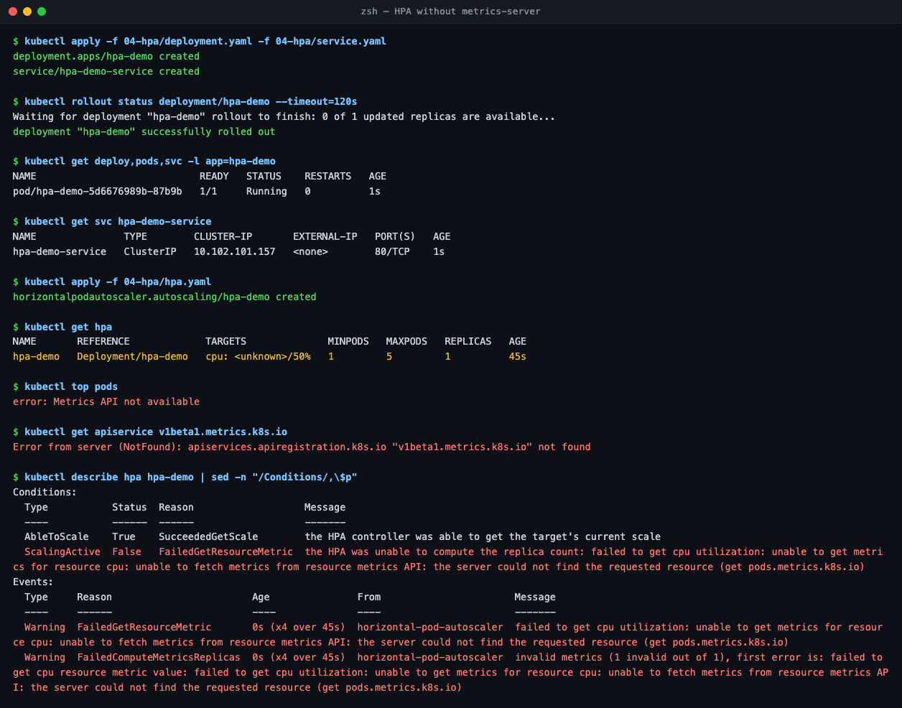

**Fix:**

```bash
minikube addons enable metrics-server
kubectl -n kube-system rollout status deployment/metrics-server
kubectl top nodes && kubectl top pods && kubectl get hpa
```

```
* The 'metrics-server' addon is enabled

NAME           CPU(cores)   CPU(%)   MEMORY(bytes)   MEMORY(%)
minikube       199m         2%       1027Mi          26%
minikube-m02   54m          0%       253Mi           6%

hpa-demo-5d6676989b-87b9b   0m           6Mi

hpa-demo   Deployment/hpa-demo   cpu: 0%/50%   1         5         1
```

The APIService reported `False (FailedDiscoveryCheck)` for a few seconds after the Pod went Ready, then `True`. The addon runs with `--metric-resolution=60s`, so `kubectl top` and the HPA lag real usage by up to a minute. That explains several "stale" readings below.

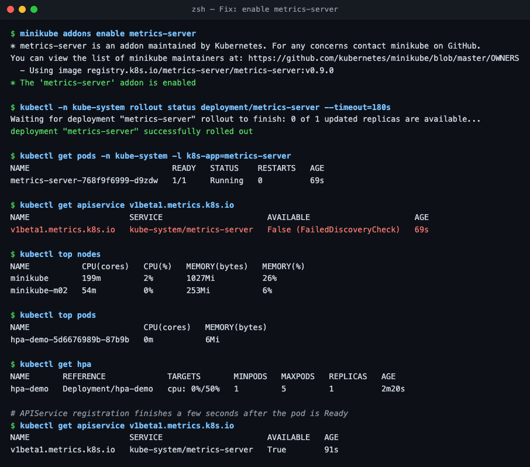

### 4. Deploy a load generator

[`04-hpa/load-generator.yaml`](04-hpa/load-generator.yaml) is the guide's `kubectl run load-generator` busybox loop, but as a **Deployment**, so step 5 is just `kubectl scale`.

```bash
kubectl apply -f 04-hpa/load-generator.yaml
kubectl top pods -l app=hpa-demo
kubectl get hpa hpa-demo
```

```
hpa-demo-5d6676989b-87b9b   63m          8Mi

hpa-demo   Deployment/hpa-demo   cpu: 13%/50%   1   5   1     <- still the previous 60s window
...
hpa-demo   Deployment/hpa-demo   cpu: 63%/50%   1   5   1
hpa-demo   Deployment/hpa-demo   cpu: 63%/50%   1   5   2     <- scaled 1 -> 2
```

`63m / 100m request = 63%` → desired = `ceil(1 × 63 / 50) = 2`.

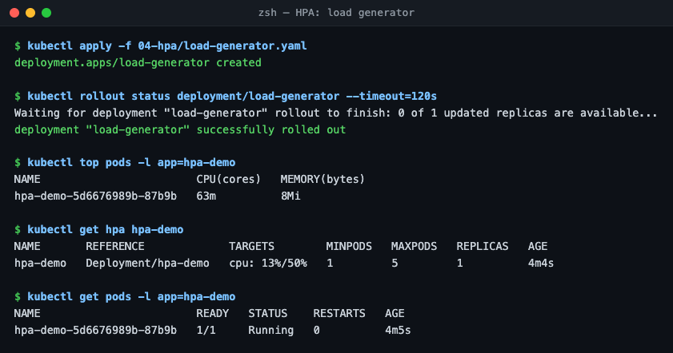

### 5. Increase load. Troubleshooting: load didn't increase

```bash
kubectl scale deployment load-generator --replicas=4
```

```
hpa-demo   Deployment/hpa-demo   cpu: 29%/50%   1   5   2
hpa-demo-5d6676989b-87b9b   29m
hpa-demo-5d6676989b-rf9tz   30m          <- 4x the generators, same ~60m total as 1 generator
```

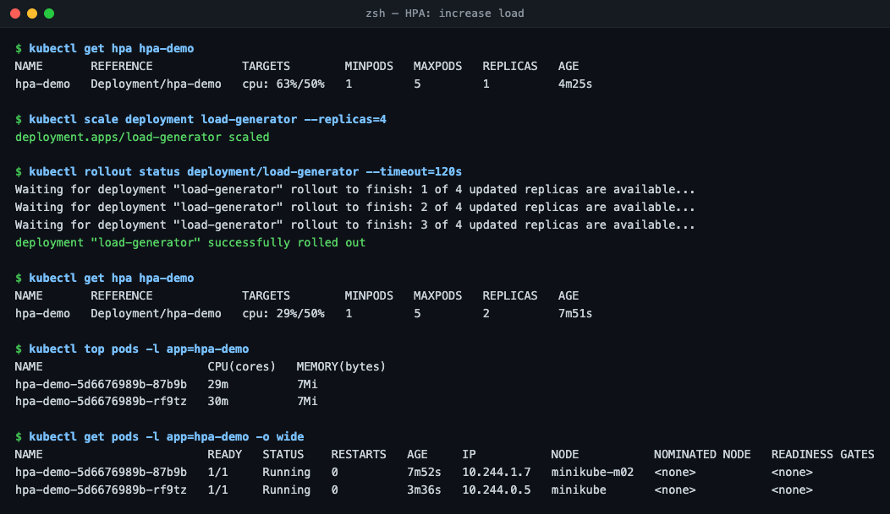

**Investigation:**

```
$ kubectl logs deploy/load-generator --tail=3
wget: bad address 'hpa-demo-service'
wget: bad address 'hpa-demo-service'

# 20s from one generator, by Service name vs by Service IP
1187 requests, 3 stalled (>= 2s)                  http://hpa-demo-service
4254 requests, 2 stalled                           http://$HPA_DEMO_SERVICE_SERVICE_HOST
```

Every `wget` resolves the name first (A + AAAA through CoreDNS) and opens a new TCP connection. Skipping DNS gave **3.6×** the throughput, but the IP path still stalled, so DNS wasn't the whole story. The real root cause turned up later in the mini project ([finding #10](#finding-liveness-killed-healthy-pods-under-load--conntrack-exhaustion)): the node's **conntrack table was full**, and the kernel log has `nf_conntrack: table full, dropping packet` for every minute of this test (14:43–14:57 UTC). Dropped packets fit both symptoms: lost DNS replies (`bad address`) and lost SYNs (multi-second stalls).

**Fix applied:** the generator targets `$HPA_DEMO_SERVICE_SERVICE_HOST`, the Service ClusterIP that kubelet injects as an env var into Pods created after the Service. That removes the DNS round-trip from every request.

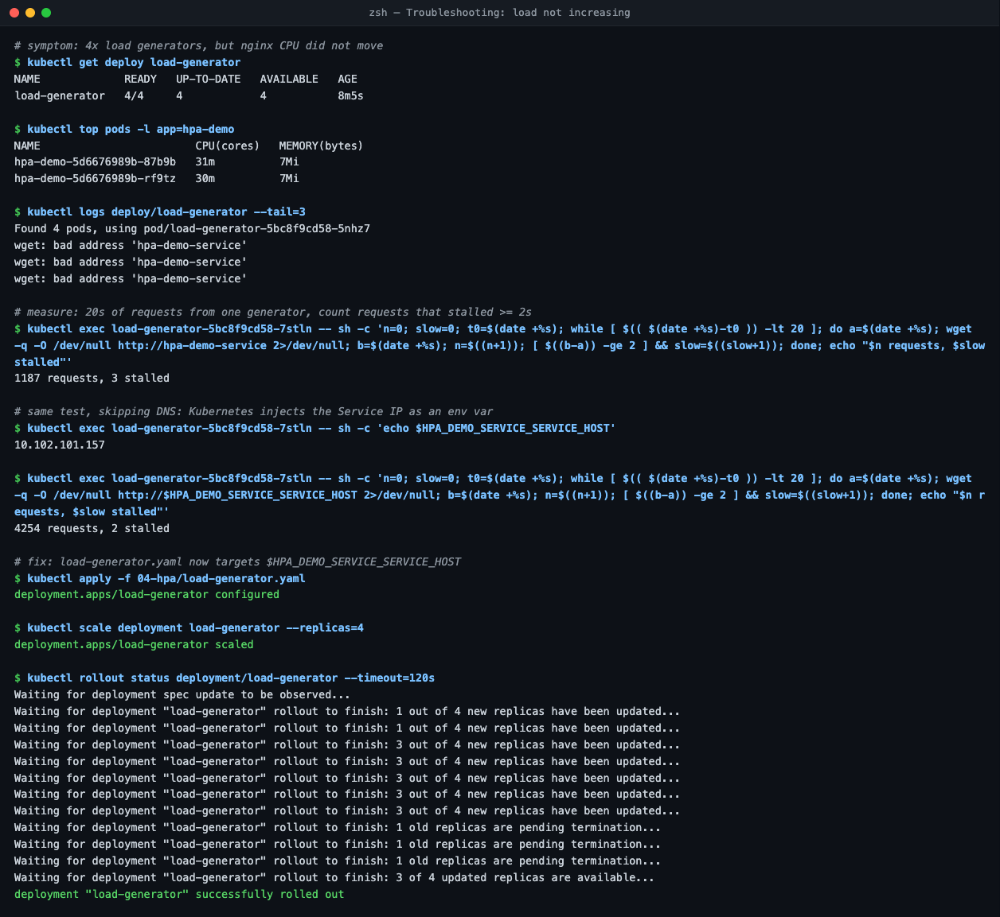

### 6–7. Observe CPU and Pod scaling

```bash
kubectl apply -f 04-hpa/load-generator.yaml && kubectl scale deployment load-generator --replicas=4
kubectl get hpa hpa-demo -w
```

```
hpa-demo   Deployment/hpa-demo   cpu: 37%/50%   1   5   2
hpa-demo   Deployment/hpa-demo   cpu: 82%/50%   1   5   2
hpa-demo   Deployment/hpa-demo   cpu: 82%/50%   1   5   4      ceil(2 × 82/50) = ceil(3.28) = 4
hpa-demo   Deployment/hpa-demo   cpu: 76%/50%   1   5   4
hpa-demo   Deployment/hpa-demo   cpu: 76%/50%   1   5   5      ceil(4 × 76/50) = ceil(6.08) = 7 -> capped at maxReplicas 5
```

```
$ kubectl top pods -l app=hpa-demo
hpa-demo-5d6676989b-4mrcd   34m
hpa-demo-5d6676989b-87b9b   36m
hpa-demo-5d6676989b-ddm6p   33m
hpa-demo-5d6676989b-qs5gn   32m
hpa-demo-5d6676989b-rf9tz   37m        <- load spread evenly across 5 replicas on both nodes

$ kubectl get hpa hpa-demo
hpa-demo   Deployment/hpa-demo   cpu: 34%/50%   1   5   5
```

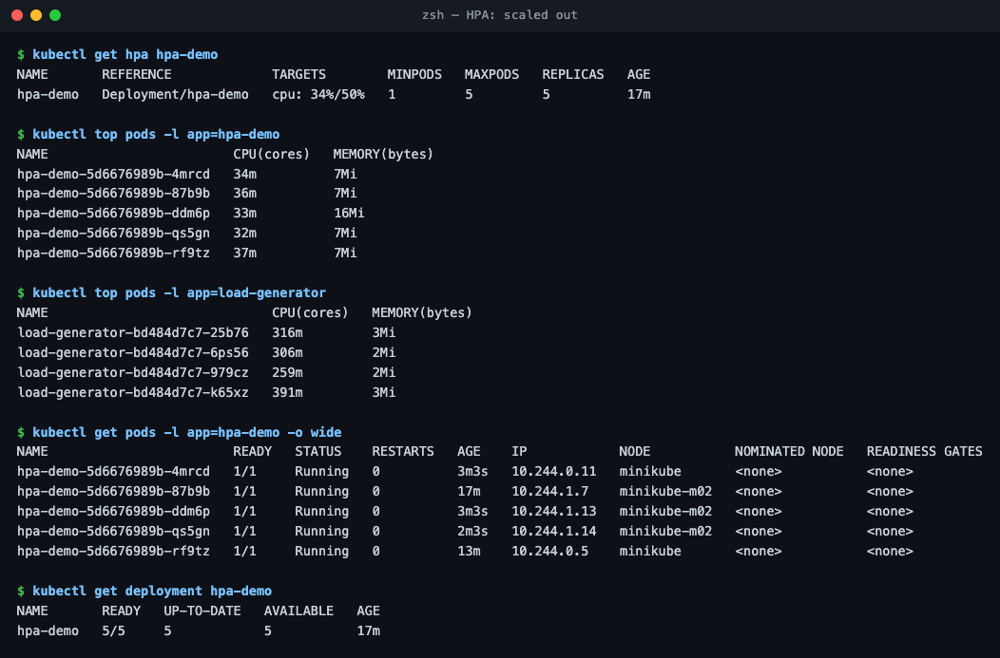

```
$ kubectl describe hpa hpa-demo
  resource cpu on pods  (as a percentage of request):  34% (34m) / 50%
Deployment pods:                                       5 current / 5 desired
  AbleToScale     True    ScaleDownStabilized  recent recommendations were higher than current one, applying the highest recent recommendation
  ScalingActive   True    ValidMetricFound
Events:
  Normal   SuccessfulRescale   New size: 2; reason: cpu resource utilization (percentage of request) above target
  Normal   SuccessfulRescale   New size: 4; reason: cpu resource utilization (percentage of request) above target
  Normal   SuccessfulRescale   New size: 5; reason: cpu resource utilization (percentage of request) above target
```

`ScaleDownStabilized`: at 34% the math says 4 replicas would do, but the HPA keeps the highest recommendation from the last 5 minutes so it doesn't flap.

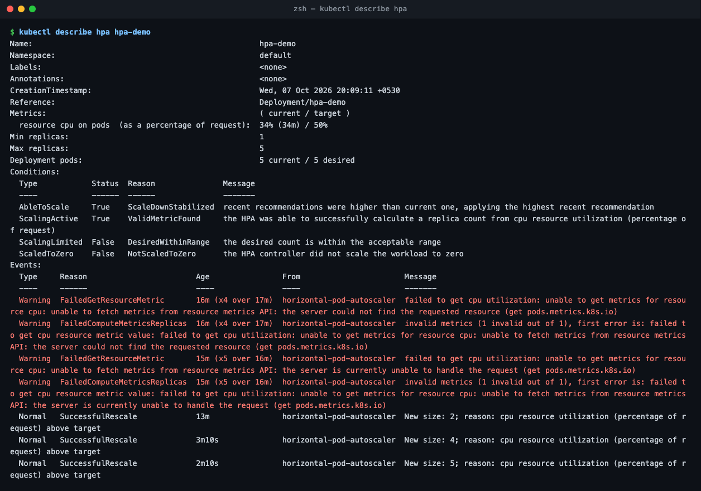

### Scale down

```bash
kubectl delete deployment load-generator
kubectl get hpa hpa-demo -w
```

```
hpa-demo   cpu: 0%/50%   1   5   5     20m    <- load gone, held for the 5-minute stabilization window
hpa-demo   cpu: 0%/50%   1   5   4     21m
hpa-demo   cpu: 0%/50%   1   5   2     23m
hpa-demo   cpu: 0%/50%   1   5   1     25m

  Normal   SuccessfulRescale   New size: 4; reason: All metrics below target
  Normal   SuccessfulRescale   New size: 2; reason: All metrics below target
  Normal   SuccessfulRescale   New size: 1; reason: All metrics below target
```

Scale-out took seconds after the metric crossed 50%. Scale-in took **~8 minutes** after the load stopped. That asymmetry is the default behavior and it's deliberate.

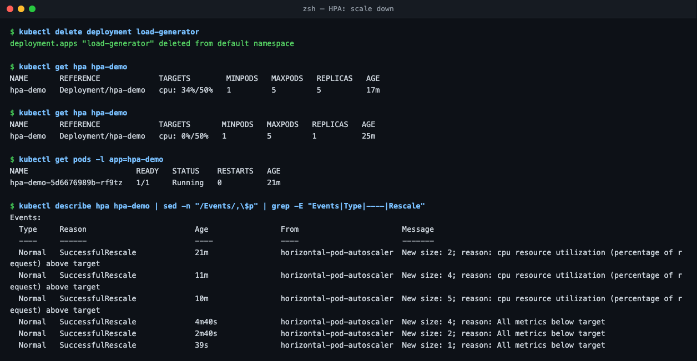

### 8. Captured output: the whole run

| `kubectl get hpa -w` | `kubectl get pods -w` |
| :--- | :--- |
| 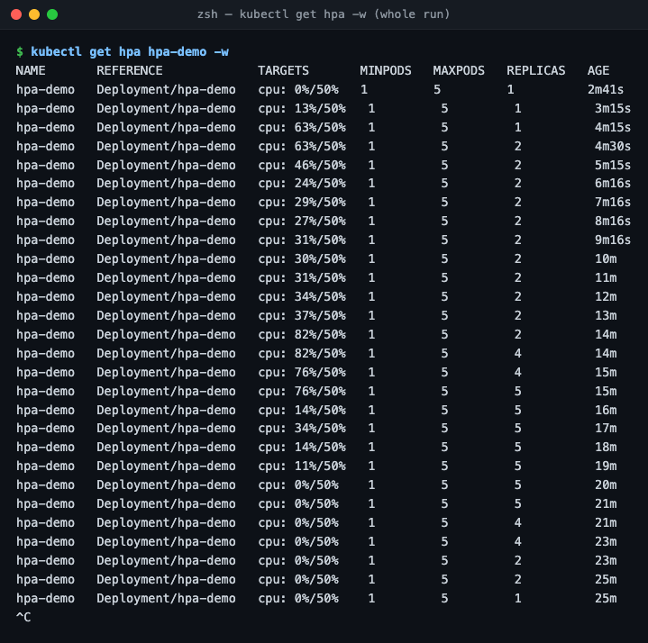 | 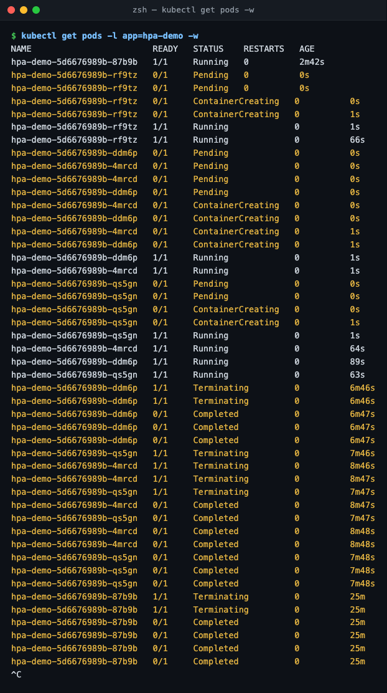 |

### Task 2b — the instructor's `hpa/` kit (Yatri backend + `load_generator.sh`)

[`hpa/hpa-backend.yaml`](hpa/hpa-backend.yaml) scales the Session 12 `yatri-backend` (requests `50m`, min 2, max 10). The backend comes from Session 12's manifests, which were **applied only, not modified**:

```bash
kubectl apply -f ../session-12-ingress-configmaps-secrets/04-full-demo/configmap.yaml \
              -f ../session-12-ingress-configmaps-secrets/04-full-demo/secret.yaml \
              -f ../session-12-ingress-configmaps-secrets/04-full-demo/backend.yaml
kubectl apply -f hpa/backend-service.yaml -f hpa/hpa-backend.yaml
```

```
yatri-backend-hpa   Deployment/yatri-backend   cpu: 14%/50%   2   10   2
```

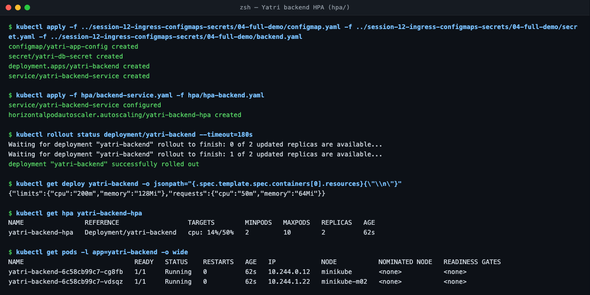

**Run 1: `bash hpa/load_generator.sh` (as written)** printed `Traffic load active!`, but the HPA stayed at 1–2% for 5 minutes.

```
$ lsof -nP -iTCP:5000 -sTCP:LISTEN
ControlCe 662 ananthadatta   12u  IPv4 ...  TCP *:5000 (LISTEN)
ControlCe 662 ananthadatta   13u  IPv6 ...  TCP *:5000 (LISTEN)

$ curl -s -o /dev/null -w 'HTTP %{http_code}  server=%header{server}\n' http://localhost:5000/healthz
HTTP 403  server=AirTunes/980.77.5

$ kubectl port-forward svc/yatri-backend-service 5000:80
Forwarding from 127.0.0.1:5000 -> 5000        <- binds without any error...
Forwarding from [::1]:5000 -> 5000            <- ...but localhost:5000 is still answered by AirTunes
```

**Root cause:** on macOS 12+ the **AirPlay Receiver** (`ControlCenter`) listens on port 5000. Every request went to AirPlay. The script's `curl -s ... || true` hides the 403s, so it never noticed.
**Fix without editing the script:** it accepts the target URL as `$1` and skips its own port-forward when the target already answers:

```bash
kubectl port-forward svc/yatri-backend-service 5050:80 &
bash hpa/load_generator.sh http://localhost:5050/healthz
```

(Or turn off *System Settings → General → AirDrop & Handoff → AirPlay Receiver*.)

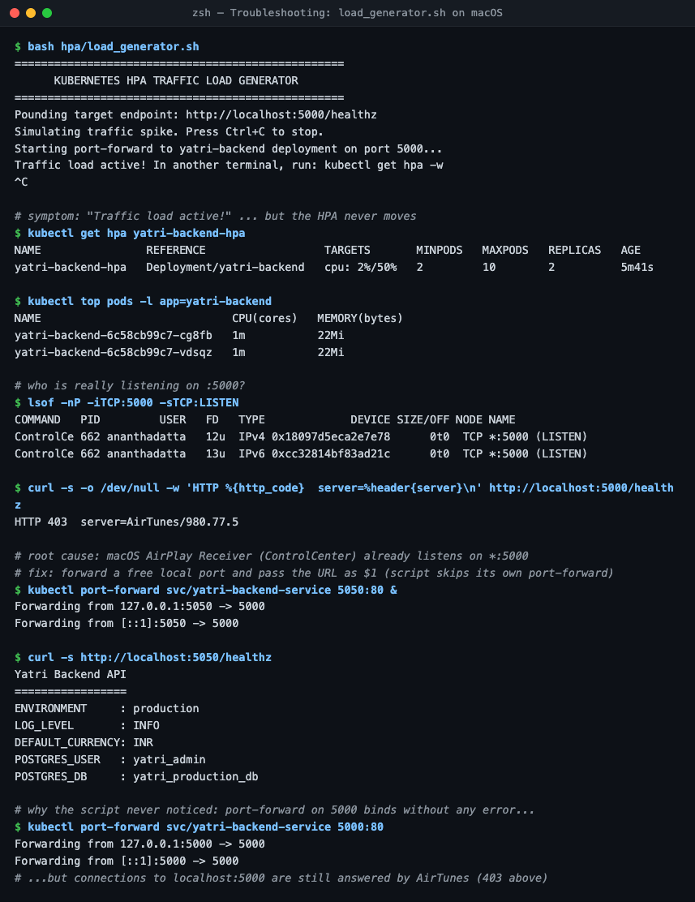

**Run 2: on port 5050.** Traffic flowed for ~540 connections, then the tunnel broke:

```
E1007 20:39:22 portforward.go:501] "Error creating forwarding stream" err="Timeout occurred" localPort=5050 remotePort=5000
E1007 20:41:06 portforward.go:549] "An error occurred forwarding" ... failed to connect to localhost:5000 inside namespace ...:
              dial tcp4 127.0.0.1:5000: connect: connection timed out
$ curl ... http://localhost:5050/healthz
HTTP 000 after 5.011949s        <- every request now hangs
```

`kubectl port-forward` tunnels through the API server to **one** Pod, which here runs a single-threaded Python `HTTPServer`. Ten parallel curl loops into one Pod is not a load test of a Service with HPA: even when it works, the extra replicas get no traffic.

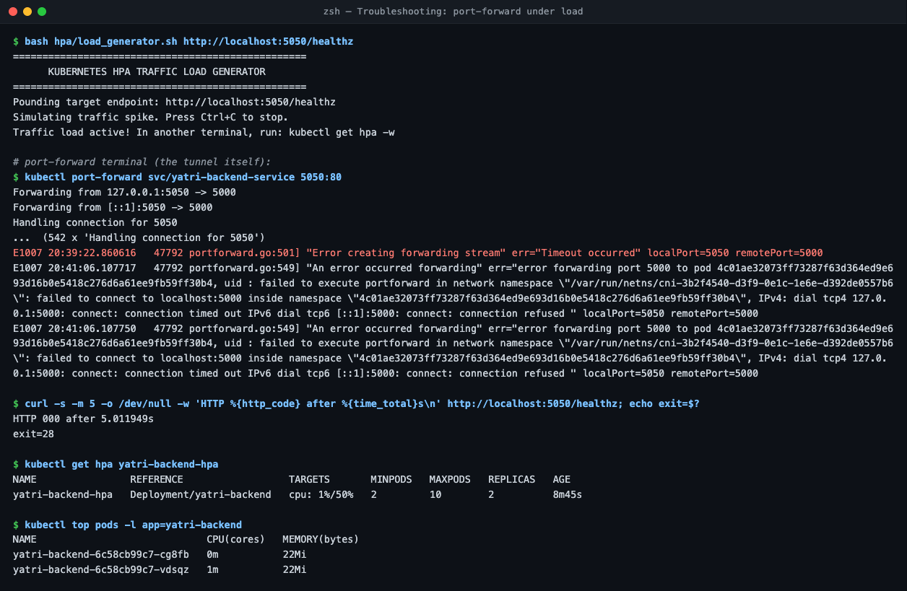

**Fix: generate load inside the cluster.** [`hpa/load-generator.yaml`](hpa/load-generator.yaml) runs 3 busybox loops against `$YATRI_BACKEND_SERVICE_SERVICE_HOST/healthz`:

```bash
kubectl apply -f hpa/load-generator.yaml
kubectl get hpa yatri-backend-hpa -w
```

```
yatri-backend-hpa   Deployment/yatri-backend   cpu: 183%/50%   2   10   2
yatri-backend-hpa   Deployment/yatri-backend   cpu: 183%/50%   2   10   4
yatri-backend-hpa   Deployment/yatri-backend   cpu: 183%/50%   2   10   8
yatri-backend-hpa   Deployment/yatri-backend   cpu: 174%/50%   2   10   10
...
yatri-backend-hpa   Deployment/yatri-backend   cpu: 47%/50%    2   10   10

  ScalingLimited  True    TooManyReplicas      the desired replica count is more than the maximum replica count
```

Ten replicas at 21–28m each (≈ 47% of the 50m request). The HPA hit `maxReplicas`, which is exactly the guard rail `maxReplicas` exists for.

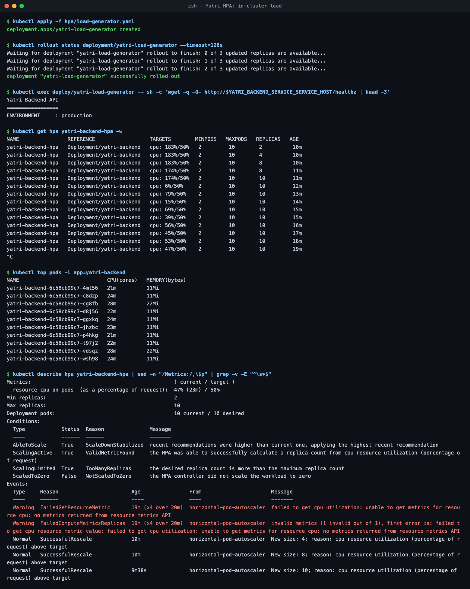

### Useful commands

```bash
kubectl get hpa                      # TARGETS = current/target, REPLICAS = current
kubectl get hpa -w                   # watch decisions as they happen
kubectl get pods -w
kubectl top pods                     # what metrics-server sees (60s resolution here)
kubectl describe hpa <name>          # Conditions (why / why not) + SuccessfulRescale events
kubectl get apiservice v1beta1.metrics.k8s.io
```

**HPA formula:** `desiredReplicas = ceil(currentReplicas × currentUtilization / targetUtilization)`, where utilization is **% of the CPU request**. No `requests.cpu` means no utilization, which means `<unknown>`.

---

## Probes — liveness, readiness, startup

Files: [`05-probes/`](05-probes/) (instructor's).

```bash
kubectl apply -f 05-probes/liveness.yaml -f 05-probes/readiness.yaml -f 05-probes/startup.yaml
kubectl describe pod startup-demo | grep -E "^\s+(Liveness|Readiness|Startup):"
kubectl expose pod readiness-demo --name=readiness-service --port=80
```

```
liveness-demo    1/1     Running   0          9s
readiness-demo   1/1     Running   0          9s
startup-demo     1/1     Running   0          9s

    Liveness:       http-get http://:80/ delay=0s timeout=1s period=5s successThreshold=1 failureThreshold=3
    Readiness:      http-get http://:80/ delay=0s timeout=1s period=5s successThreshold=1 failureThreshold=3
    Startup:        http-get http://:80/ delay=0s timeout=1s period=2s successThreshold=1 failureThreshold=30

readiness-service-rw5bb   IPv4   80   10.244.1.16
```

The startup probe gives the app `2s × 30 = 60s` to boot. Liveness and readiness don't run until it passes.

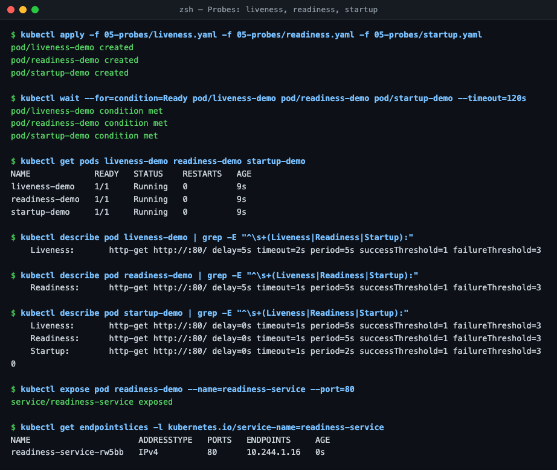

### Break readiness

The guide says to change the path and `kubectl apply` again:

```
$ sed 's#path: /$#path: /wrong-path#' 05-probes/readiness.yaml | kubectl apply -f -
The Pod "readiness-demo" is invalid: spec: Forbidden: pod updates may not change fields other than
`spec.containers[*].image`, ..., `spec.tolerations` (only additions...), ...
-     "Path": "/",
+     "Path": "/wrong-path",
```

A bare Pod's spec is immutable (Deployments get around this by creating new Pods). Recreate it instead:

```
$ sed 's#path: /$#path: /wrong-path#' 05-probes/readiness.yaml | kubectl replace --force -f -
pod "readiness-demo" deleted
pod/readiness-demo replaced

$ kubectl get pod readiness-demo
readiness-demo   0/1     Running   0          25s           <- Running, but not Ready, and NOT restarted

  Warning  Unhealthy  4s (x4 over 19s)  kubelet  Readiness probe failed: HTTP probe failed with statuscode: 404

$ kubectl get endpoints readiness-service
Warning: v1 Endpoints is deprecated in v1.33+; use discovery.k8s.io/v1 EndpointSlice
readiness-service               <- empty

$ kubectl get endpointslices -l kubernetes.io/service-name=readiness-service -o jsonpath='{...addresses[0]}  ready={...conditions.ready}'
10.244.1.18  ready=false        <- EndpointSlices still list the Pod, flagged not ready

$ kubectl run curl-test --rm -i --restart=Never --image=busybox:1.36 -- wget -T 3 -q -O- http://readiness-service
wget: can't connect to remote host (10.103.237.186): Connection refused
```

nginx is up and serving, but the Service sends it nothing. With zero ready endpoints, kube-proxy rejects the connection.

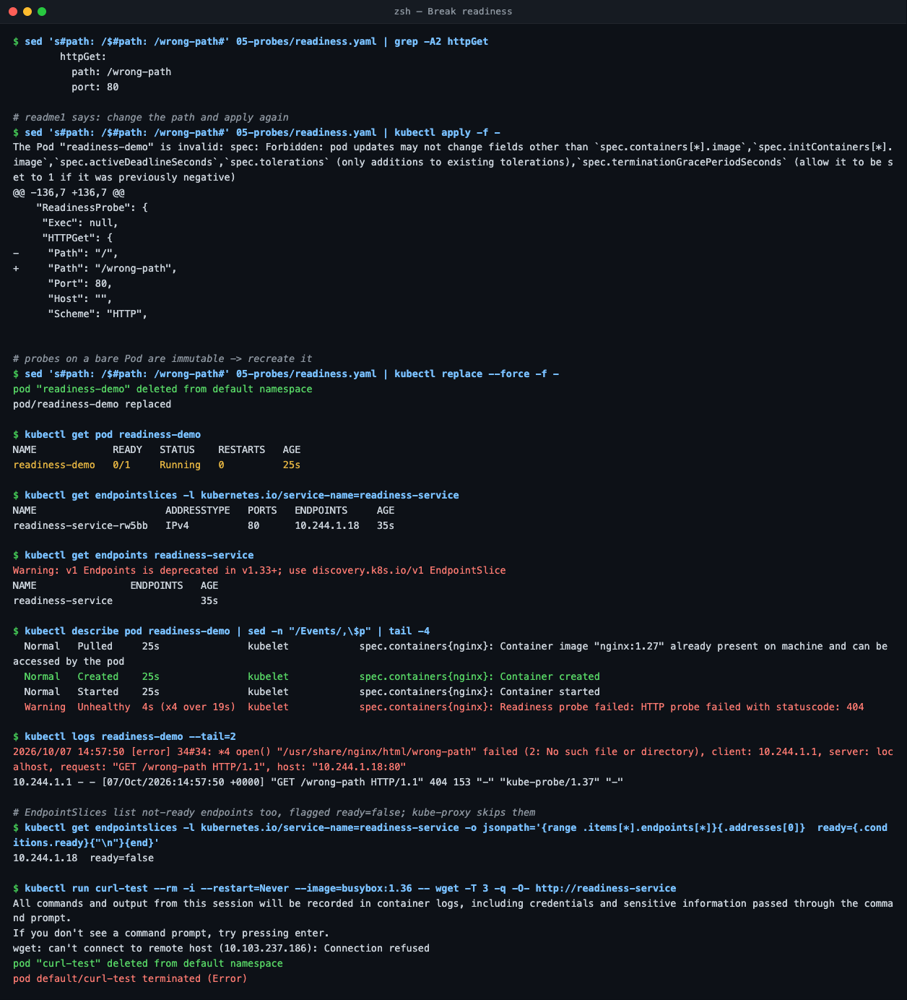

### Break liveness

```bash
sed 's#path: /$#path: /wrong-path#' 05-probes/liveness.yaml | kubectl replace --force -f -
kubectl get pod liveness-demo -w
```

```
liveness-demo   1/1     Running             0            1s
liveness-demo   1/1     Running             1 (0s ago)   21s
liveness-demo   1/1     Running             2 (0s ago)   41s
liveness-demo   1/1     Running             3 (0s ago)   61s
liveness-demo   1/1     Running             4 (0s ago)   81s
liveness-demo   0/1     CrashLoopBackOff    4 (0s ago)   101s
liveness-demo   1/1     Running             5 (47s ago)  2m28s
liveness-demo   0/1     CrashLoopBackOff    5 (0s ago)   2m46s

  Warning  Unhealthy  (x18 over 3m21s)  Liveness probe failed: HTTP probe failed with statuscode: 404
  Normal   Killing    (x6 over 3m11s)   Container nginx failed liveness probe, will be restarted
  Warning  BackOff    (x4 over 110s)    Back-off restarting failed container nginx
```

A restart every ~20s: `initialDelaySeconds 5` + `3 failures × periodSeconds 5`, plus restart time. After a few restarts kubelet adds exponential back-off, so `CrashLoopBackOff` shows up even though the app never crashed. The probe is killing it.

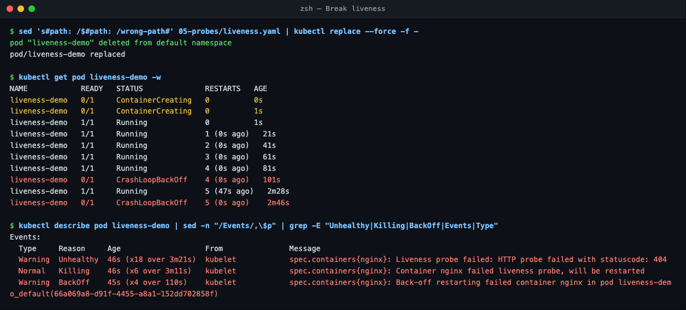

| Probe | Question | On failure |
| :--- | :--- | :--- |
| Startup | Has it finished booting? | Container restarted; liveness/readiness wait for it |
| Readiness | Can it take traffic now? | Removed from Service endpoints. **No restart** |
| Liveness | Is it stuck beyond recovery? | Container **restarted** |

---

## Task 3 — Mini Project

Brief: [`mini-project/README.md`](mini-project/README.md) (instructor's). One `web-app` Deployment in namespace `production-webapp` combining a PVC (`/data`), an HPA (2–5 replicas, 50% CPU) and startup/readiness/liveness probes. Files: `namespace.yaml`, `pvc.yaml`, `deployment.yaml`, `service.yaml`, `hpa.yaml`, plus one new file from this lab: [`pvc-local-path.yaml`](mini-project/pvc-local-path.yaml).

```bash
cd mini-project
```

### 5.1–5.4 Deploy

```bash
kubectl apply -f namespace.yaml
kubectl apply -f pvc.yaml
kubectl apply -f deployment.yaml
kubectl apply -f service.yaml
kubectl apply -f hpa.yaml
kubectl get all,pvc -n production-webapp
```

```
web-data   Bound    pvc-f58e266c-...   500Mi   RWO   standard

NAME                      READY   STATUS    RESTARTS   AGE   IP            NODE
web-app-d45775485-5swpf   1/1     Running   0          9s    10.244.0.18   minikube
web-app-d45775485-k5pfq   1/1     Running   0          9s    10.244.1.29   minikube-m02     <- two nodes, one RWO volume

web-app-hpa   Deployment/web-app   cpu: 1%/50%   2   5   2
```

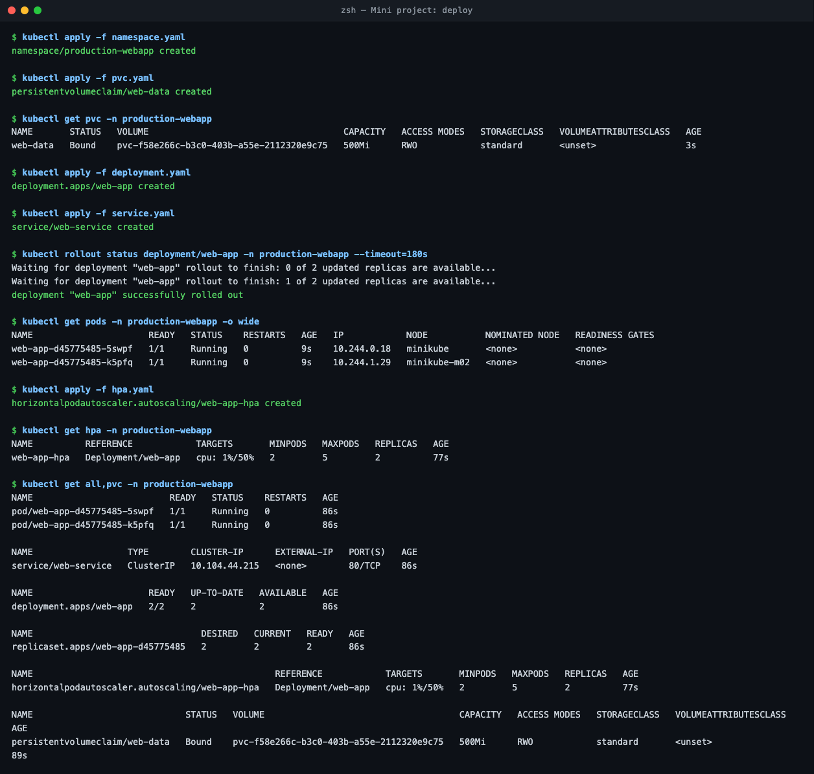

### Verification 1: storage persistence. The guide's check passes, but the data is split

Following the guide exactly:

```
$ POD_NAME=$(kubectl get pods -n production-webapp -l app=web-app -o jsonpath='{.items[0].metadata.name}')
$ kubectl exec -n production-webapp $POD_NAME -- sh -c 'echo "Student: Anantha Datta" > /data/student.txt'
$ kubectl delete pod -n production-webapp $POD_NAME
$ NEW_POD=$(kubectl get pods ... -o jsonpath='{.items[0].metadata.name}'); kubectl exec ... $NEW_POD -- cat /data/student.txt
Student: Anantha Datta                       <- "passes"
```

Then checking **every** replica, not just `items[0]`:

```
pod/web-app-d45775485-6h4rs (minikube):
Student: Anantha Datta
pod/web-app-d45775485-k5pfq (minikube-m02):
cat: /data/student.txt: No such file or directory
```

The replacement Pod happened to land on the same node, so the guide's check passed by luck.

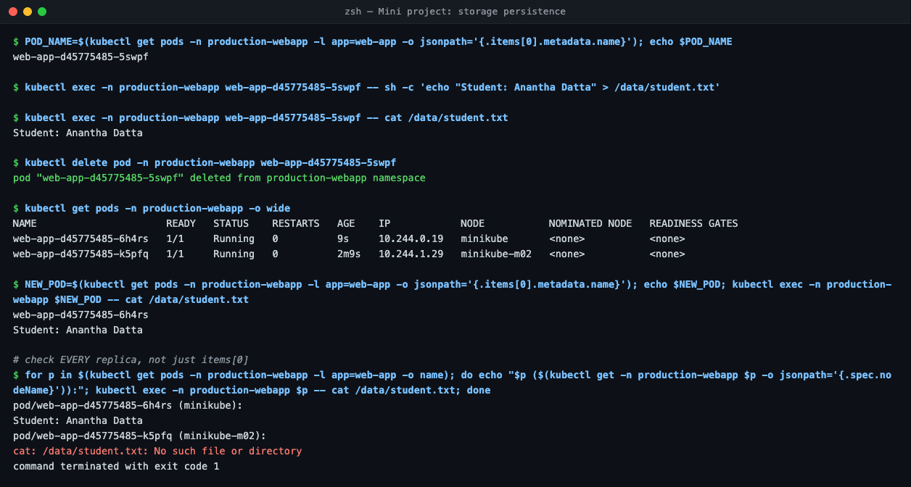

**Root cause:**

```
$ kubectl get pv pvc-f58e266c-... -o jsonpath='type: hostPath  path: {.spec.hostPath.path}  nodeAffinity: [{.spec.nodeAffinity}]'
type: hostPath  path: /tmp/hostpath-provisioner/production-webapp/web-data
nodeAffinity: []

$ minikube ssh -n minikube -- ls -la /tmp/hostpath-provisioner/production-webapp/web-data
-rw-r--r-- 1 root root   23 Oct  7 15:25 student.txt
$ minikube ssh -n minikube-m02 -- ls -la /tmp/hostpath-provisioner/production-webapp/web-data
total 8                                       <- a different, empty directory
```

minikube's `standard` class (`k8s.io/minikube-hostpath`) creates a **hostPath PV with no `nodeAffinity`**. Nothing tells the scheduler where the data lives, and hostPath has no attach step, so `ReadWriteOnce` is never enforced. Each node's kubelet mounts its own local directory with the same path. On a 1-node cluster you'd never notice; on 2 nodes you get two diverging copies of "persistent" data.

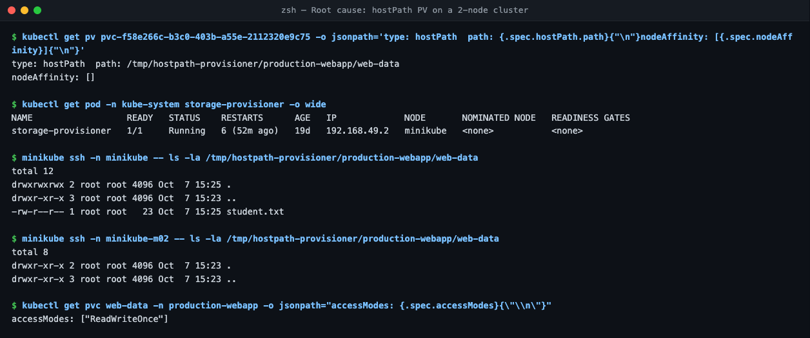

**Fix:** a StorageClass whose provisioner records the node in the PV. minikube ships one:

```bash
minikube addons enable storage-provisioner-rancher     # StorageClass local-path: WaitForFirstConsumer + PV nodeAffinity
kubectl delete deployment web-app -n production-webapp
kubectl delete pvc web-data -n production-webapp
kubectl apply -f pvc-local-path.yaml                   # same claim, storageClassName: local-path
kubectl apply -f deployment.yaml
```

Note: enabling this addon makes `local-path` the **default** class. `pvc-local-path.yaml` names its class explicitly, and the cleanup section restores `standard` as the default.

The PVC sat in `Pending` (`WaitForFirstConsumer` is expected until a Pod is scheduled), but then didn't bind and the Pods stayed `Pending` too:

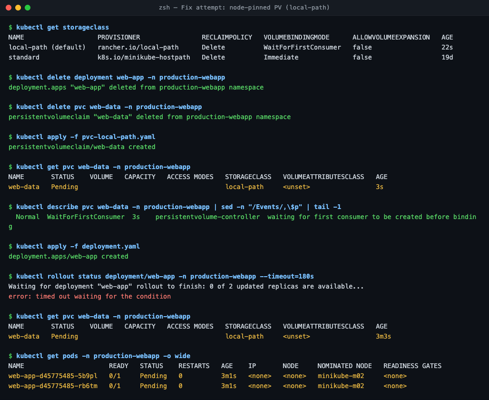

**Troubleshooting the fix:**

```
$ kubectl describe pvc web-data -n production-webapp | grep ProvisioningFailed
Warning  ProvisioningFailed  failed to provision volume with StorageClass "local-path": ... create process timeout after 120 seconds

$ kubectl get pods -n local-path-storage
helper-pod-create-pvc-87bc43e0-...   0/1     ErrImagePull
$ kubectl describe pod -n local-path-storage -l '!app' | grep -o 'unexpected status.*'
unexpected status from HEAD request to https://registry-1.docker.io/v2/library/busybox/manifests/sha256:3fbc...: 429 Too Many Requests
```

The provisioner creates each volume with a short-lived busybox "helper" Pod, and Docker Hub was rate-limiting anonymous pulls (`429`). Both nodes already had `busybox:1.36` cached from the HPA tests, so the fix points the helper at that image and restarts the provisioner:

```bash
kubectl -n local-path-storage get cm local-path-config -o yaml \
  | sed 's#docker.io/busybox:stable@sha256:[a-f0-9]*#busybox:1.36#' | kubectl apply -f -
kubectl -n local-path-storage rollout restart deployment/local-path-provisioner
```

The first attempt used `docker.io/busybox:1.36`, and kubelet **still** tried to pull it (and got 429 again). A test Pod with the exact reference `busybox:1.36` started from cache, so the final value is `busybox:1.36`.

```
Normal   ProvisioningSucceeded   Successfully provisioned volume pvc-87bc43e0-4c97-4d74-95cc-1b017c4b42c6
```

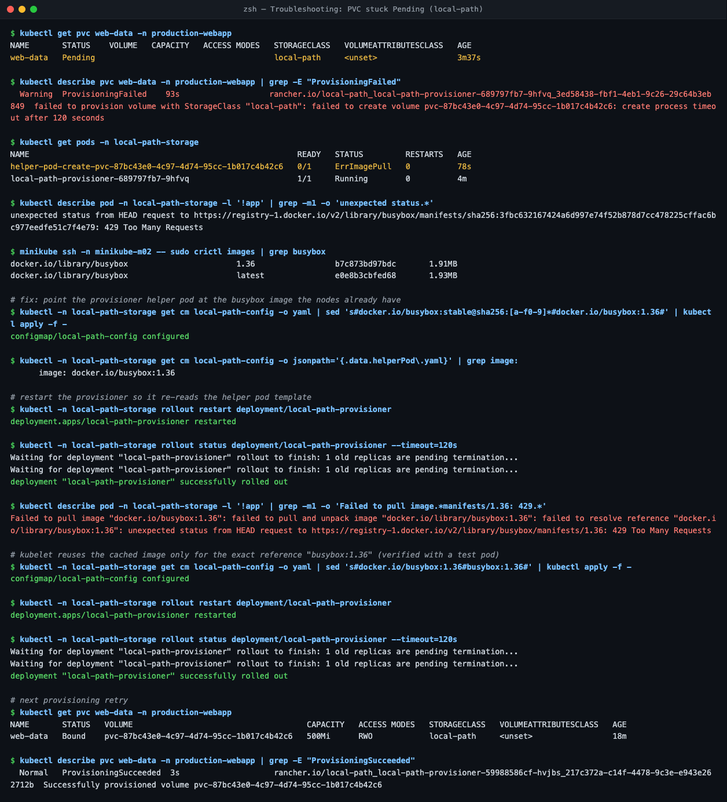

**Verified:**

```
$ kubectl get pv pvc-87bc43e0-... -o jsonpath='{.spec.nodeAffinity.required.nodeSelectorTerms[0].matchExpressions[0]}'
{"key":"kubernetes.io/hostname","operator":"In","values":["minikube-m02"]}

web-app-d45775485-5b9pl   1/1     Running   minikube-m02
web-app-d45775485-rb6tm   1/1     Running   minikube-m02     <- scheduler keeps every replica with the data

# write via one Pod, delete it, then read from EVERY replica
pod/web-app-d45775485-nnbr4 (minikube-m02):
Student: Anantha Datta
pod/web-app-d45775485-rb6tm (minikube-m02):
Student: Anantha Datta
```

The trade-off is that all replicas now share one node, so node loss means downtime. That's the honest meaning of `ReadWriteOnce`. Real multi-node HA needs `ReadWriteMany` storage (NFS, EFS, CephFS) or one volume per replica (a StatefulSet with `volumeClaimTemplates`).

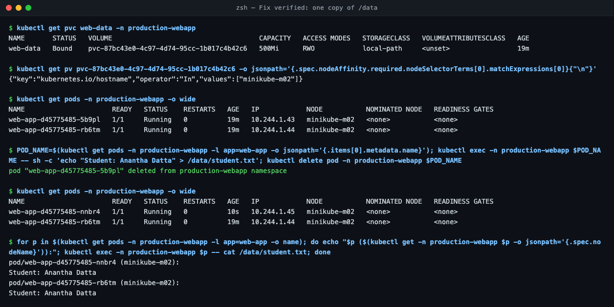

### Verification 2: Service

```bash
kubectl port-forward -n production-webapp svc/web-service 8080:80 &
curl -s http://localhost:8080 | head -4
```

```
web-service-n5gxw   IPv4   80   10.244.1.44,10.244.1.45

<!DOCTYPE html>
<html>
<head>
<title>Welcome to nginx!</title>

HTTP 200  server=nginx/1.27.5
```

(Port 8080 was checked free first with `lsof -iTCP:8080 -sTCP:LISTEN`, after the port 5000 lesson.)

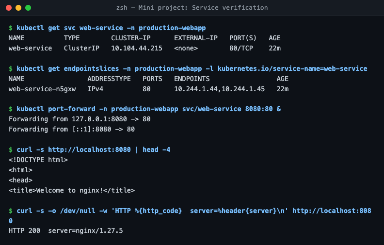

### Verification 3: HPA elastic scaling

With the guide's exact load generator:

```bash
kubectl run load-generator -n production-webapp --image=busybox:1.36 --restart=Never \
  -- /bin/sh -c "while true; do wget -q -O- http://web-service; done"
kubectl get hpa -n production-webapp -w
```

```
web-app-hpa   Deployment/web-app   cpu: <unknown>/50%   2   5   2     <- replacement Pod not scraped yet (2 x 60s)
web-app-hpa   Deployment/web-app   cpu: 20%/50%         2   5   2
web-app-hpa   Deployment/web-app   cpu: 41%/50%         2   5   2
web-app-hpa   Deployment/web-app   cpu: 40%/50%         2   5   2     <- plateau. The guide expects 110% -> 4 -> 5

load-generator            785m     <- the generator burns 785m to push 81m into nginx
web-app-d45775485-nnbr4   40m
web-app-d45775485-rb6tm   41m
```

One `wget`-per-request loop can't push 2 nginx replicas past 50% of their 100m request. To increase the load, add two generators that skip the per-request DNS lookup (same technique as Task 2):

```bash
for i in 2 3; do
  kubectl run load-generator-$i -n production-webapp --image=busybox:1.36 --restart=Never \
    -- /bin/sh -c 'while true; do wget -q -O- http://$WEB_SERVICE_SERVICE_HOST; done'
done
```

```
web-app-hpa   Deployment/web-app   cpu: 60%/50%    2   5   2
web-app-hpa   Deployment/web-app   cpu: 81%/50%    2   5   2
web-app-hpa   Deployment/web-app   cpu: 81%/50%    2   5   4      ceil(2 x 81/50) = 4
web-app-hpa   Deployment/web-app   cpu: 56%/50%    2   5   4
web-app-hpa   Deployment/web-app   cpu: 44%/50%    2   5   4

web-app-d45775485-2vhbf   1/1   Running   minikube-m02    <- new HPA replicas also land on the PV's node
web-app-d45775485-jzdsd   1/1   Running   minikube-m02
```

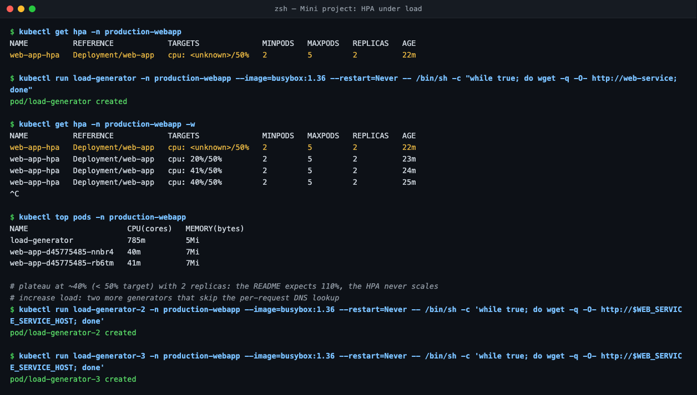

### Finding: liveness killed healthy Pods under load — conntrack exhaustion

During that test one replica restarted (`RESTARTS 1`) and the HPA briefly went `<unknown>`:

```
Killing     1   Container nginx failed liveness probe, will be restarted
Unhealthy   5   Liveness probe failed:  Get "http://10.244.1.44:80/": context deadline exceeded (Client.Timeout exceeded while awaiting headers)
Unhealthy   6   Readiness probe failed: Get "http://10.244.1.44:80/": context deadline exceeded ...
```

nginx wasn't broken. The probe just got no answer within `timeoutSeconds: 2`.

**Hypothesis 1, CPU throttling at the 200m limit: rejected.** `nnbr4` also failed probes in the same window but was never restarted, so its cgroup counters cover the whole incident: `nr_throttled 3, throttled_usec 77452` (0.08s in total).

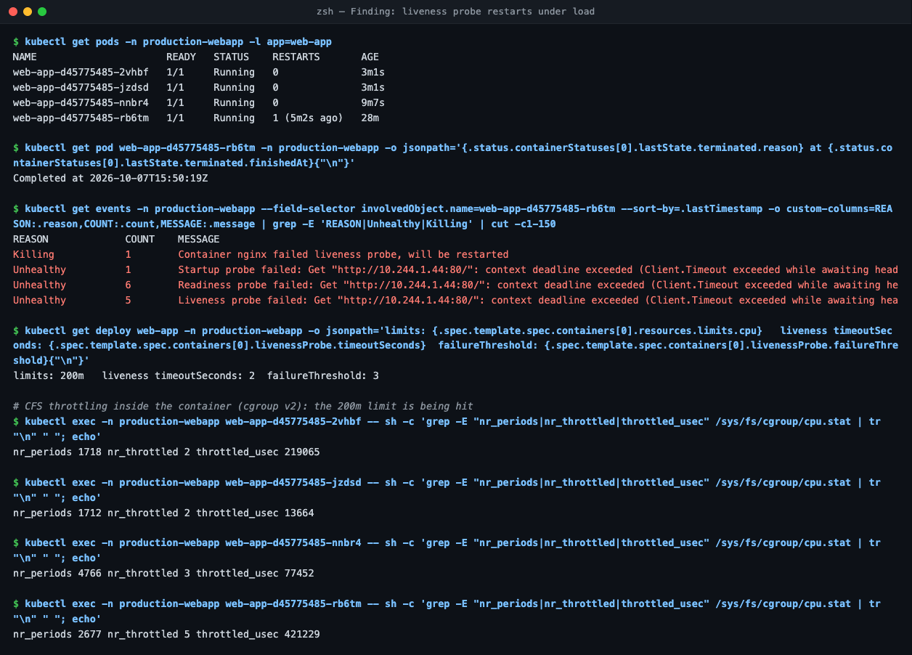

**Root cause, confirmed: the node's conntrack table was full.**

```
$ minikube ssh -n minikube-m02 -- "cat /proc/sys/net/netfilter/nf_conntrack_count /proc/sys/net/netfilter/nf_conntrack_max"
64368
65536

$ minikube ssh -n minikube-m02 -- "sudo dmesg | grep 'table full' | tail -3"
[ 4711.907292] nf_conntrack: nf_conntrack: table full, dropping packet
[ 4712.932405] nf_conntrack: nf_conntrack: table full, dropping packet

# drop messages per minute (UTC). They line up with every load test in this lab:
14:43–14:57   Task 2 hpa-demo load         (the "bad address" / stalls)
15:13–15:22   Task 2b Yatri in-cluster load
15:50–15:51   Task 3 mini-project load      (these probe failures)
```

Every `wget` opens a brand-new TCP connection, and every DNS lookup adds UDP entries. Each one occupies a conntrack slot until it times out (TIME_WAIT entries stay for 120s), so ~550 new connections per second is already enough to hold 65,536 slots. Once the table is full the kernel **drops new packets**: kubelet's probe connections, DNS queries and client requests alike. All three generators and every `web-app` replica were on `minikube-m02`, so they shared that node's table. (Both nodes print the same `dmesg` because they're containers on the one Docker Desktop VM kernel.) After the load stopped the count fell to 270.

Lessons:

- **Liveness should be the most forgiving probe.** A liveness failure removes capacity exactly when you're overloaded, which is a cascading-failure pattern. Keep `timeoutSeconds`/`failureThreshold` higher than readiness, and never make liveness depend on anything outside the container.
- **Load-test with keep-alive clients** (`hey`, `wrk`, `k6`), not a new connection per request, or you test the node's conntrack table instead of the app.
- On real nodes kube-proxy sizes `nf_conntrack_max` per CPU core (`--conntrack-max-per-core`, default 32768). `node_nf_conntrack_entries` vs `..._limit` is worth an alert.

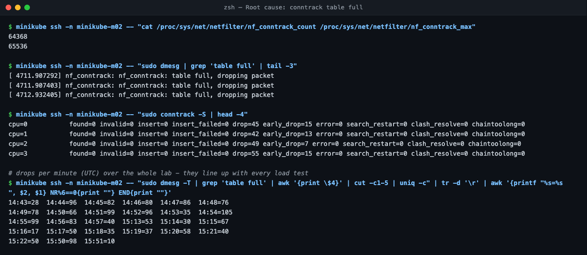

### Stop load and scale down

```bash
kubectl delete pod load-generator load-generator-2 load-generator-3 -n production-webapp
kubectl get hpa -n production-webapp -w
```

```
web-app-hpa   cpu: 43%/50%   2   5   4   33m
web-app-hpa   cpu: 1%/50%    2   5   4   35m
web-app-hpa   cpu: 1%/50%    2   5   2   39m     <- after the 5-minute stabilization window, straight to minReplicas

Normal  SuccessfulRescale  New size: 2; reason: All metrics below target
```

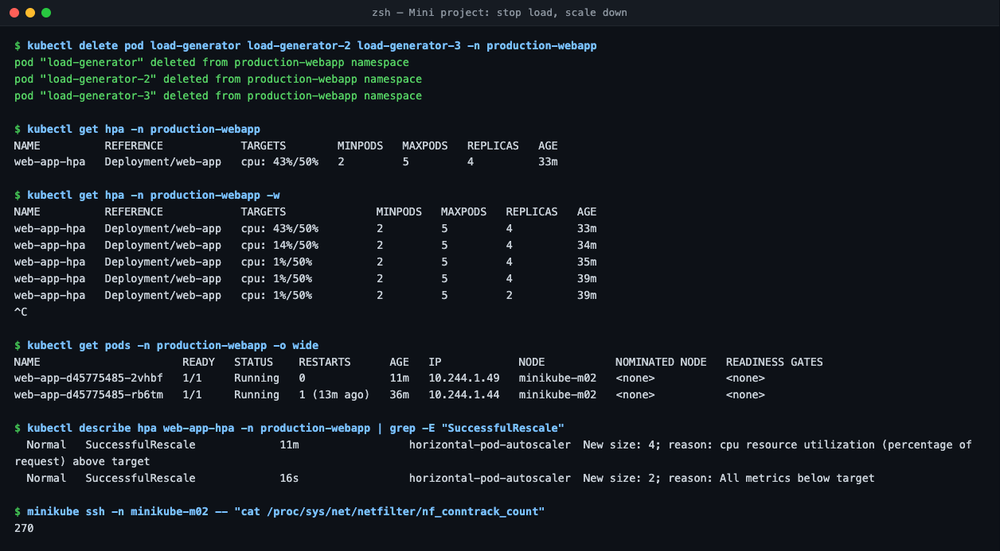

### Bonus challenges

**1. Target tuning: 50% → 30%**, with the same single generator that plateaued at 40%:

```bash
sed 's/averageUtilization: 50/averageUtilization: 30/' hpa.yaml | kubectl apply -f -
```

```
web-app-hpa   cpu: 21%/30%   2   5   2
web-app-hpa   cpu: 40%/30%   2   5   2
web-app-hpa   cpu: 40%/30%   2   5   3      ceil(2 x 40/30) = 3
web-app-hpa   cpu: 34%/30%   2   5   3      -> settled at 28m per Pod
```

Same load: at 50% it **never** scaled, at 30% it scaled within one metrics cycle. A lower target buys headroom and earlier scale-out at the cost of more idle replicas. Restored afterwards with `kubectl apply -f hpa.yaml`.

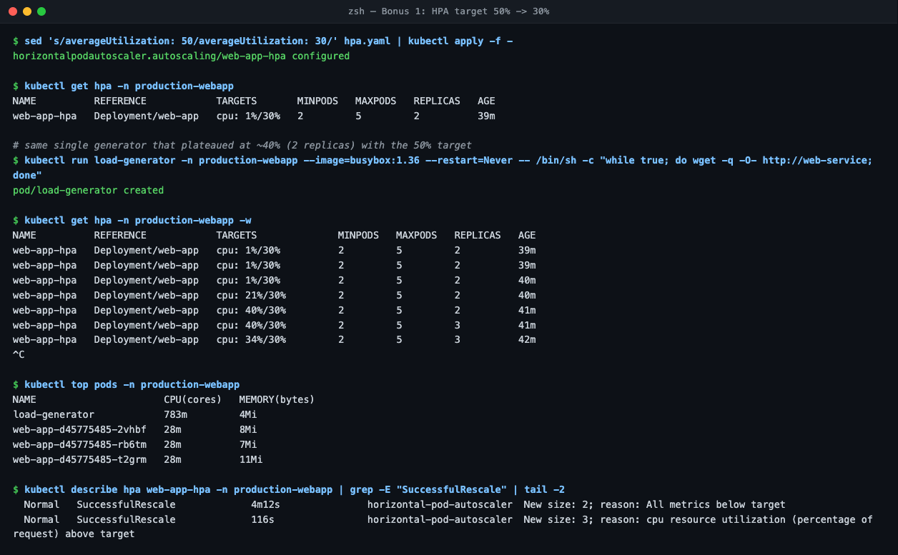

**2. Readiness gating.** `readinessProbe.httpGet.path: /does-not-exist`:

```
$ kubectl get pods -n production-webapp
web-app-5945bfc776-fsqml   0/1     Running   0          45s
web-app-5945bfc776-j72vc   0/1     Running   0          45s
web-app-5945bfc776-t7r7w   0/1     Running   0          45s

$ kubectl get endpoints -n production-webapp web-service
web-service               <- empty
10.244.1.54  ready=false  10.244.1.53  ready=false  10.244.1.55  ready=false   (EndpointSlice)

$ kubectl run curl-test ... wget -T 3 -q -O- http://web-service
wget: can't connect to remote host (10.104.44.215): Connection refused
```

This was a **total outage**, because the Deployment uses `strategy: Recreate`, which kills every old Pod before starting new ones. With `RollingUpdate` the old Pods would have kept serving and the rollout would have just stalled. `Recreate` is right for an RWO volume, but it means a bad probe takes everything down. Recovered with `kubectl rollout undo`.

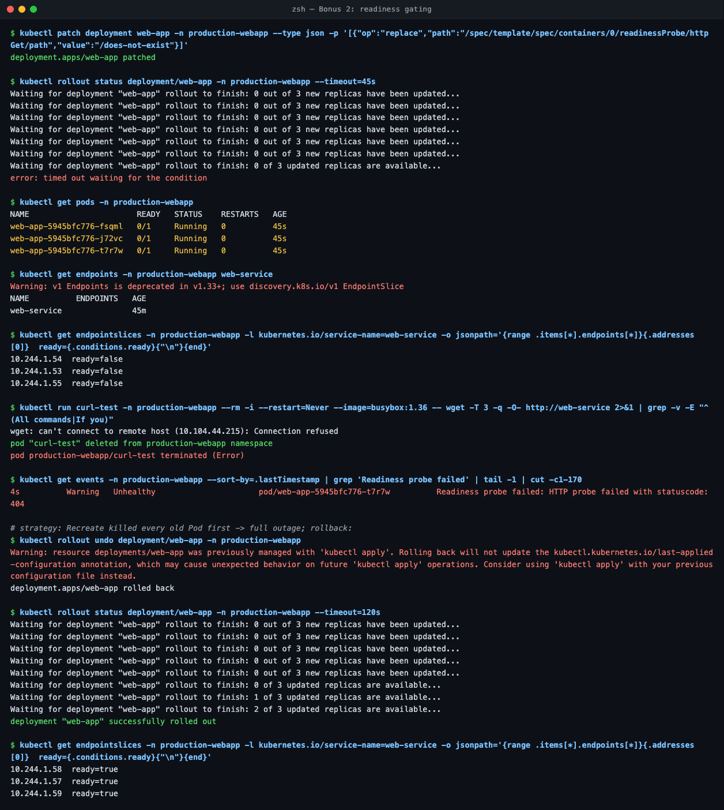

**3. Liveness restart loop.** `livenessProbe.httpGet.path: /crash`:

```
web-app-85d86b65d-gmdss   1/1     Running             0              9s
web-app-85d86b65d-gmdss   0/1     Running             1 (0s ago)     15s
web-app-85d86b65d-gmdss   0/1     Running             2 (0s ago)     30s
web-app-85d86b65d-gmdss   0/1     Running             3 (0s ago)     45s
web-app-85d86b65d-gmdss   0/1     CrashLoopBackOff    3 (1s ago)     61s
web-app-85d86b65d-gmdss   0/1     Running             4 (27s ago)    87s
web-app-85d86b65d-gmdss   0/1     CrashLoopBackOff    5 (0s ago)     2m
```

Exactly every 15s at first (`initialDelaySeconds 5`, then failures at 5/10/15s with `failureThreshold 3`), then kubelet's exponential back-off. Restored with `kubectl apply -f deployment.yaml`. After all three challenges and several `Recreate` rollouts, `/data/student.txt` still read `Student: Anantha Datta`.

`kubectl apply -f deployment.yaml` also resets `replicas: 2` and overrides whatever the HPA had set. That's harmless here (HPA min is 2), but in real setups you drop `replicas` from the manifest once an HPA owns it.

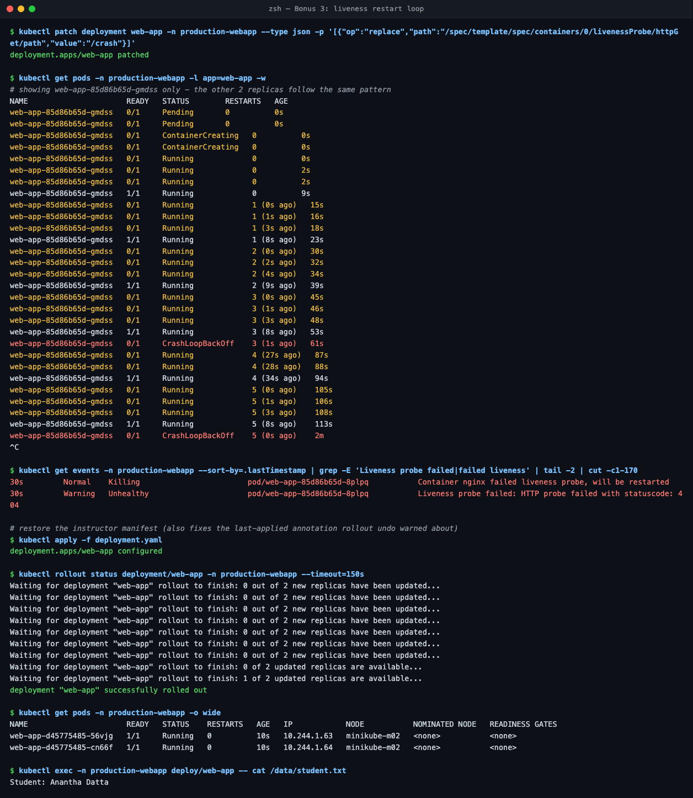

### The brief's troubleshooting guide, checked against what happened

| Brief | Seen in this lab? |
| :--- | :--- |
| Issue 1: PVC stuck `Pending` | Yes, with a different cause: the provisioner's helper image hit a Docker Hub `429`. `kubectl describe pvc` → `ProvisioningFailed` → helper Pod events |
| Issue 2: HPA `<unknown>/50%` | Yes, twice. No metrics-server (Task 2), and right after Pods were replaced (`did not receive metrics for targeted pods`) |
| Issue 3: `CrashLoopBackOff` | Yes. Bonus 3 (bad liveness path), and a liveness kill under load (conntrack) |

---

## Cleanup

```bash
kubectl delete namespace production-webapp
kubectl patch storageclass local-path -p '{"metadata":{"annotations":{"storageclass.kubernetes.io/is-default-class":"false"}}}'
kubectl patch storageclass standard   -p '{"metadata":{"annotations":{"storageclass.kubernetes.io/is-default-class":"true"}}}'
```

`metrics-server` is left enabled for Session 14 (`kubectl top`).
