# Session 14 — Kubernetes Troubleshooting

minikube v1.39 · Kubernetes v1.37 · 2 nodes. All output below is real. Extra manifests I wrote are in [`issues/`](issues/).

**Method used for every issue:** `get` → `describe` (Events) → `logs` → `exec` → fix → verify.

---

## Task 1 — Commands

| Command | Use |
| :--- | :--- |
| `kubectl get pods -o wide` | Status, restarts, Pod IP, node. First look. |
| `kubectl describe pod 
` | Full state + **Events** (scheduling, pulls, probe failures). |
| `kubectl logs 
` / `--previous` | App output. `--previous` = the container *before* the current one. |
| `kubectl exec 
 -- <cmd>` | Test from inside the Pod (curl localhost, env, DNS). |
| `kubectl events --for pod/
` | Events for one object, sorted. |
| `kubectl explain <field>` | Built-in API docs for any YAML field. |
| `kubectl top nodes/pods` | Live CPU/memory (needs metrics-server). |

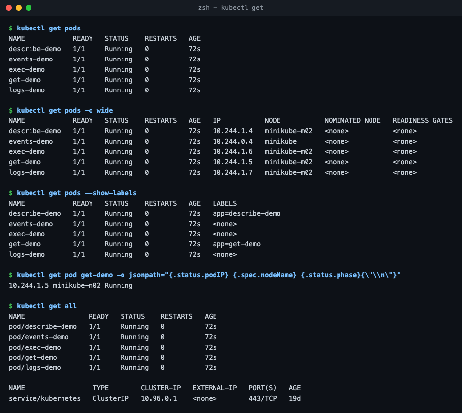
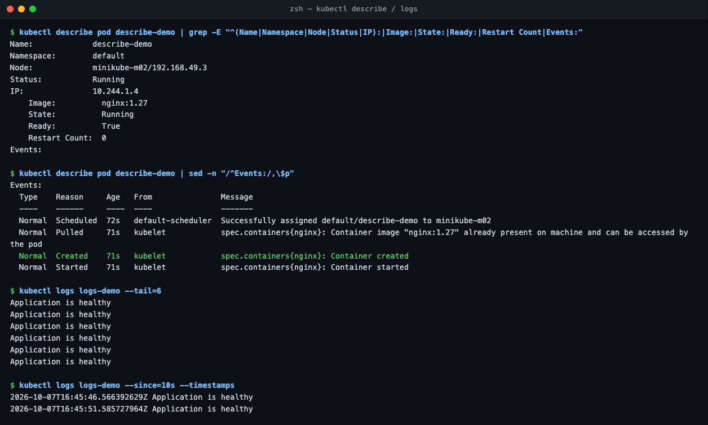
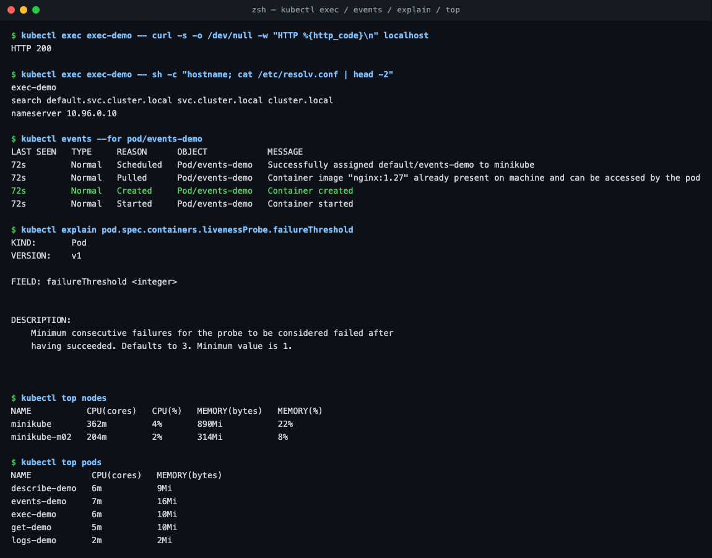

---

## Task 2 — Common issues

Started with the instructor's gauntlet `scenarios/triage_all.sh`:

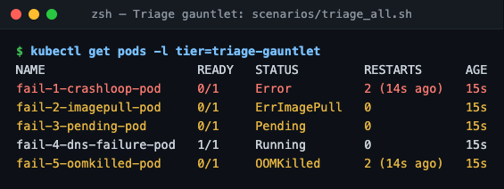

| Issue | What I saw | Root cause | Fix |
| :--- | :--- | :--- | :--- |
| **CrashLoopBackOff** | `Error`, Exit Code 1, `BackOff` | Command exits 1 (`crash-demo`); `DATABASE_URL` missing (scenario 1) | `fixed-pod.yaml`; add env var **and** keep the process running |
| **ImagePullBackOff / ErrImagePull** | `Failed to pull image` | Tag doesn't exist; repo doesn't exist | Use `nginx:1.27` |
| **Pending** | `FailedScheduling` | nodeSelector matches no node; requests 500 CPU / 1000Gi | Remove selector; sane requests |
| **OOMKilled** | `OOMKilled`, Exit Code 137 | Allocates ~1GB with a 20Mi limit | Limit that fits the workload (or fix the leak) |
| **ContainerCreating** | `FailedMount: configmap "site-config" not found` | Mounted ConfigMap missing | Create the ConfigMap |
| **Config issue** | `CreateContainerConfigError: secret "db-credentials" not found` | Env var refers to a missing Secret | Create the Secret |
| **Service connectivity** | `curl: (7) Couldn't connect`, Endpoints empty | Selector `app=web-ahsgdf` ≠ label `app=web` | Fix selector |
| **DNS** | `Could not resolve host` / `NXDOMAIN` | Wrong hostname, no such Service | Create Service, use `postgres-db.production.svc.cluster.local` |
| **Pod networking** | Pod Running, Service has endpoint, still refused | App listens on `127.0.0.1` only | Bind `0.0.0.0` |

### CrashLoopBackOff
- `kubectl logs --previous` failed (`unable to retrieve container logs`). When the status is `Error`, the dead container **is** the current one, so use plain `kubectl logs`.
- Scenario 1: adding `DATABASE_URL` alone still restarted (`Completed`, exit 0). A Pod restarts on **any** exit, so the app must keep running.
- Then the logs were empty: Python buffers stdout. `PYTHONUNBUFFERED=1` fixed it ([`issues/crashloop-config-fixed.yaml`](issues/crashloop-config-fixed.yaml)).

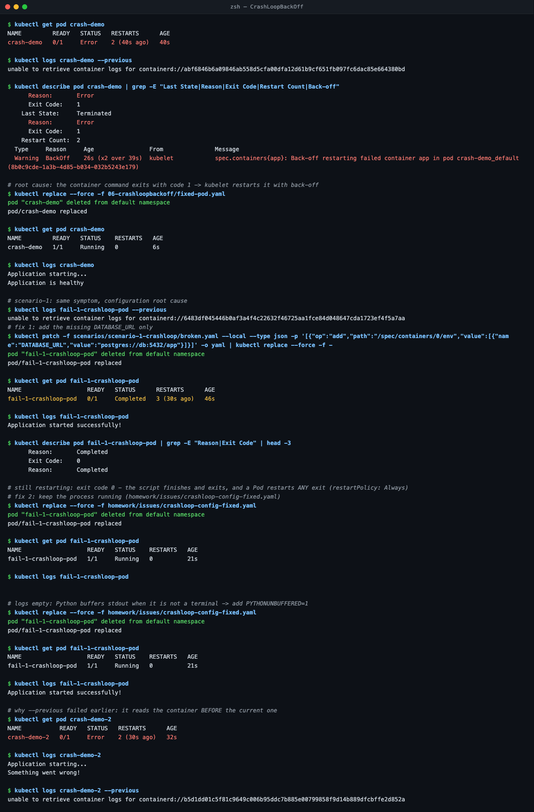

### ImagePullBackOff / ErrImagePull
- `ErrImagePull` = the pull just failed. `ImagePullBackOff` = kubelet waiting before retrying.
- The real error for `image-demo` was **`429 Too Many Requests`** (Docker Hub rate limit), which hides "tag not found". `docker manifest inspect` confirmed the tag doesn't exist.

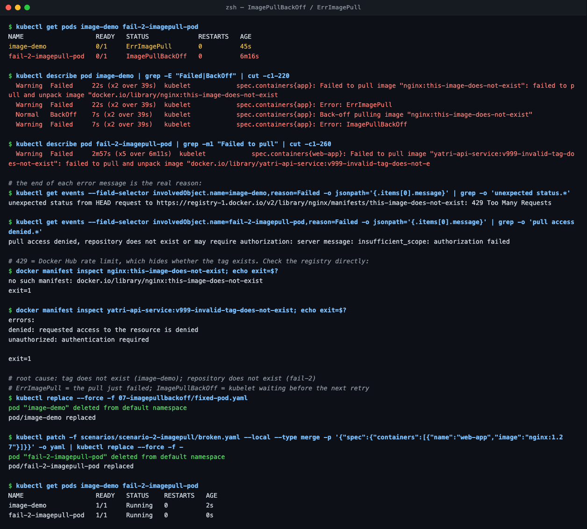

### Pending
- Scheduler message says exactly why: `didn't match Pod's node affinity/selector` and `Insufficient cpu, Insufficient memory`.
- Nodes have 8 CPU; the Pod asked for 500.

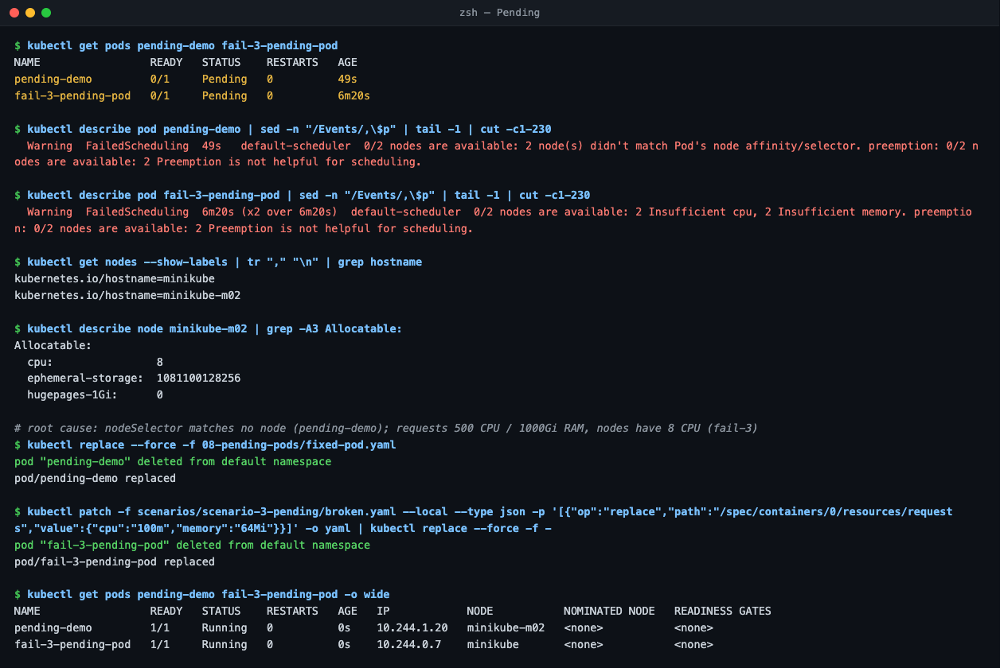

### OOMKilled
- `Reason: OOMKilled`, `Exit Code: 137` (128 + SIGKILL). The kernel killed it, not Kubernetes.
- Raising the limit is only right if the app really needs the memory; otherwise fix the leak.

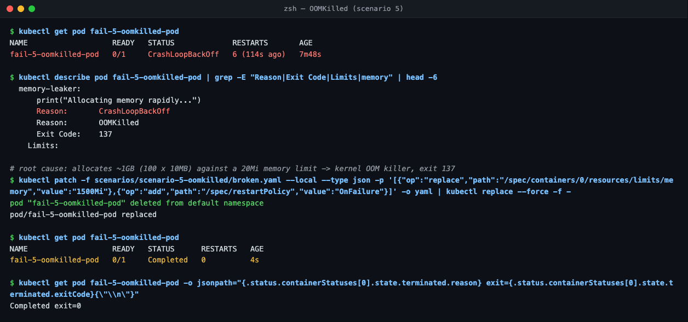

### ContainerCreating & configuration errors
- Missing ConfigMap volume → stuck `ContainerCreating` with `FailedMount`. Created it, Pod started on its own.
- Missing Secret in `env` → `CreateContainerConfigError`. Created it, Pod started on its own (no restart needed).

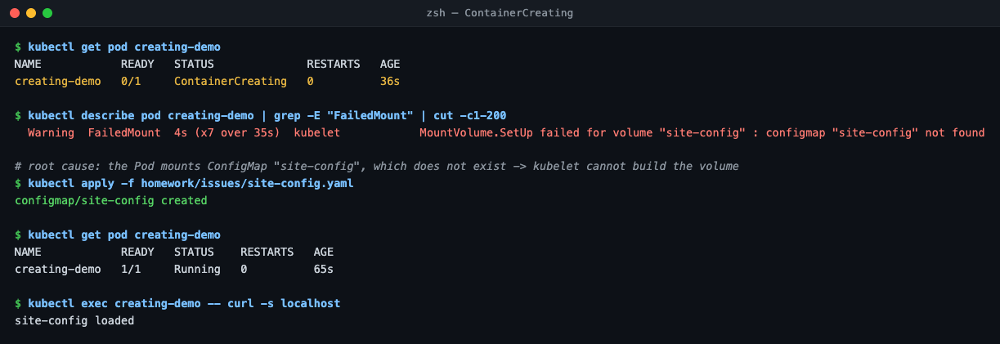
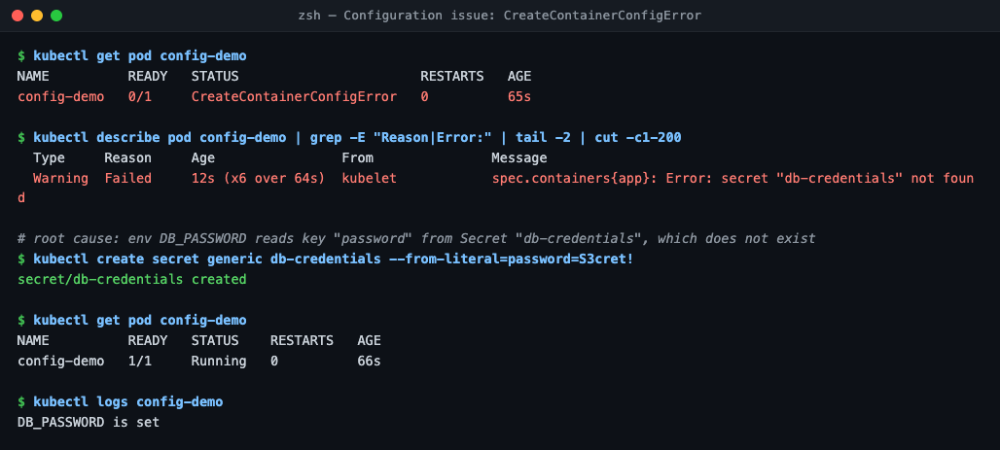

### Service connectivity
- Endpoints `<unset>` is the giveaway. Compare `describe svc` Selector with `get pods --show-labels`.

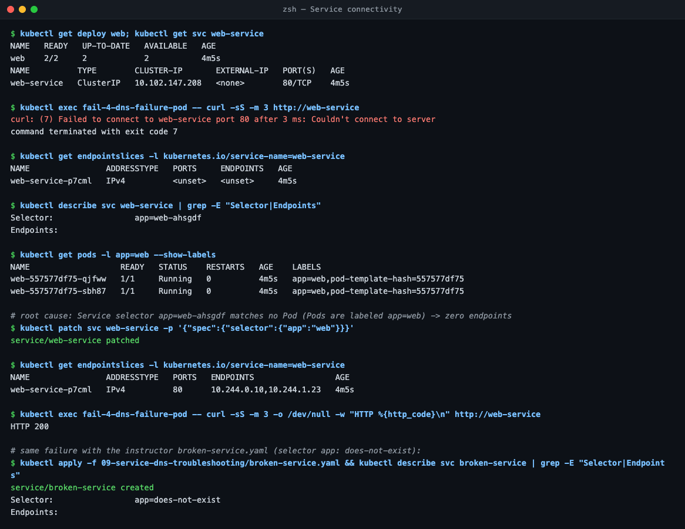

### DNS
- The instructor's `dns-test-pod.yaml` image `e2e-test-images/dnsutils:1.3` **does not exist**. The real one is `jessie-dnsutils:1.3` ([`issues/dns-test-pod-fixed.yaml`](issues/dns-test-pod-fixed.yaml)).
- Scenario 4's app hides its error (`curl -s ... || true`). Running it with `-sS` showed `Could not resolve host`.
- Fixed with a real `postgres-db` Service in `production` + correct name ([`issues/dns-fix-postgres-db.yaml`](issues/dns-fix-postgres-db.yaml), [`issues/dns-client-fixed.yaml`](issues/dns-client-fixed.yaml)).

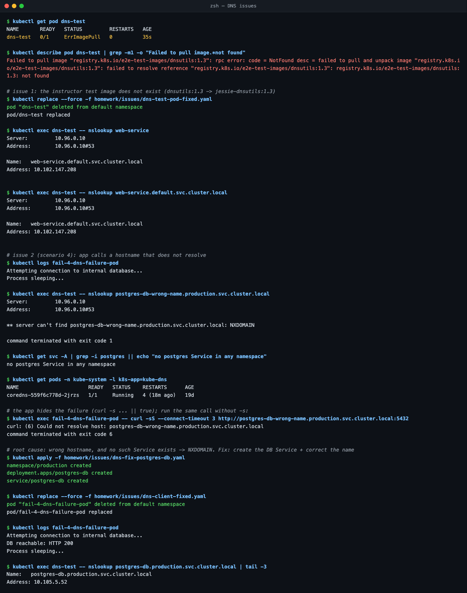

### Pod networking
- Pod IP and Service both refused, but `wget 127.0.0.1:8080` inside the Pod worked.
- `/proc/net/tcp` showed `0100007F:1F90` = 127.0.0.1:8080. After the fix: `00000000:1F90` = 0.0.0.0:8080.

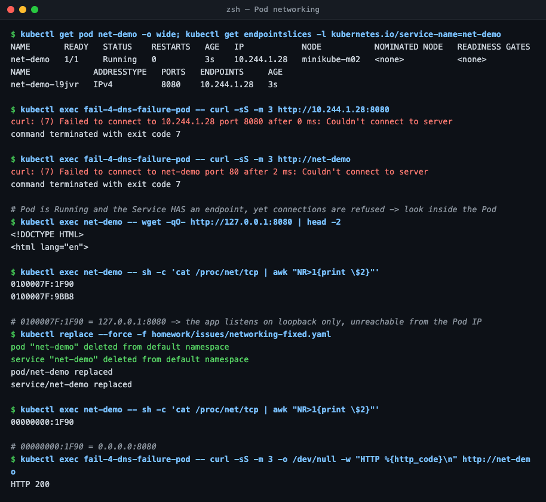

---

## Task 3 — Mini project

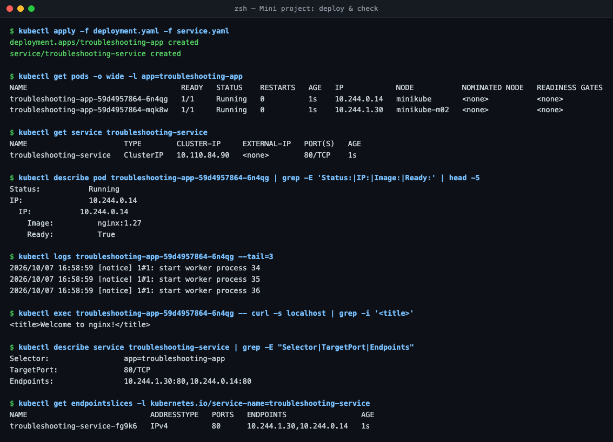

**Broken pod (`project-broken-pod`)**
1. **Status:** `ErrImagePull` → `ImagePullBackOff`.
2. **Error:** `Failed to pull image "nginx:this-tag-does-not-exist"` (registry also returned `429 Too Many Requests`).
3. **Command:** `kubectl describe pod project-broken-pod` (Events).
4. **What's wrong:** the tag `this-tag-does-not-exist` doesn't exist (`docker manifest inspect` → no such manifest).
5. **Fix:** use a real tag (`nginx:1.27`). Pod became `Running`.

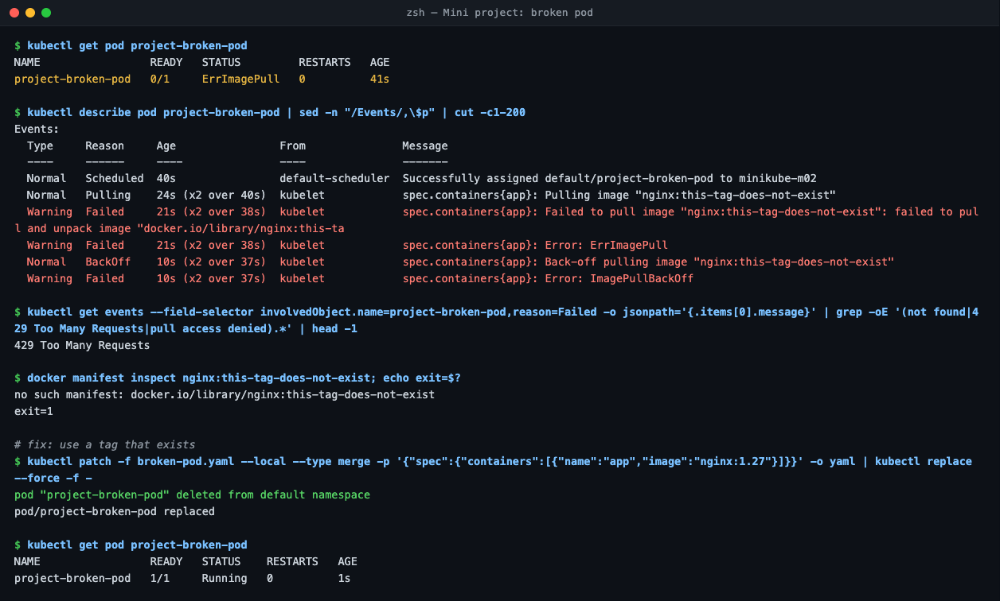

**Service selector challenge:** selector changed to `app: wrong-app` → Endpoints `<none>`, curl refused. Pod labels say `app=troubleshooting-app`. Re-applied `service.yaml` → endpoints back, `HTTP 200`.

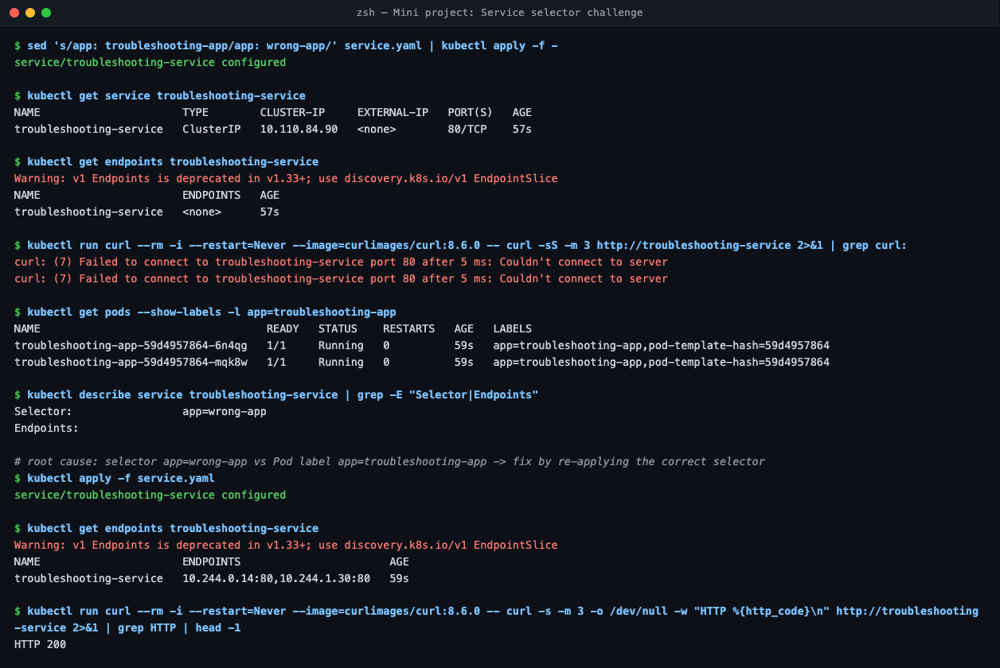

| Problem | What I saw | Command | Root cause | Fix |
| :--- | :--- | :--- | :--- | :--- |
| Broken Pod | `ErrImagePull` | `describe pod` | Bad image tag | `nginx:1.27` |
| Service problem | Endpoints `<none>` | `describe svc`, `get pods --show-labels` | Selector ≠ Pod label | Correct selector |
| Image problem | `429` hid the real error | `docker manifest inspect` | Tag doesn't exist | Real tag |

**README questions**
1. **`get`:** quick list of resources and their current status.
2. **`get` vs `describe`:** `get` = one-line summary; `describe` = full detail + Events.
3. **`logs`:** see what the app printed (errors, stack traces).
4. **`exec`:** test from inside the Pod: curl localhost, check env, DNS, files.
5. **CrashLoopBackOff:** container keeps exiting; kubelet restarts it with growing delays.
6. **ImagePullBackOff:** image can't be pulled (bad name/tag, auth, rate limit); kubelet retries with back-off.
7. **Pending:** scheduler can't place it: not enough CPU/memory, selector/affinity/taint mismatch, unbound PVC.
8. **No endpoints:** selector matches no Pod, or the matching Pods aren't Ready.
9. **Selector ↔ labels:** the Service sends traffic to Pods whose labels match its selector.
10. **Kubernetes DNS:** CoreDNS gives every Service a name, `<svc>.<ns>.svc.cluster.local`.
