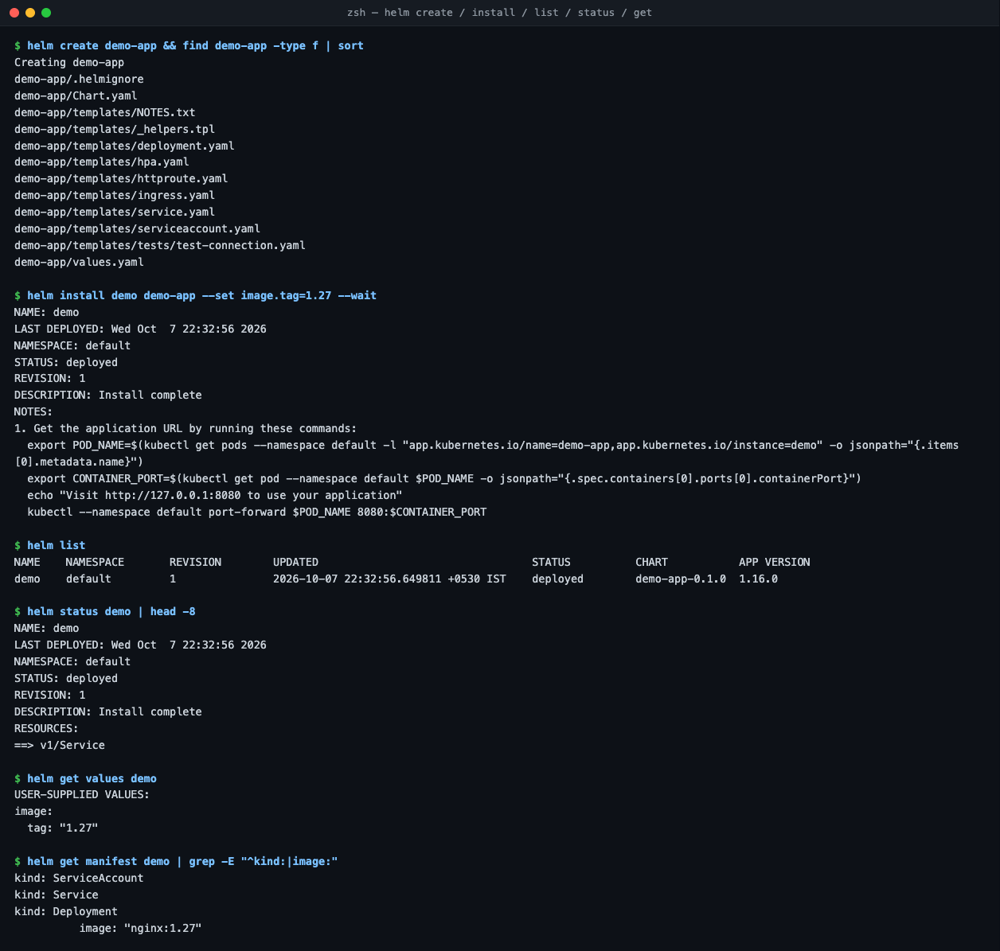
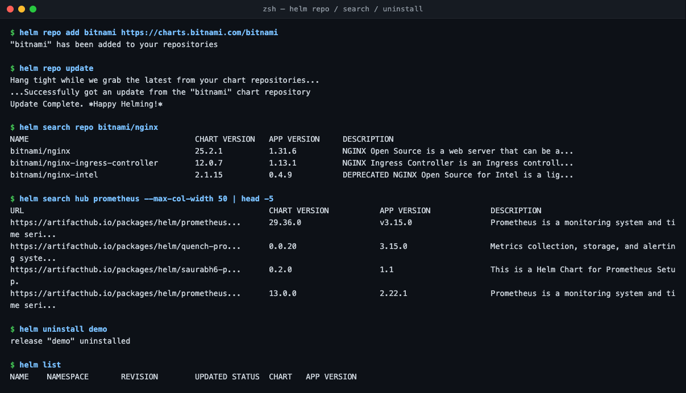
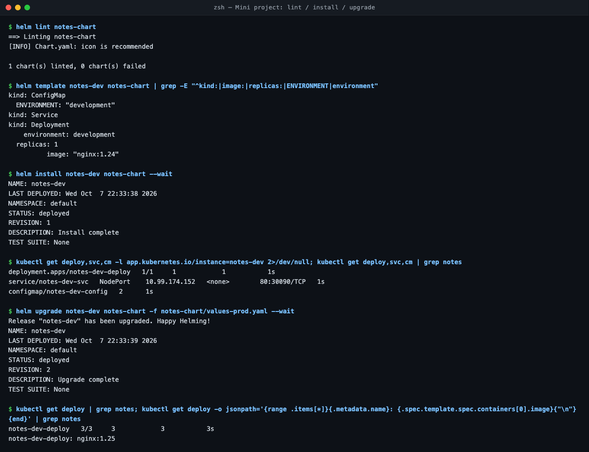
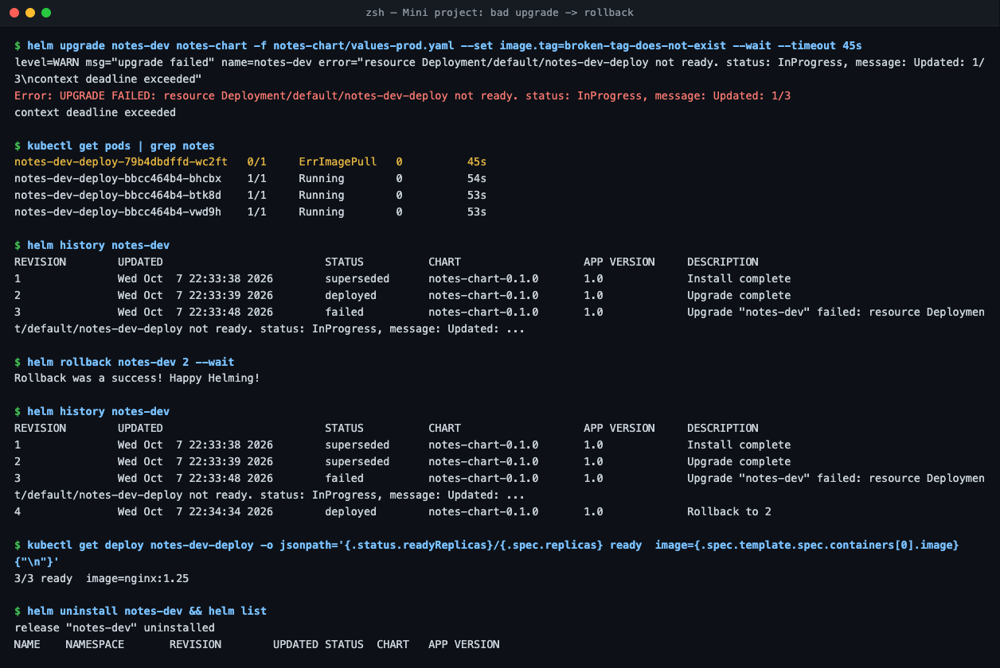

# Session 15 — Helm

Helm v4.3.0 on minikube (2 nodes). All output is real.

## Task 1 — Helm commands

| Command | What it does |
| :--- | :--- |
| `helm create demo-app` | Scaffolds a chart: `Chart.yaml`, `values.yaml`, `templates/` ([`demo-app/`](demo-app/)). |
| `helm install demo demo-app` | Renders templates with values and creates a **release** (revision 1). |
| `helm list` / `helm status demo` | Releases in the namespace / one release's state and resources. |
| `helm get values` / `get manifest` | Values used / the exact YAML Helm applied. |
| `helm upgrade` / `history` / `rollback` | New revision / all revisions / go back to an old revision. |
| `helm repo add/update` / `helm search repo/hub` | Add a chart repo / search it or Artifact Hub. |
| `helm uninstall demo` | Deletes the release and everything it created. |

## Task 2 + Task 3 — Mini project & rollback workflow

Chart: [`../mini-project/notes-chart`](../mini-project/notes-chart) (instructor's). Flow: **install → upgrade → verify → bad upgrade → verify → rollback → verify**.

| Rev | Action | Result |
| :-- | :--- | :--- |
| 1 | `helm install notes-dev notes-chart` | 1 replica, `nginx:1.24`, env `development` |
| 2 | `helm upgrade -f values-prod.yaml` | 3/3 replicas, `nginx:1.25`, env `production` |
| 3 | `upgrade --set image.tag=broken-tag-does-not-exist` | **failed**: new Pod `ErrImagePull`, old 3 Pods kept serving |
| 4 | `helm rollback notes-dev 2` | back to 3/3, `nginx:1.25` |

- Rollback doesn't delete history; it creates a **new** revision (4 = "Rollback to 2").
- `--wait --timeout 45s` made the bad upgrade fail fast and get marked `failed`. Without `--wait`, Helm reports success even though the Pods are broken.

