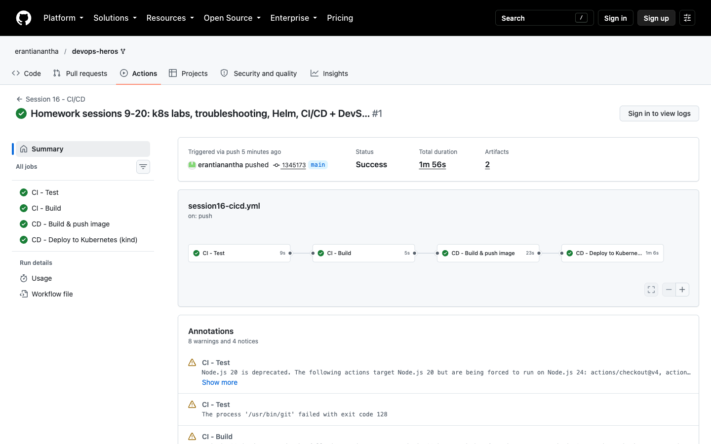
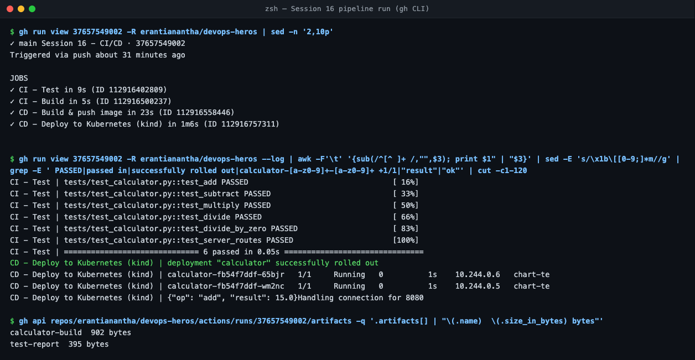

# Session 16 — CI/CD & GitHub Actions

Project: [`cicd-demo/`](cicd-demo/) (instructor's calculator from `10-final-cicd-pipeline` + HTTP server, Dockerfile, k8s manifest).
Workflow: [`.github/workflows/session16-cicd.yml`](../../.github/workflows/session16-cicd.yml). Runs on GitHub: [Actions](https://github.com/erantianantha/devops-heros/actions/workflows/session16-cicd.yml).

```
push to main ─► CI: Test ─► CI: Build ─► CD: Docker build + push (GHCR) ─► CD: Deploy to kind + smoke test
```

| Concept | In this project |
| :--- | :--- |
| **CI vs CD** | CI = test + build on every push. CD = ship the image and deploy it automatically. |
| **Workflow** | YAML in `.github/workflows/`, triggered by `push` (path-filtered) or `workflow_dispatch`. |
| **Jobs / Steps** | 4 jobs chained with `needs:`; each job is a list of steps (`uses:` an action or `run:` a shell). |
| **Runners** | `ubuntu-latest` GitHub-hosted VM, fresh for every job. |
| **Secrets** | `secrets.GITHUB_TOKEN` logs in to GHCR. Never printed, masked as `***` in logs. |
| **Artifacts** | `test-report` (JUnit XML) and `calculator-build` uploaded with `actions/upload-artifact`. |
| **Build / Test** | `pytest` (6 passed) → `build.sh` → `docker build`. |
| **Execution** | All 4 jobs green; the deploy job rolled out 2 Pods and `curl /add?a=10&b=5` → `{"result": 15.0}`. |



