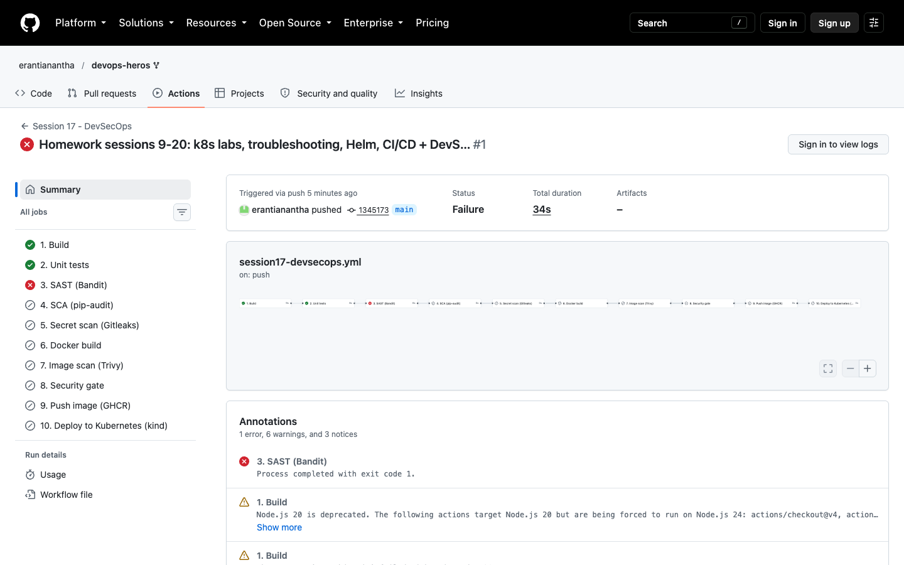
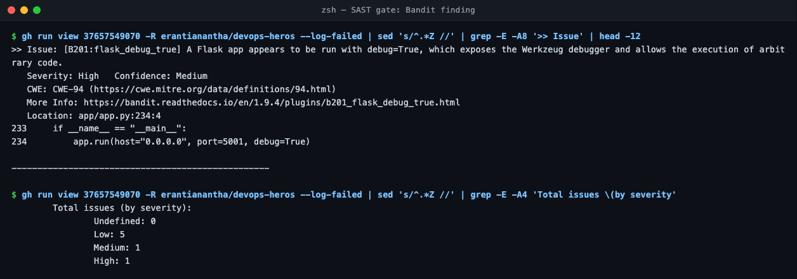
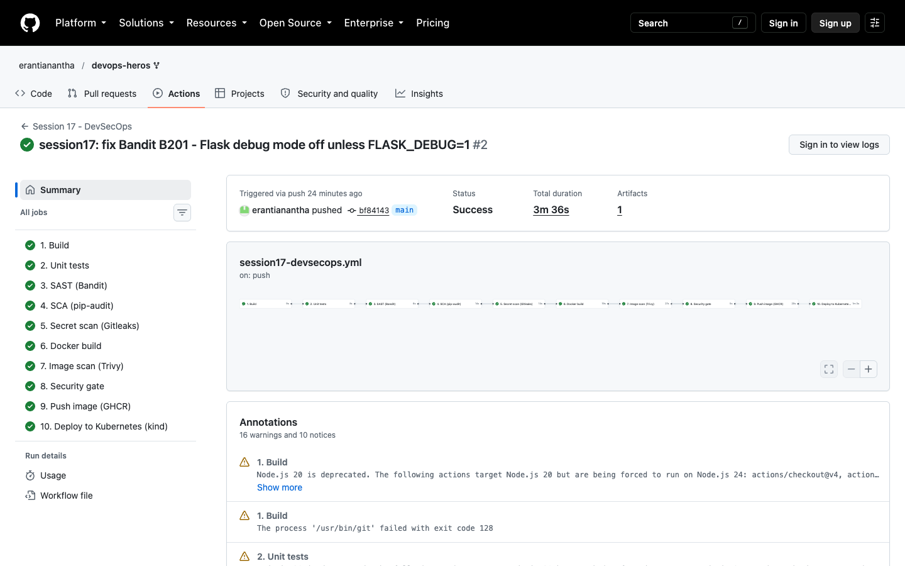
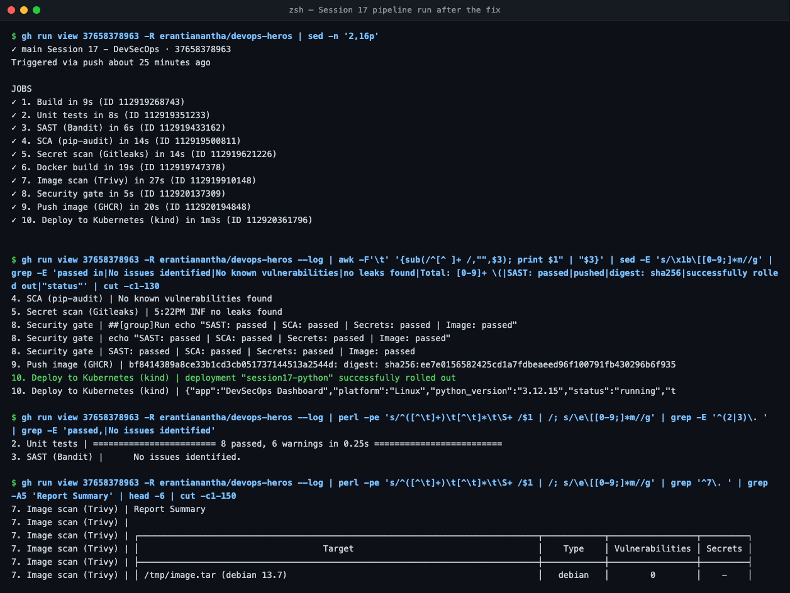
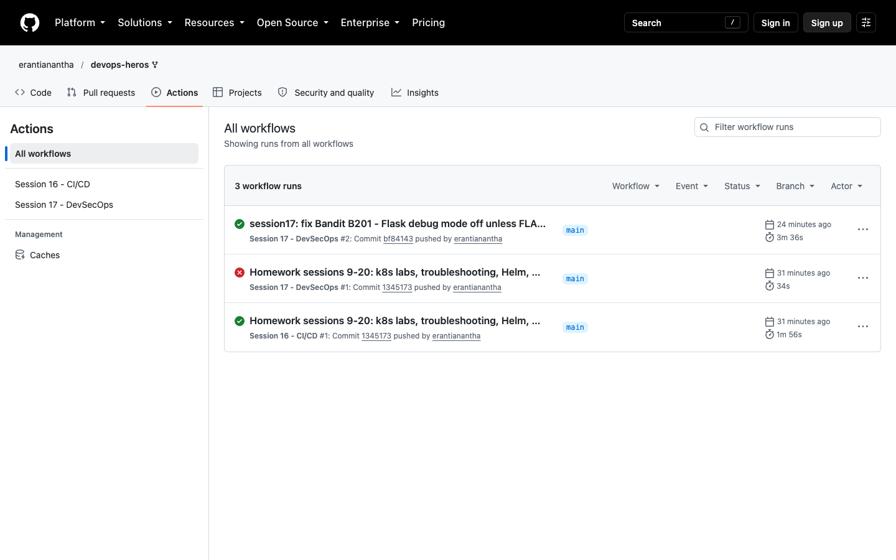

# Session 17 — CI/CD + DevSecOps

App: [`devsecops-demo/`](devsecops-demo/) (instructor's Flask demo). Pipeline: [`.github/workflows/session17-devsecops.yml`](../../.github/workflows/session17-devsecops.yml) · [runs](https://github.com/erantianantha/devops-heros/actions/workflows/session17-devsecops.yml)

```
Build → Unit Test → SAST → SCA → Secret Scan → Docker Build → Image Scan → Security Gate → Push (GHCR) → Deploy (kind)
```

| Stage | Tool | Gate rule |
| :--- | :--- | :--- |
| SAST | Bandit | fail on HIGH severity |
| SCA | pip-audit | fail on any known-vulnerable package |
| Secret scan | Gitleaks | fail on any secret |
| Image scan | Trivy | fail on fixable CRITICAL |
| Security gate | `needs:` all scans | image is pushed **only** if every scan passed |

## Run 1 — blocked by the gate
- SAST failed: **Bandit B201**, `app.run(..., debug=True)` (HIGH, CWE-94). The Werkzeug debugger allows remote code execution.
- Nothing after SAST ran: no image built, pushed or deployed. That's the gate working.




## Fix → Run 2 — all green
- `debug=os.environ.get("FLASK_DEBUG") == "1"` (off by default).
- Bandit: no issues · pip-audit: no known vulnerabilities · Gitleaks: no leaks · Trivy: 0 (Debian 13.7) → pushed to GHCR → 2 Pods rolled out → `/api/status` = `running`.
- Changed from the instructor's version: added secret scanning + an explicit gate job, and push to GHCR with `GITHUB_TOKEN` (no Docker Hub password).




