# Session 10 — Kubernetes Core Objects & Deployment Strategies

**Repo:** devops-heros / `session10-k8s-core-objects`
**Cluster:** minikube v1.39.0, Kubernetes v1.37.0, **2 nodes** (`minikube` control-plane + `minikube-m02` worker) so DaemonSet / scheduling behaviour is visible.

```bash
minikube start
minikube node add        # second node, used in Task 7
```

---

## Task 1 — Cluster health check

```bash
kubectl cluster-info
kubectl get nodes -o wide
```

```
Kubernetes control plane is running at https://127.0.0.1:57404
CoreDNS is running at https://127.0.0.1:57404/api/v1/namespaces/kube-system/services/kube-dns:dns/proxy

NAME           STATUS   ROLES           AGE     VERSION   INTERNAL-IP    CONTAINER-RUNTIME
minikube       Ready    control-plane   4m30s   v1.37.0   192.168.49.2   containerd://2.3.4
minikube-m02   Ready    <none>          2m19s   v1.37.0   192.168.49.3   containerd://2.3.4
```

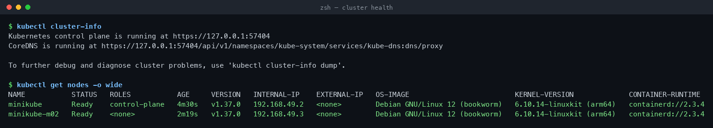

---

## Task 2 — Pod: deploy, inspect, delete (`pod.yml`)

Every manifest needs the same 4 top-level fields: `apiVersion`, `kind`, `metadata`, `spec`.

```bash
kubectl apply -f pod.yml
kubectl get pods -o wide
kubectl logs nginx-pod
kubectl delete -f pod.yml
```

```
NAME        READY   STATUS    RESTARTS   AGE   IP           NODE
nginx-pod   1/1     Running   0          19s   10.244.1.2   minikube-m02
```

The Pod got a cluster IP from the CNI and was scheduled onto the worker node, not the control plane.

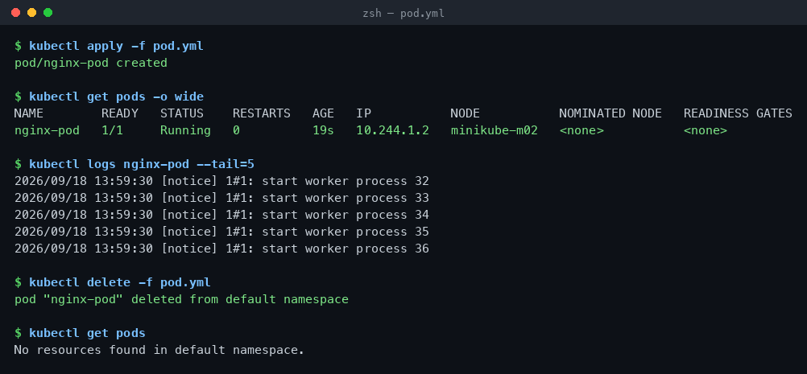

---

## Task 3 — `ErrImagePull` → `ImagePullBackOff`

```bash
kubectl apply -f pod-lifecycle/06-imagepullbackoff.yaml
kubectl get pod lifecycle-image-error
kubectl describe pod lifecycle-image-error | grep -A 7 Events:
```

```
NAME                    READY   STATUS         RESTARTS   AGE
lifecycle-image-error   0/1     ErrImagePull   0          41s

Warning  Failed   21s (x2 over 39s)  kubelet  Failed to pull image "jakwehrgkaejw:kahsdfgkhj"
Warning  Failed   21s (x2 over 39s)  kubelet  Error: ErrImagePull
Normal   BackOff  7s  (x2 over 38s)  kubelet  Back-off pulling image "jakwehrgkaejw:kahsdfgkhj"
```

**Why the object still exists:** the API server only validates the manifest and writes it to etcd — that part succeeded. The failure happens later, on the node, when the kubelet asks containerd to pull the image. Kubelet then retries with exponential backoff (`ErrImagePull` → `ImagePullBackOff`).

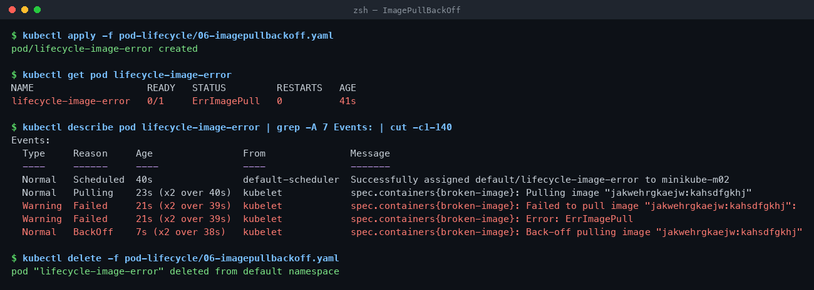

---

## Task 4 — Transient pod phases (`hello.yml`)

`restartPolicy: Never` + a short command, polled every 0.5s:

```bash
kubectl apply -f hello.yml
kubectl get pods -w
```

```
hello-pod   0/1   Pending             0   0s
hello-pod   0/1   ContainerCreating   0   0s
hello-pod   1/1   Running             0   5s
hello-pod   0/1   Completed           0   6s

$ kubectl logs hello-pod
Hello Kubernetes
```

`Completed` = phase `Succeeded`, exit code 0. Without `restartPolicy: Never` this would have become `CrashLoopBackOff`.

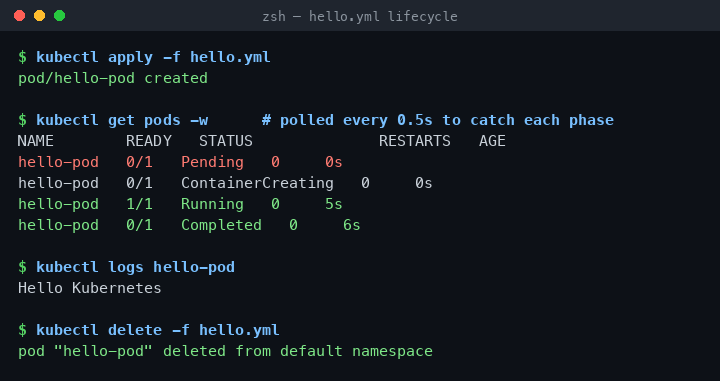

---

## Task 5 — Pod lifecycle & probes lab (`pod-lifecycle/`)

### 5a. Pending + CrashLoopBackOff

```bash
kubectl apply -f 02-pending.yaml -f 05-crashloopbackoff.yaml
```

```
lifecycle-crashloop   0/1   ContainerCreating   0             0s
lifecycle-crashloop   1/1   Running             0             1s
lifecycle-crashloop   0/1   Error               1 (5s ago)    8s
lifecycle-crashloop   1/1   Running             2 (15s ago)   22s
lifecycle-crashloop   0/1   CrashLoopBackOff    2 (26s ago)   51s

lifecycle-pending     0/1   Pending             0             51s
Warning  FailedScheduling  default-scheduler  0/2 nodes are available: 2 Insufficient memory.
```

Pending = the scheduler found no node with 9Gi free. Nothing is wrong with the image — the Pod was never placed.

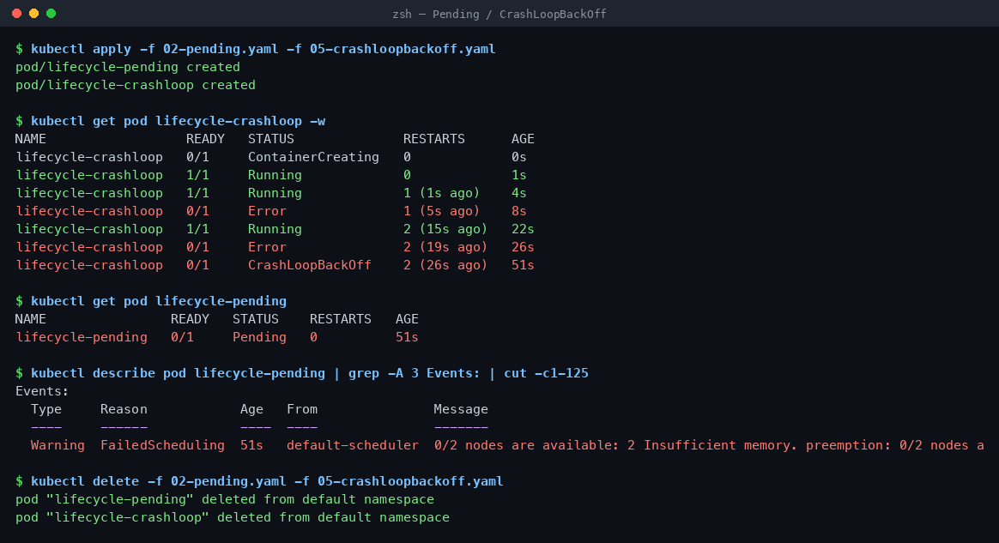

### 5b. Succeeded / Failed / readiness / liveness / startup

```bash
kubectl apply -f 03-succeeded.yaml -f 04-failed.yaml -f 07-readiness.yaml -f 08-liveness.yaml -f 09-startup.yaml
```

```
# t+4s  — running but not ready yet
lifecycle-startup     0/1   Running     0   4s

# t+50s
lifecycle-succeeded   0/1   Completed   0   50s
lifecycle-failed      0/1   Error       0   50s
lifecycle-readiness   1/1   Running     0   50s
lifecycle-startup     1/1   Running     0   50s

# t+92s — liveness probe failed, kubelet restarted the container
lifecycle-liveness    1/1   Running     1 (40s ago)   100s
Warning  Unhealthy  kubelet  Liveness probe failed:
Normal   Killing    kubelet  Container app failed liveness probe, will be restarted
```

| Probe | Failure means |
| :--- | :--- |
| **readiness** | Pod is pulled out of the Service endpoints. Container keeps running. |
| **liveness** | Container is killed and restarted. |
| **startup** | Holds liveness/readiness back until the app finishes booting — no premature restarts. |

`0/1 Running` is the whole point: **Running ≠ Ready**, and only Ready pods receive traffic.

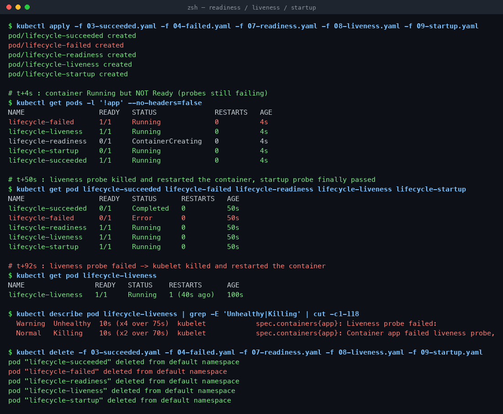

### 5c. Init container + sidecar

```bash
kubectl apply -f 10-init-container.yaml -f 11-multi-container.yaml
```

```
lifecycle-init              0/1   Init:0/1   0   0s      <- app container not started yet
lifecycle-init              1/1   Running    0   13s

lifecycle-multi-container   2/2   Running    0   13s     <- app + sidecar in one Pod

$ kubectl logs lifecycle-multi-container -c sidecar
Sidecar is running
```

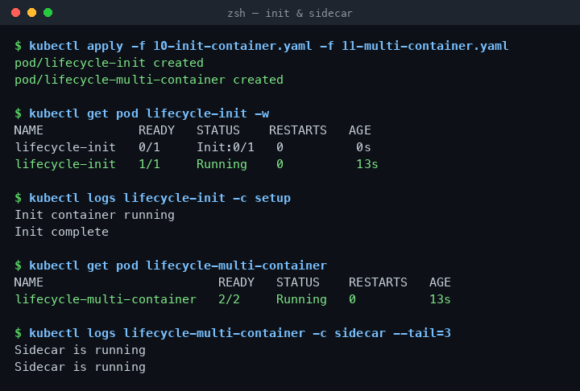

### 5d. Graceful termination

```bash
kubectl apply -f 12-termination.yaml
time kubectl delete pod lifecycle-termination
```

```
pod "lifecycle-termination" deleted from default namespace
kubectl delete pod lifecycle-termination   11.413 total
```

11s, not instant: the container traps `SIGTERM`, cleans up for 10s, then exits — all inside the 20s `terminationGracePeriodSeconds`. Blow past the grace period and you get `SIGKILL`.

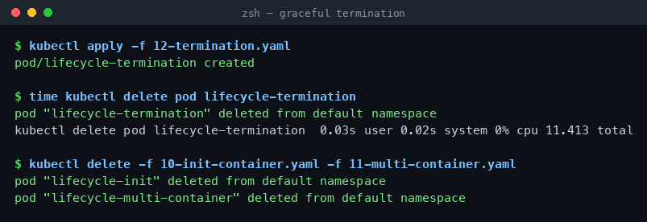

---

## Task 6 — ReplicaSet & StatefulSet

### ReplicaSet — self-healing

```bash
kubectl apply -f replicaset.yml
kubectl delete pod nginx-rs-2z8d7
kubectl get pods -l app=nginx
```

```
NAME             READY   STATUS              RESTARTS   AGE
nginx-rs-9gl8r   1/1     Running             0          2m2s
nginx-rs-jttkc   1/1     Running             0          2m2s
nginx-rs-n7jz4   0/1     ContainerCreating   0          2s      <- replacement, 2s later
```

### StatefulSet — ordinals + per-pod storage

```bash
kubectl apply -f k8s-core-objects/statefulset.yml
```

`mysql:5.7` is amd64-only, so on Apple Silicon it lands in `ImagePullBackOff`. Fixed by switching to the multi-arch tag:

```bash
kubectl set image statefulset/mysql mysql=mysql:8.0
kubectl delete pod mysql-0
```

```
NAME      READY   STATUS    RESTARTS   AGE     IP            NODE
mysql-0   1/1     Running   0          3m43s   10.244.1.20   minikube-m02
mysql-1   1/1     Running   0          2m30s   10.244.0.5    minikube
mysql-2   1/1     Running   0          107s    10.244.1.21   minikube-m02

NAME                               STATUS   CAPACITY   ACCESS MODES
mysql-persistent-storage-mysql-0   Bound    5Gi        RWO
mysql-persistent-storage-mysql-1   Bound    5Gi        RWO
mysql-persistent-storage-mysql-2   Bound    5Gi        RWO
```

Look at the ages — 3m43s, 2m30s, 107s. Pods start **one at a time, in order**, and each gets its own PVC from `volumeClaimTemplates`.

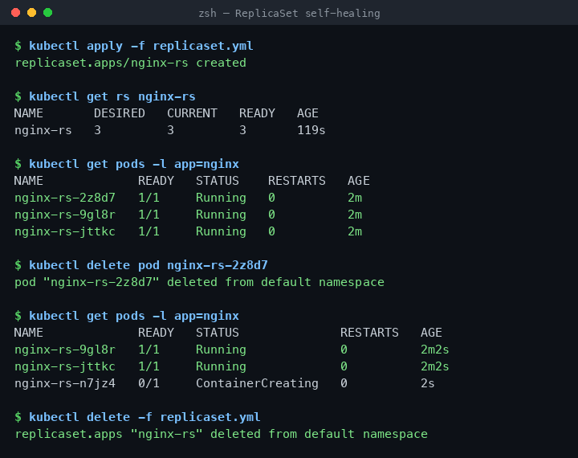
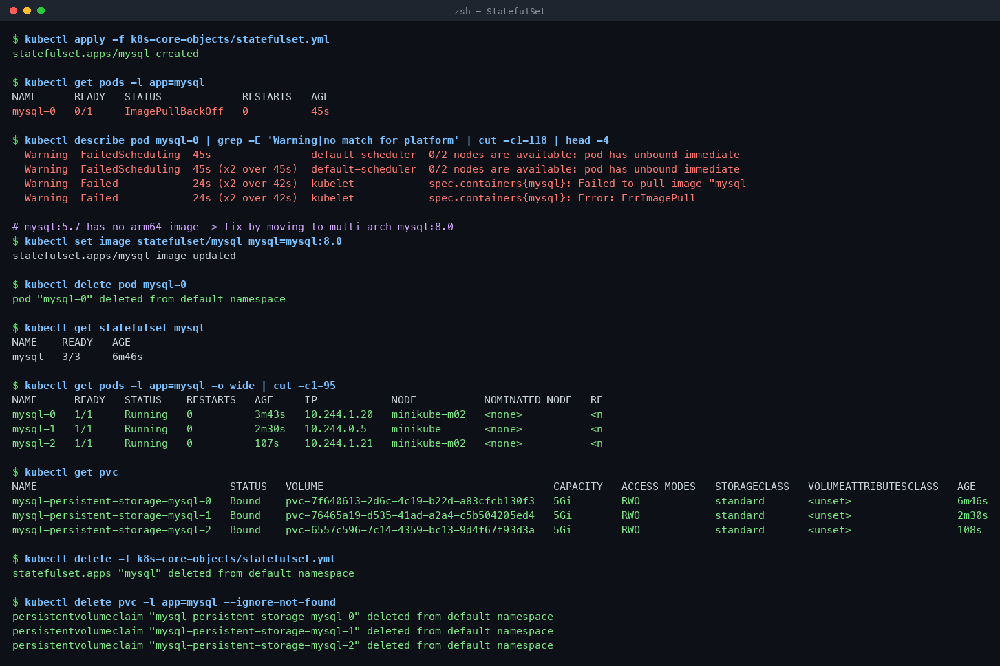

---

## Task 7 — DaemonSet: one pod per node

```bash
kubectl apply -f k8s-core-objects/deamonset.yml
kubectl get ds node-exporter
kubectl get pods -l app=node-exporter -o wide
```

```
NAME            DESIRED   CURRENT   READY   AVAILABLE   NODE SELECTOR   AGE
node-exporter   2         2         2       2           <none>          9s

NAME                  READY   STATUS    IP            NODE
node-exporter-4ckdw   1/1     Running   10.244.1.22   minikube-m02
node-exporter-wcmhk   1/1     Running   10.244.0.6    minikube
```

No `replicas` field anywhere — DESIRED is simply the node count. Add a node and a pod appears on it automatically. This is how node-exporter, Fluentd, Falco and CNI agents are deployed.

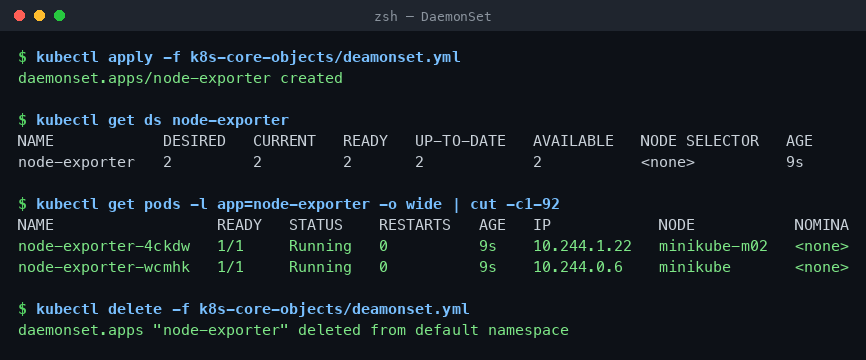

---

## Task 8 — Rolling update & rollback (`01-rolling-update/`)

`replicas: 4`, `maxSurge: 1`, `maxUnavailable: 0`.

```bash
kubectl apply -f deployment-v1.yaml -f service.yaml
kubectl apply -f deployment-v2.yaml
kubectl rollout status deployment/app-rolling
kubectl rollout history deployment/app-rolling
kubectl rollout undo deployment/app-rolling
```

Traffic polled from inside the node while the rollout ran:

```
HTTP 200  VERSION: v1
HTTP 200  VERSION: v2     <- first v2 pod passed its readiness probe
HTTP 200  VERSION: v1
HTTP 200  VERSION: v2
HTTP 200  VERSION: v2     <- rollout finished, 100% v2

100 requests: 98x HTTP 200, 2x timeout while a pod was terminating, 0 connection refused
```

`maxUnavailable: 0` means the 4 old pods only start dying after a new one is Ready — capacity never dips below 100%. `rollout undo` flips back to revision 1 the same way.

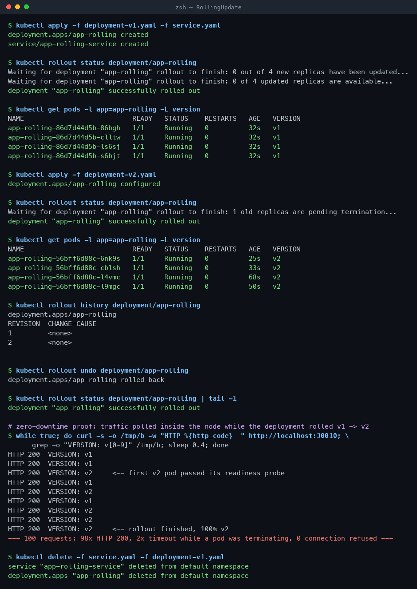

---

## Task 9 — Troubleshooting drills (`troubleshooting/`)

### Drill 1 — broken image stalls the rollout

```bash
kubectl apply -f deployment/deployment-v1.yaml       # healthy 3 pods
kubectl apply -f troubleshooting/broken-image.yaml   # bad tag
kubectl rollout status deployment/yatri-backend --timeout=30s
```

```
error: timed out waiting for the condition

NAME                             READY   STATUS             RESTARTS   AGE
yatri-backend-7554bd5c75-7z6lm   1/1     Running            0          64s
yatri-backend-7554bd5c75-n2nh7   1/1     Running            0          64s
yatri-backend-7554bd5c75-pv65s   1/1     Running            0          64s
yatri-backend-77dbb657cd-b7mcs   0/1     ImagePullBackOff   0          50s   <- the surge pod
```

The three old pods keep serving. `maxUnavailable: 0` turned a bad deploy into a stalled deploy instead of an outage.

```bash
kubectl rollout undo deployment/yatri-backend    # deployment.apps/yatri-backend rolled back
```

### Drill 2 — selector / label mismatch

```bash
kubectl apply -f troubleshooting/selector-mismatch.yaml
```

```
The Deployment "selector-error-demo" is invalid: spec.template.metadata.labels:
Invalid value: {"app":"wrong-app-name"}: `selector` does not match template `labels`
```

Rejected by the API server before anything is created — `spec.selector` is immutable, so it must match `spec.template.metadata.labels` exactly. Fix: make both `app: correct-app-name`.

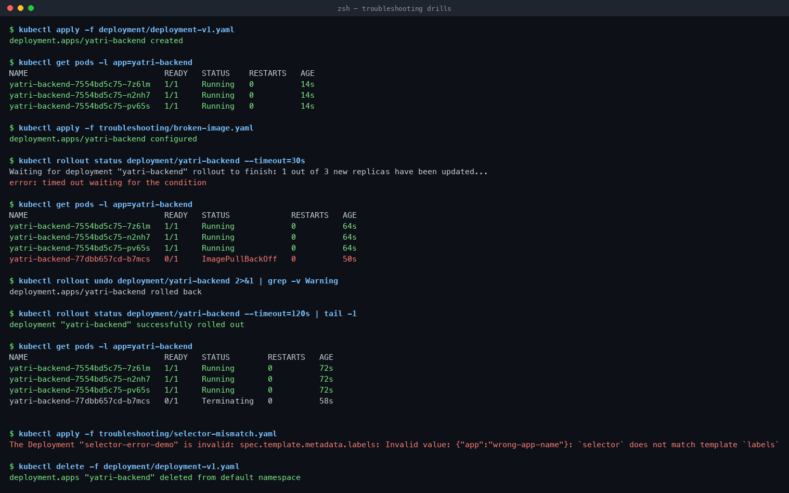

---

## Task 10 — Concepts

### The 4 ports

```
Client ──► nodePort 30080 (every node's IP)
              └──► port 8080 (Service ClusterIP)
                      └──► targetPort 80 (Pod)
                              └──► containerPort 80 (app process)
```

| Port | Lives on | Notes |
| :--- | :--- | :--- |
| `containerPort` | Pod spec | Documentation only — it does not open anything. |
| `targetPort` | Service → Pod | The port the Service actually forwards to. |
| `port` | Service ClusterIP | What other pods in the cluster connect to. |
| `nodePort` | Every node | 30000–32767, external entry point. |

### Labels vs Selectors

- **Label** — a key/value tag on an object: `app: nginx`, `slot: blue`.
- **Selector** — the query that finds objects by those labels. Services use it to build endpoints; Deployments use it to own their pods.

One is the sticker, the other is the search.

### Deployment strategies

| Strategy | Downtime | Extra capacity | Use it when |
| :--- | :--- | :--- | :--- |
| **RollingUpdate** (default) | None | +`maxSurge` | Normal stateless releases |
| **Recreate** | Yes | None | Schema migration, versions can't coexist |
| **Blue-Green** | None | 2× | Need an instant, total rollback |
| **Canary** | None | +canary pods | Want production metrics before full rollout |

### maxSurge vs maxUnavailable

For `replicas: 4`, `maxSurge: 1`, `maxUnavailable: 0`:
- Max pods during rollout = 4 + 1 = **5**
- Min available = 4 − 0 = **4** → full capacity throughout

Percentages round up for surge and down for unavailable, e.g. `replicas: 10, maxSurge: 25%` → 3 extra pods.

### Requests vs Limits, GB vs GiB

- **Request** — what the scheduler reserves. No node with that much free → `Pending`.
- **Limit** — the cgroup ceiling. Over CPU limit → throttled. Over memory limit → **OOMKilled**.
- 1 GB = 10⁹ bytes; 1 GiB = 2³⁰ = 1,073,741,824 bytes. Kubernetes uses `Mi` / `Gi`, so `512Mi` ≠ `512M`.

---

## Task 11 — Blue-Green (`02-blue-green/`)

```bash
kubectl apply -f deployment-blue.yaml -f deployment-green.yaml -f service-blue.yaml
```

```
NAME                        READY   STATUS    SLOT    VERSION
app-blue-5c69d7785c-2xc5m   1/1     Running   blue    v1
app-green-84df7f978-98m7c   1/1     Running   green   v2      (6 pods total)

Selector:   app=myapp,slot=blue
Endpoints:  10.244.0.19:80,10.244.1.41:80,10.244.1.38:80
<p>BLUE ENVIRONMENT</p>
```

The switch — one selector change, nothing redeployed:

```bash
kubectl apply -f service-green.yaml
```

```
Selector:   app=myapp,slot=green
Endpoints:  10.244.1.40:80,10.244.0.18:80,10.244.1.39:80
<p>GREEN ENVIRONMENT</p>
```

Rollback is the same command in reverse (`service-blue.yaml`) → `<p>BLUE ENVIRONMENT</p>`. Cost: you pay for both environments the whole time.

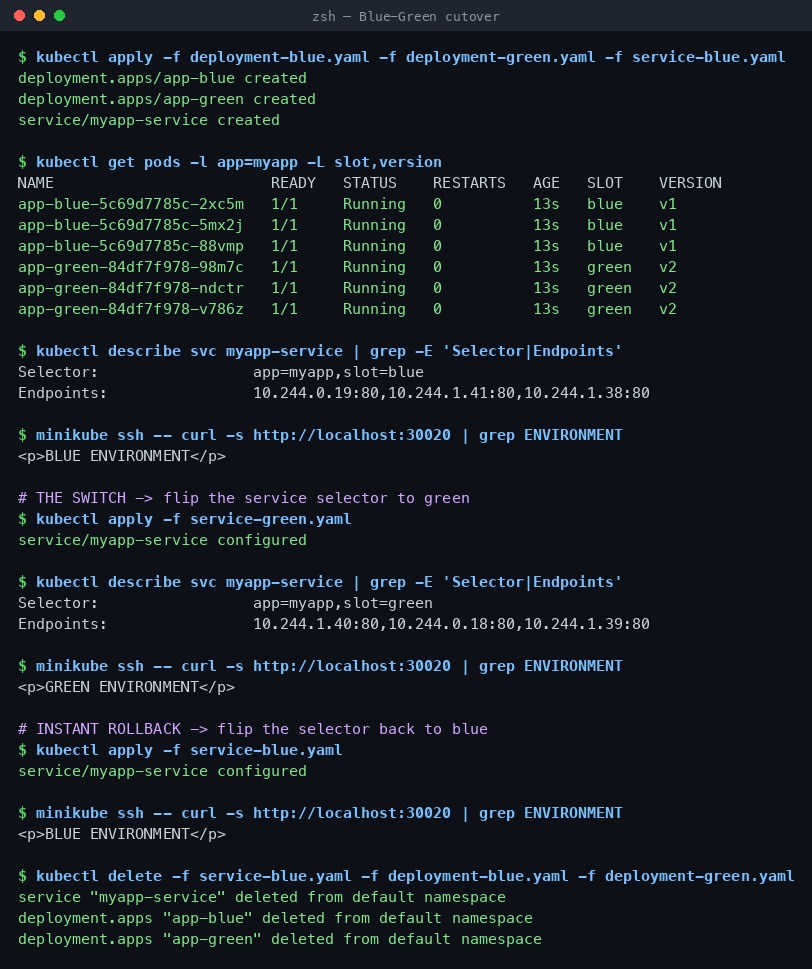

---

## Task 12 — Canary (`03-canary/`)

One Service selects both tracks on the shared label `app=myapp-canary`, so the split is just the pod ratio.

```bash
kubectl apply -f deployment-stable.yaml -f deployment-canary.yaml -f service.yaml
```

```
NAME         READY   TRACK    VERSION
app-canary   1/1     canary   v2
app-stable   9/9     stable   v1
                                        10 endpoints behind one Service
```

20 requests at 9:1 →

```
STABLE v1   x19
CANARY v2   x1
```

Shift to 30% and abort:

```bash
kubectl scale deployment app-canary --replicas=3
kubectl scale deployment app-stable --replicas=7
#  8 CANARY v2 / 12 STABLE v1  out of 20

kubectl scale deployment app-canary --replicas=0
kubectl scale deployment app-stable --replicas=9
# 10 STABLE v1 out of 10
```

Rollback = scale to 0. It is instant, and the split is approximate because kube-proxy balances per connection, not per percentage — real percentage control needs an Ingress or service mesh.

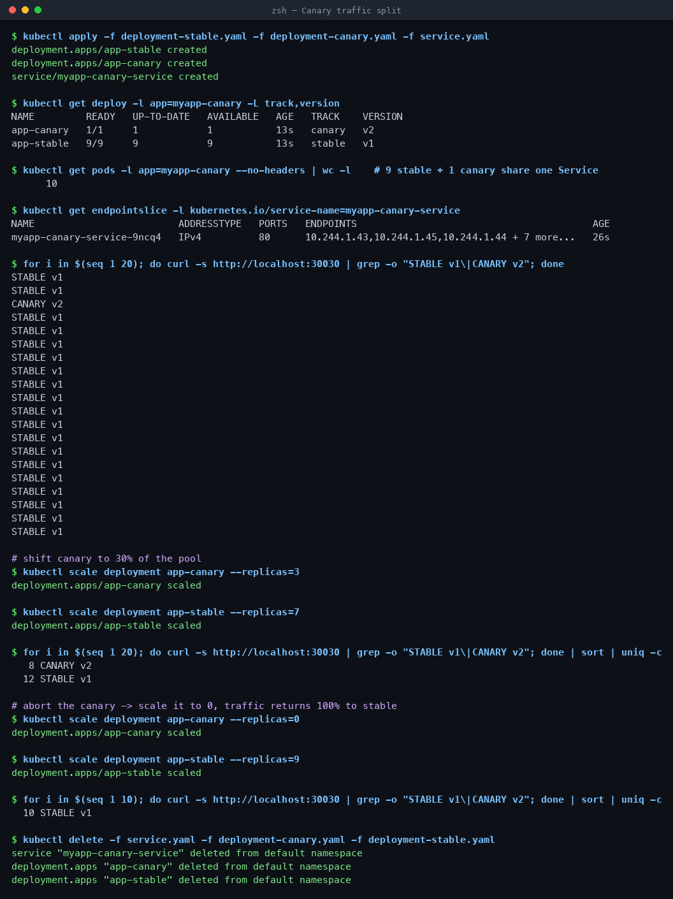

---

## Task 13 — Recreate + downtime window (`04-recreate/`)

```bash
kubectl apply -f deployment-v1.yaml -f service.yaml
kubectl apply -f deployment-v2.yaml      # strategy.type: Recreate
```

Traffic polled during the update:

```
VERSION: v1
VERSION: v1
[OUTAGE] no pod alive (curl code 000)      <- all 3 v1 pods killed, 0 pods serving
[OUTAGE] no pod alive (curl code 000)
VERSION: v2 (UPGRADED)                     <- v2 started only after the full shutdown
VERSION: v2 (UPGRADED)

70 requests: 6x v1, 2x OUTAGE (~4s of real downtime), 62x v2
```

```bash
kubectl rollout history deployment/app-recreate
kubectl rollout undo deployment/app-recreate
```

The outage is the feature: v1 and v2 never run at the same time, which is what you want when both versions would write to the same database schema.

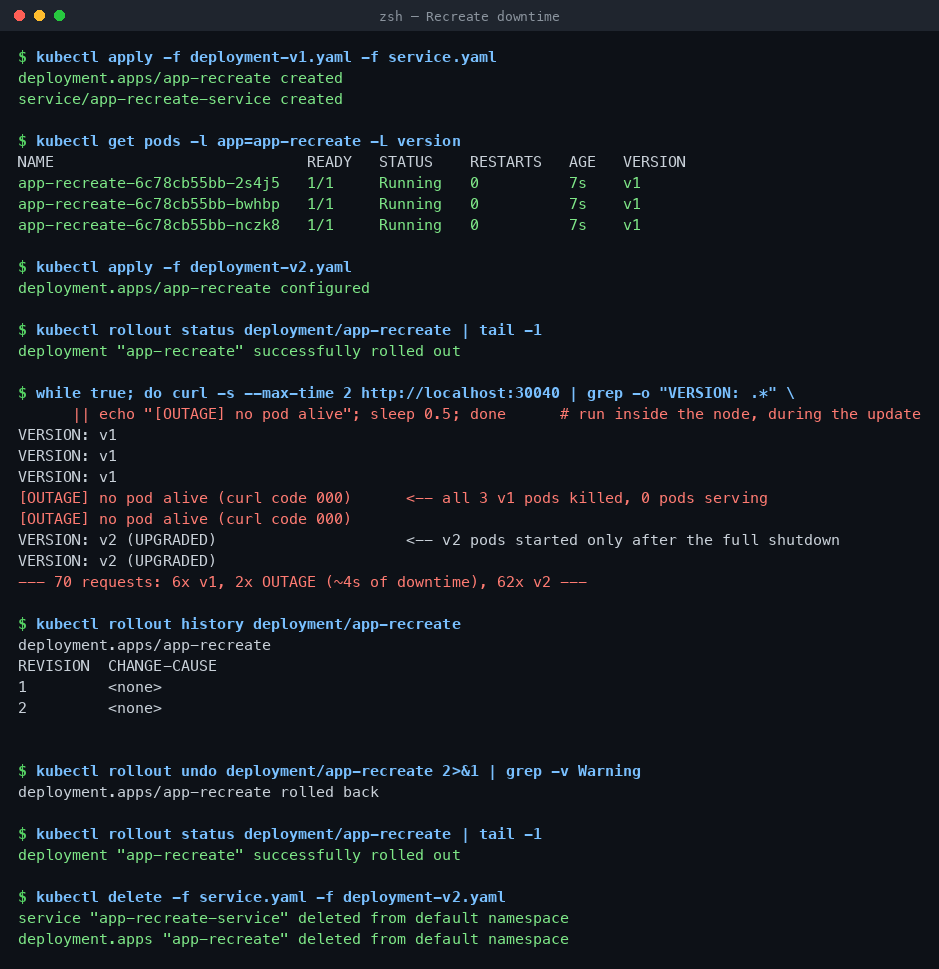

---

## Cleanup

```bash
kubectl delete -f 01-rolling-update/ -f 02-blue-green/ -f 03-canary/ -f 04-recreate/ --ignore-not-found
kubectl delete pvc --all
```
