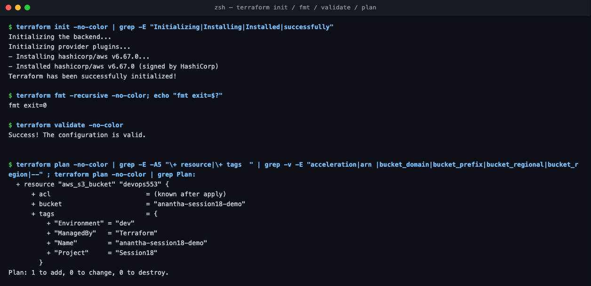
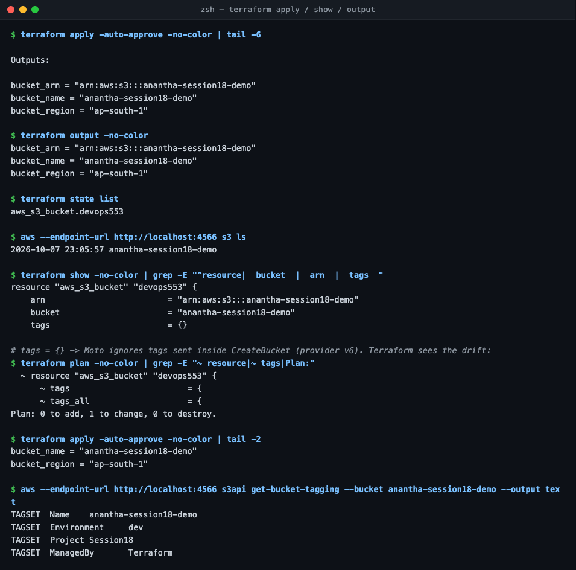
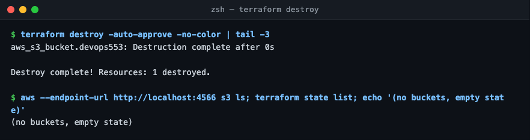

# Session 18 — Terraform & IaC

Run against **Moto** (local AWS emulator) instead of a real AWS account: `docker run -d -p 4566:5000 motoserver/moto`.
Terraform v1.16.5, AWS provider v6.67.0. Port 4566 because macOS AirPlay owns 5000.

## Task 1 — `terraform-s3-demo/`
Files: `main.tf` (bucket) · `variables.tf` · `outputs.tf` · `provider.tf` (Moto endpoint, test creds) · `terraform.tfvars` (name/region).

| Command | Result |
| :--- | :--- |
| `init` | downloaded `hashicorp/aws` v6.67.0 |
| `fmt` / `validate` | formatted / "configuration is valid" |
| `plan` | `1 to add`: bucket `anantha-session18-demo` with 4 tags |
| `apply` | created; `aws s3 ls` shows the bucket |
| `show` / `output` | resource attributes / `bucket_arn`, `bucket_name`, `bucket_region` |
| `destroy` | `1 destroyed`; bucket and state gone |

**Finding:** after `apply`, `show` said `tags = {}`. Provider v6 sends the tags **inside** CreateBucket and Moto ignores them (real AWS keeps them). The next `plan` caught the drift (`~ tags`, 1 to change) and the second `apply` set them. That's state vs. reality in action.

## Task 2 — AWS services
[IAM](aws-services/01-iam/README.md) · [EC2](aws-services/02-ec2/README.md) · [S3](aws-services/03-s3/README.md) · [VPC](aws-services/04-vpc/README.md) · [DynamoDB & RDS](aws-services/05-dynamodb-rds/README.md)
