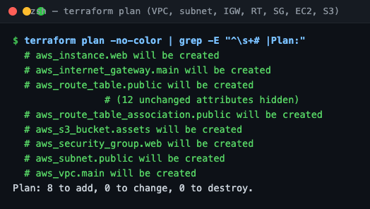
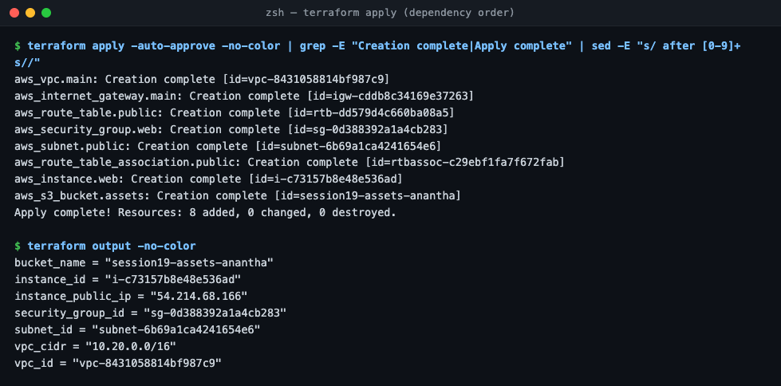
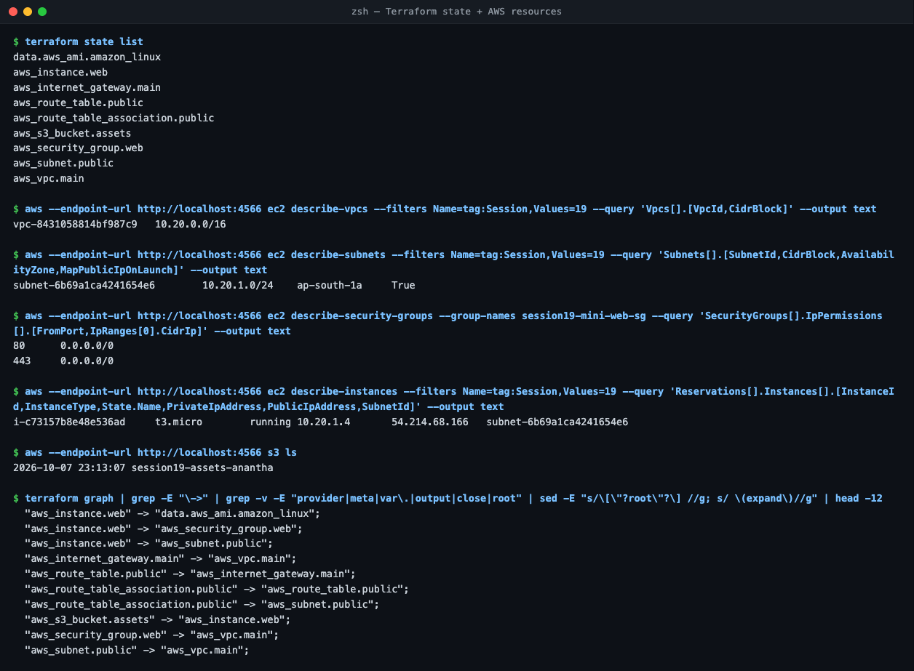
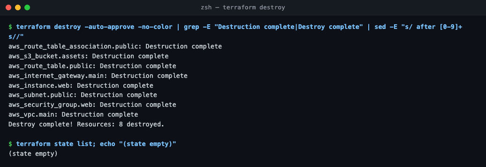

# Session 19 — Cloud & Terraform in Action

Project: [`cloud-infra/`](cloud-infra/): instructor's `08-mini-project` (VPC, subnet, IGW, route table, SG) + **EC2 + S3** ([`compute-storage.tf`](cloud-infra/compute-storage.tf)). Run against Moto (local AWS).

```
                 ┌───────────────── VPC 10.20.0.0/16 ─────────────────┐
 Internet ── IGW ┤ Route table 0.0.0.0/0 → IGW                         │
                 │   └─ Public subnet 10.20.1.0/24 (ap-south-1a)       │
                 │        └─ EC2 t3.micro  ◄── SG: 80, 443 in          │
                 └────────────────────────────────────────────────────┘
 S3 bucket session19-assets-anantha (depends_on EC2)
```

| Concept | Where |
| :--- | :--- |
| Provider | `versions.tf`: `hashicorp/aws ~> 6.0`, endpoints → Moto |
| Variables | `aws_region`, `instance_type`, `aws_endpoint` (+ `terraform.tfvars`) |
| Resources | 8: VPC, subnet, IGW, route table, association, SG, EC2, S3 (+ `data.aws_ami`) |
| Outputs | VPC/subnet/SG IDs, instance ID + public IP, bucket name |
| Dependencies | implicit via references (`aws_subnet.public.id`); explicit `depends_on` for S3 |
| State | `terraform state list` = 9 entries; empty after destroy |

- **Apply order** followed the graph: VPC → IGW/SG/subnet → route table → association → EC2 → S3.
- **Destroy** ran in reverse: association/S3 first, VPC last.
- Verified with `aws ec2 describe-*`: VPC `10.20.0.0/16`, subnet public-IP on launch, SG 80/443, instance `running` at `10.20.1.4`.





