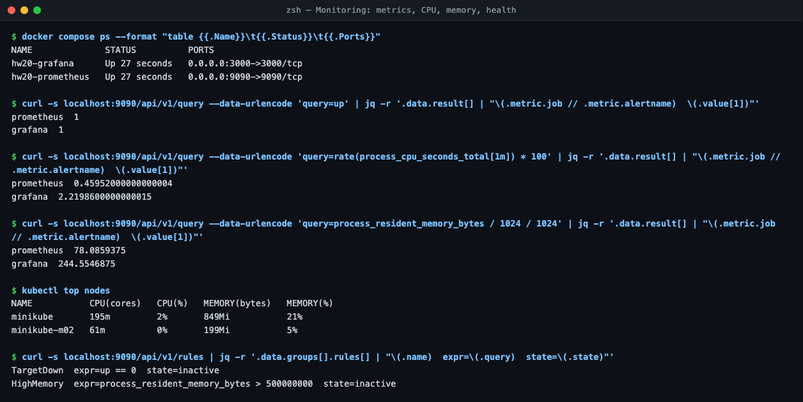
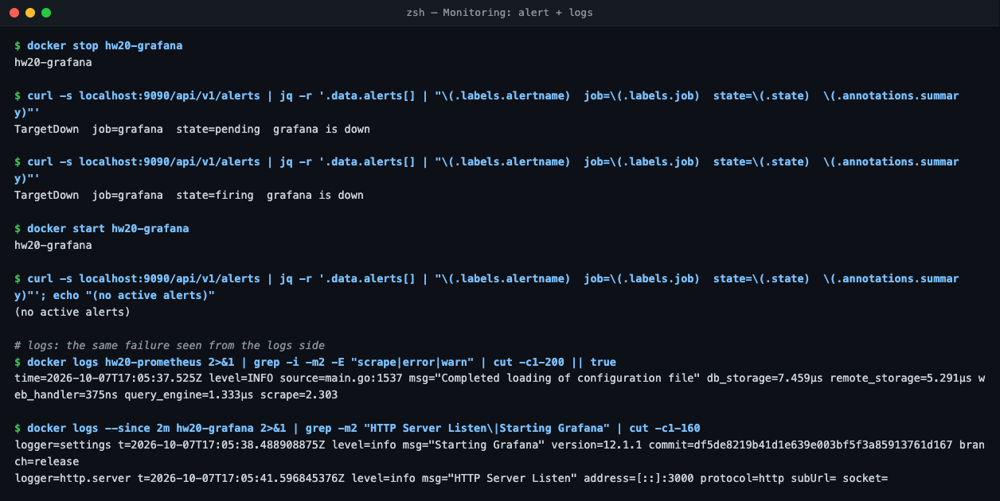
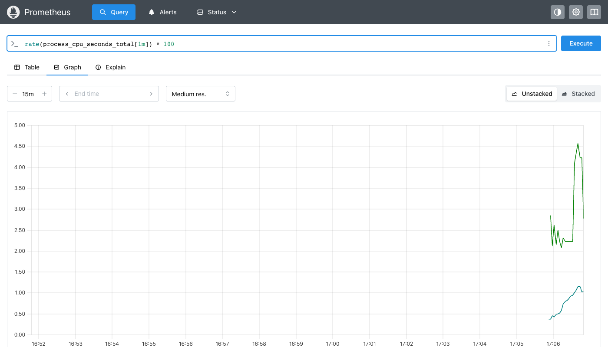
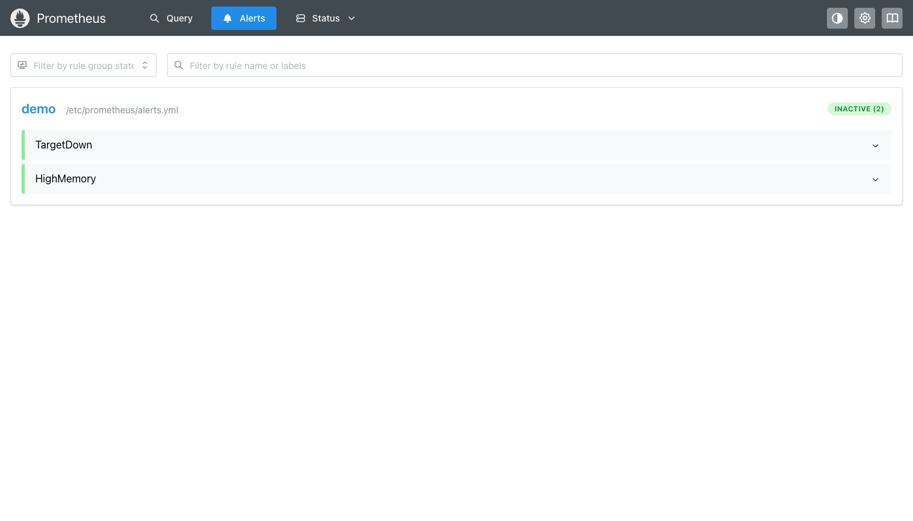
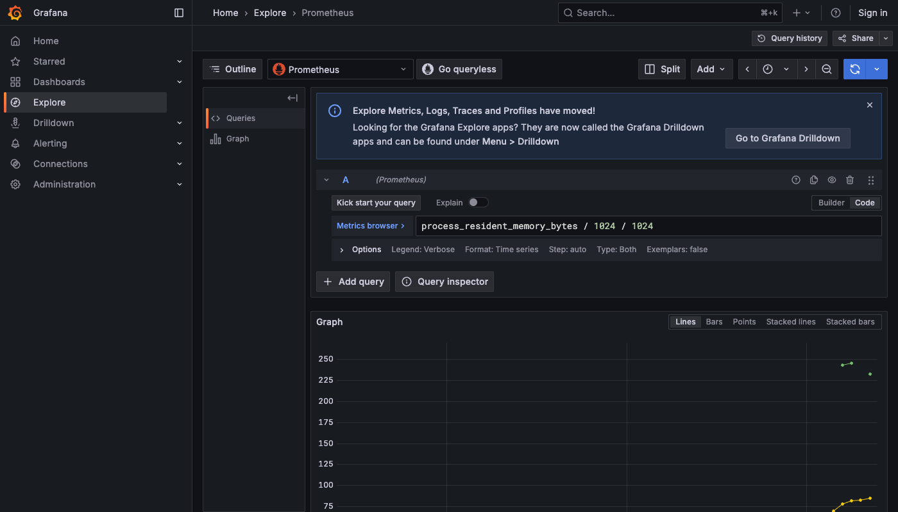
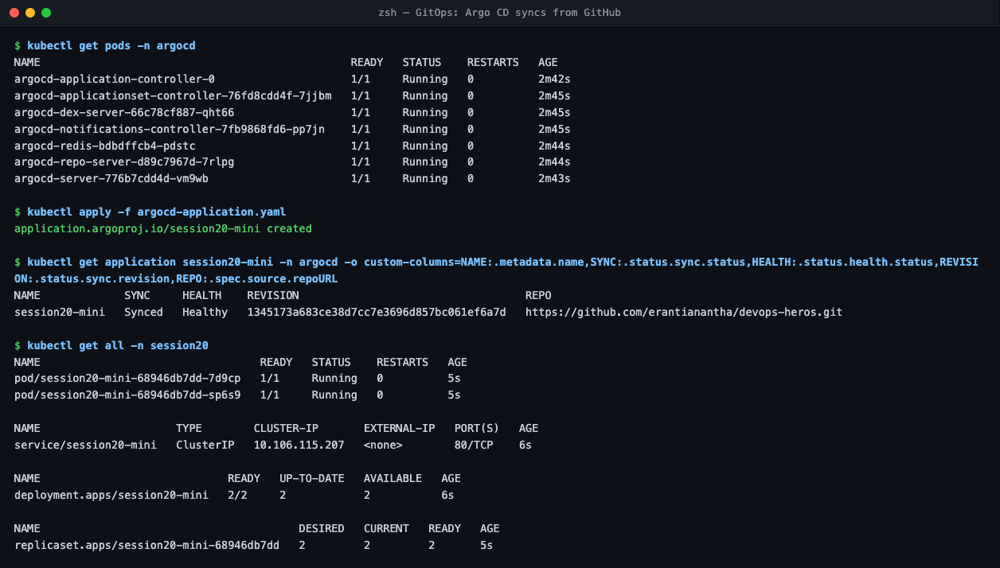
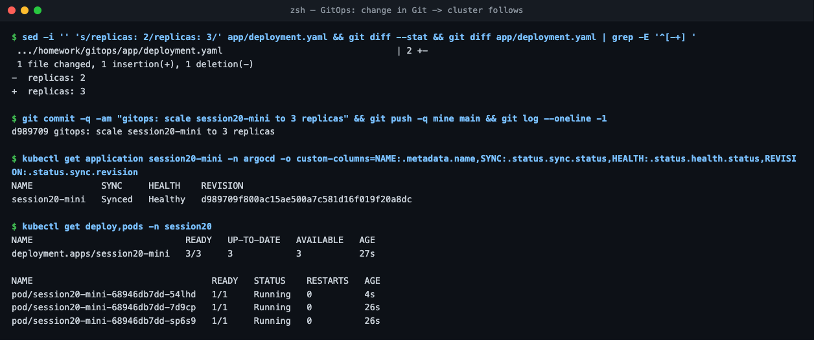
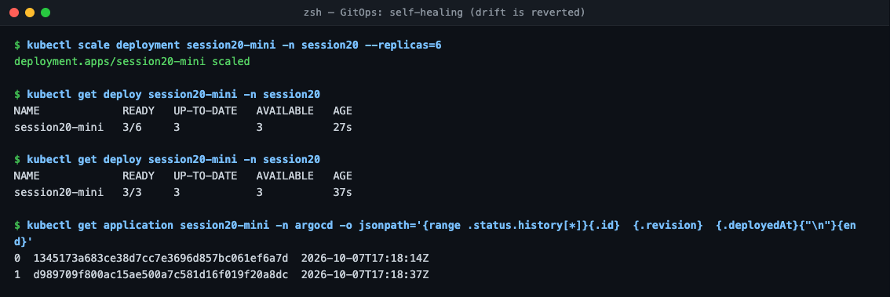
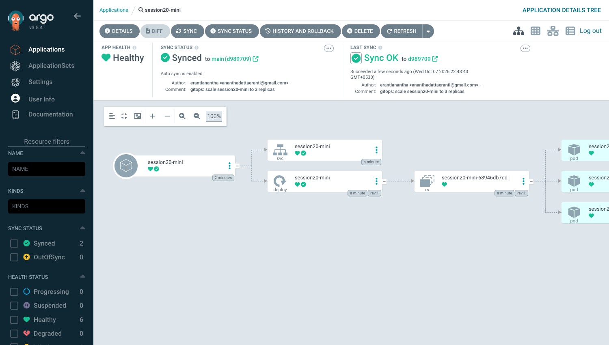

# Session 20 — Monitoring, Observability & GitOps

## Task 1 — Monitoring demo ([`monitoring/`](monitoring/))
Prometheus + Grafana (`docker compose up -d`). Prometheus scrapes itself and Grafana (the "app"); alert rules in `alerts.yml`.

| Signal | How |
| :--- | :--- |
| Metrics | PromQL over HTTP API: `up`, `rate(process_cpu_seconds_total[1m])`, `process_resident_memory_bytes` |
| CPU / memory | Grafana ≈ 2.2% CPU, 245 MiB; Prometheus ≈ 0.5%, 78 MiB; cluster nodes via `kubectl top nodes` |
| App health | `up{job="grafana"}` = 1 |
| Alert | stopped Grafana → `TargetDown` **pending → firing** → restarted → resolved |
| Logs | `docker logs` / `kubectl logs` |

## Task 2 — Observability
- **Metrics:** numbers over time (CPU, latency, error rate). Cheap; tell you *that* something is wrong. Tools: Prometheus, Grafana.
- **Logs:** timestamped events from the app. Tell you *what* happened. Tools: Loki, ELK/OpenSearch, `kubectl logs`.
- **Traces:** one request followed across services. Tell you *where* time was spent. Tools: OpenTelemetry, Jaeger, Tempo.
- **Why:** monitoring answers known questions (is it up?); observability lets you debug unknown failures from the outside.
- **Kubernetes:** metrics-server (`kubectl top`), kube-prometheus-stack, Fluent Bit → Loki, OpenTelemetry Collector.

## Task 3 — GitOps demo ([`gitops/`](gitops/))
Argo CD on minikube watches **this repo**, path `session20-monitoring-observability-gitops/homework/gitops/app`.

- **GitOps:** Git is the single source of truth for what runs; an agent in the cluster pulls and applies it.
- **Declarative:** the YAML says *what* (3 replicas), not *how*.
- **Continuous reconciliation:** Argo CD compares Git with the cluster and fixes any difference.
- **Workflow:** change YAML → commit → push → Argo CD syncs. No `kubectl apply` from laptops or CI.

| Step | Result |
| :--- | :--- |
| Apply `argocd-application.yaml` | `Synced / Healthy` at commit `1345173`, 2 Pods |
| Edit `replicas: 2 → 3`, `git push` | synced to `d989709`, 3 Pods. Git history = deploy history |
| `kubectl scale --replicas=6` (drift) | `selfHeal` scaled it back to 3 within seconds |

