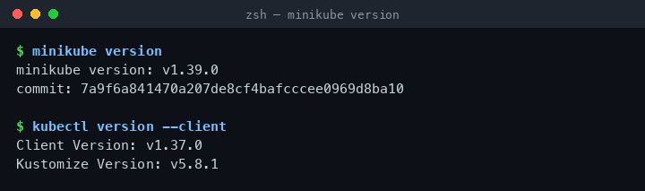
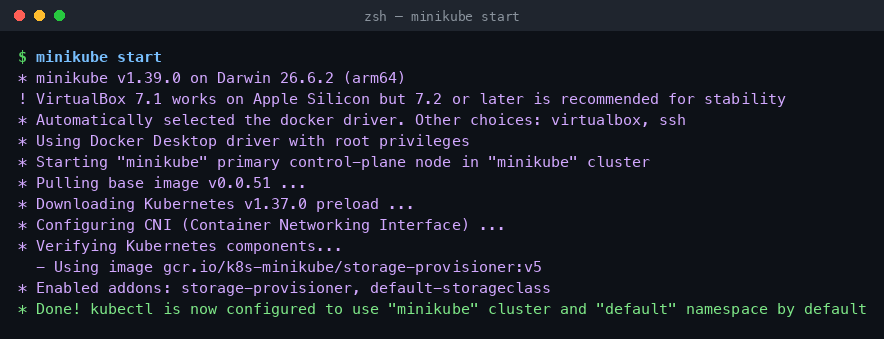
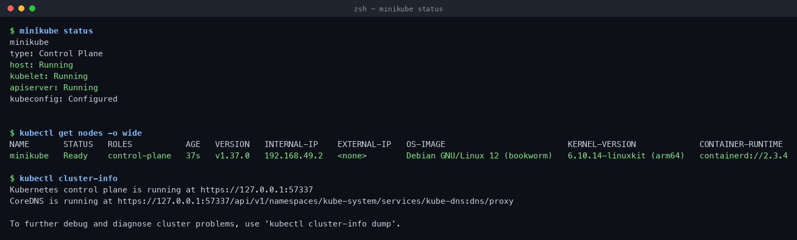
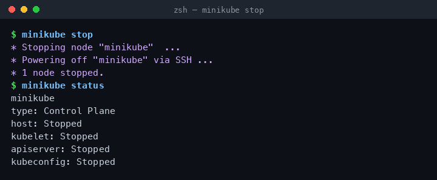

# Session 9 — Kubernetes Fundamentals & Cluster Architecture

**Repo:** devops-heros / `session9-k8s`
**Setup:** macOS (Apple Silicon) · minikube v1.39.0 · kubectl v1.37.0 · Docker driver

---

## Task 1 — Install & verify minikube + kubectl

```bash
minikube version
kubectl version --client
```

```
minikube version: v1.39.0
commit: 7a9f6a841470a207de8cf4bafcccee0969d8ba10

Client Version: v1.37.0
Kustomize Version: v5.8.1
```



---

## Task 2 — Start the cluster

```bash
minikube start
```

```
* minikube v1.39.0 on Darwin 26.6.2 (arm64)
* Automatically selected the docker driver. Other choices: virtualbox, ssh
* Starting "minikube" primary control-plane node in "minikube" cluster
* Pulling base image v0.0.51 ...
* Downloading Kubernetes v1.37.0 preload ...
* Configuring CNI (Container Networking Interface) ...
* Verifying Kubernetes components...
* Enabled addons: storage-provisioner, default-storageclass
* Done! kubectl is now configured to use "minikube" cluster
```



---

## Task 3 — Verify cluster status & node health

```bash
minikube status
kubectl get nodes -o wide
kubectl cluster-info
```

```
minikube
type: Control Plane
host: Running
kubelet: Running
apiserver: Running
kubeconfig: Configured

NAME       STATUS   ROLES           AGE   VERSION   INTERNAL-IP    CONTAINER-RUNTIME
minikube   Ready    control-plane   37s   v1.37.0   192.168.49.2   containerd://2.3.4

Kubernetes control plane is running at https://127.0.0.1:57337
CoreDNS is running at https://127.0.0.1:57337/api/v1/namespaces/kube-system/services/kube-dns:dns/proxy
```



---

## Task 4 — Stop the cluster

```bash
minikube stop
minikube status
```

```
* Stopping node "minikube"  ...
* Powering off "minikube" via SSH ...
* 1 node stopped.

minikube
type: Control Plane
host: Stopped
kubelet: Stopped
apiserver: Stopped
```



---

## Task 5 — Cluster architecture

```
+--------------------------- CONTROL PLANE ----------------------------+
|                                                                      |
|   etcd  <---->  kube-apiserver  <---->  kube-scheduler               |
|                       |                                              |
|                       v                                              |
|            kube-controller-manager                                   |
+---------------------------+------------------------------------------+
                            |
            +---------------+---------------+
            v                               v
   +----------------+              +----------------+
   |  WORKER NODE 1 |              |  WORKER NODE 2 |
   | kubelet        |              | kubelet        |
   | kube-proxy     |              | kube-proxy     |
   | containerd     |              | containerd     |
   |   Pod  Pod     |              |   Pod  Pod     |
   +----------------+              +----------------+
```

### Control plane

| Component | What it does |
| :--- | :--- |
| **kube-apiserver** | The only front door. Every `kubectl` call, controller and kubelet talks to it. Nothing else touches etcd. |
| **etcd** | Key-value store holding the entire cluster state — the desired state lives here. |
| **kube-scheduler** | Picks a node for every Pod that has none, using requests, affinity, taints and tolerations. |
| **kube-controller-manager** | Runs the reconcile loops (node, replicaset, endpointslice…) that drive current state toward desired state. |

### Worker node

| Component | What it does |
| :--- | :--- |
| **kubelet** | Node agent. Takes PodSpecs from the API server, tells the runtime to start containers, reports health back. |
| **kube-proxy** | Programs iptables/IPVS rules so Service IPs reach the right Pods. |
| **containerd (CRI)** | Actually pulls images and runs containers. Docker daemon is no longer used directly. |
| **Pod** | Smallest deployable unit — one or more containers sharing a network namespace and volumes. |

**Flow of one `kubectl apply -f pod.yml`:**
`kubectl` → apiserver (authn/authz) → object written to etcd → scheduler assigns a node → kubelet on that node pulls the image via containerd → kube-proxy wires up networking → status reported back to apiserver.

---

## Cleanup

```bash
minikube stop
```
